# SYSTEM_ARCHITECTURE.md — HRMS Setting Service

**Status:** Draft for Engineering Review
**Source of Truth for Business Behavior:** `HRMS-Setting-Module-PRD-v2.md` (Approved, 2026-08-08)
**Source of Truth for Persistence Shape:** `setting-schema-v3.sql`
**Audience:** Backend (NestJS), Go Worker, Frontend, DevOps, QA

> This document translates the approved Setting Module PRD into a concrete technical design. It does not redefine business behavior. Where the PRD and schema are silent or appear to conflict, the conflict is documented in **Section 31 — Architecture Gaps / Open Decisions** rather than resolved silently.

---

## Table of Contents

1. System Context
2. Backend Stack — Setting Service (NestJS)
3. Go Worker Stack
4. Effective-Dated Change Architecture
5. Asynq Design
6. Kafka Architecture
7. Transactional Outbox
8. Setting Service NestJS Modules
9. Company Template Architecture
10. Location
11. Department
12. Grade
13. Job Title
14. Point of Contact
15. Company Setup and Activation
16. Redis Responsibilities
17. Shared Libraries
18. Frontend Stack
19. Frontend Effective-Date UX
20. Request Context
21. Observability
22. Failure Scenarios
23. Idempotency
24. Concurrency
25. Security and Tenant Isolation
26. Deployment Architecture
27. Architecture Diagrams
28. Sequence Diagrams
29. Architecture Decision Records
30. Prohibited Designs
31. Architecture Gaps / Open Decisions

---

## 1. System Context

The HRMS platform is a multi-tenant, polyrepo SaaS system. The **Setting Service** is the system of record for organizational configuration within a Tenant:

- Company
- Location
- Department
- Grade
- Job Title
- Point of Contact (PoC)
- Company setup progress (8 mandatory steps)
- Effective-dated organizational changes

**Explicitly out of ownership** (per PRD §3.2 and schema comments):

| Domain | Owner | Setting Service's relationship |
|---|---|---|
| Authentication | Identity/Auth domain | Consumed via `@hros/libs-apis` guards; never reimplemented |
| Authorization / Role definitions | Authorization domain | Setting Service tracks only a completion reference for the "Roles" setup step, and copy-candidate status during template copy |
| Employee master data | Directory domain | Setting Service keeps a local read-only projection (`employee_references`) for validation/display, never authoritative |
| Employee import | Employee Import domain | Setting Service tracks only setup-step completion, not import mechanics |
| Payroll | Payroll domain | No direct dependency; "Payroll Owner" is only a `pocType` string |
| Audit-log persistence | Log Service | Setting Service emits domain events; it does not persist an audit trail itself (per schema comment: "Audit history is owned by Log Service, not Setting DB") |

This produces a clean bounded context: Setting Service is authoritative for *organizational structure*, and treats identity, authorization, and workforce data as external, referenced domains.

### 1.1 High-level actors mapped to system components

| PRD Actor | System representation |
|---|---|
| Tenant | `tenants` local projection row; tenant lifecycle owned upstream |
| Company | `companies` row, owned by Setting Service |
| Administrator | Authenticated principal in `RequestContext`, authorized via `@hros/libs-apis` |
| HR Business User | Authenticated principal, read-scoped |
| System | Setting Service (NestJS) + Go Effective Worker, acting jointly under the boundary in §4 |
| Point of Contact (PoC) | Business data (`pocs` row), not a system actor |
| Employee | `employee_references` local projection, authoritative record lives in Directory domain |


---

## 2. Backend Stack — Setting Service (NestJS)

| Concern | Choice |
|---|---|
| Language | TypeScript |
| Framework | NestJS |
| Database | PostgreSQL 18 |
| Cache / ephemeral store | Redis |
| Async messaging | Kafka |
| Package manager | pnpm |

Shared libraries (independently versioned npm packages, **not** workspace-linked):

- `@hros/libs-core`
- `@hros/libs-apis`
- `@hros/libs-sql`
- `@hros/libs-events`

### 2.1 Repository model

- **Polyrepo.** `setting-service` is its own repository with its own CI/CD pipeline, its own release cadence, and its own versioned dependency on each `@hros/libs-*` package (pinned semver ranges in `package.json`, resolved from a private npm registry).
- Shared libraries are published as normal npm packages. Consumers (Setting Service, other domain services) bump their `package.json` version like any third-party dependency.
- `workspace:*` protocol is **not used** across repository boundaries — it only makes sense inside a single monorepo. Each repo pins an explicit version (e.g. `"@hros/libs-core": "^3.4.0"`), so upgrades are deliberate, reviewable PRs rather than implicit whole-org changes.
- No monorepo is introduced anywhere in this architecture, including between `setting-service` and `setting-effective-worker-go` — they are separate repositories, separate pipelines, separate deploy artifacts.

---

## 3. Go Worker Stack

A dedicated, independently deployable Go service — `setting-effective-worker-go` — coordinates scheduled execution of effective-dated changes.

| Concern | Choice |
|---|---|
| Language | Go |
| Task scheduling | Asynq |
| Broker for Asynq | Redis |
| Messaging | Kafka |
| Kafka client | IBM Sarama |
| Logging | `log/slog` |

### 3.1 Responsibility boundary (critical)

> **The Go Worker MUST NOT directly own or mutate Setting Service domain data in PostgreSQL.**

The worker has **zero PostgreSQL driver, zero connection string, zero schema knowledge** of the Setting Service database. Its entire responsibility is:

1. Consume a *scheduling* event from Kafka.
2. Create/update an Asynq task whose `ProcessAt` equals `effectiveAt`.
3. When the task fires, publish an *execution* event back to Kafka.
4. Track its own operational state (Asynq task metadata) in Redis — never business state.

This makes the worker a **scheduler/execution coordinator**, not a domain owner. Domain authority — validation, conflict detection, state transition, and the resulting fact that a change was applied — always lives in the NestJS Setting Service, which is the only process with a PostgreSQL connection to the Setting DB.

**Why this boundary matters:**
- A single source of truth for business rules (BR-10 through BR-15, BR-28 through BR-33) avoids the two services drifting into inconsistent validation logic.
- The worker can be redeployed, scaled, or even rewritten in another language without any Setting Service schema/migration coordination.
- It eliminates a whole class of dual-write and cross-service transaction problems (see §24 and prohibited design in §30).

---

## 4. Effective-Dated Change Architecture

Per PRD FR-13, FR-14, FR-15, BR-10 through BR-15: every create/update/deactivate on Location, Department, Grade, Job Title, and (where applicable) PoC requires an `effectiveAt` that is **not earlier than the end of the current business day**. The active version presented to users must always reflect "current date vs. configured effective dates."

### 4.1 High-level flow

```text
Administrator
    |
    v
React UI
    |
    v
NestJS Setting Service  --- validates effectiveAt, current state, one-pending-change rule
    |
    v
PostgreSQL (single transaction)
    |
    +--> master table row (status=scheduled) and/or effective_changes row
    |
    +--> outbox row: setting.effective-change.scheduled
                |
                v (outbox publisher, async)
              Kafka
                |
                v
          Go Scheduler Worker (Sarama consumer)
                |
                v
             Asynq (Redis-backed), ProcessAt(effectiveAt)
                |
          [ time passes until effectiveAt ]
                |
                v
          Asynq handler fires
                |
                v
              Kafka: setting.effective-change.execute
                |
                v
      NestJS Setting Service (consumer)
                |
                v
        revalidate current state, apply change transactionally
                |
                v
        PostgreSQL updated + outbox: setting.effective-change.applied
                |
                v
        publish final domain event (e.g. setting.location.updated)
```

### 4.2 Numbered responsibility boundary

1. Setting Service accepts the business request (REST call from Administrator via React UI).
2. Setting Service validates the request: `effectiveAt` ≥ end of current business day (BR-10), at most one pending scheduled change per entity (BR-13), tenant/company scoping (§25).
3. Setting Service persists the scheduled change — either as a `scheduled` master row (for CREATE) or an `effective_changes` row (for UPDATE/DEACTIVATE) — within the same DB transaction as an outbox row.
4. Setting Service (via the Outbox Publisher, see §7) publishes a `setting.effective-change.scheduled` event to Kafka.
5. Go Worker consumes the event via a Sarama consumer group.
6. Go Worker enqueues an Asynq task with `ProcessAt(effectiveAt)`, keyed by a deterministic task ID derived from `changeId` (see §5.2).
7. At execution time, the Asynq handler fires and Go Worker publishes a `setting.effective-change.execute` command event to Kafka — it does **not** touch PostgreSQL.
8. NestJS Setting Service consumes `setting.effective-change.execute`.
9. Setting Service reloads the `effective_changes` row and the current master-data row by `entity_id`, and **revalidates** (row still exists, `expected_updated_at` matches, change not already cancelled/applied — see §24).
10. Setting Service applies the change transactionally: master row transitions `scheduled → active` (or `active → inactive`), `effective_changes.status` transitions to `applied`, outbox row for the resulting domain event is written in the same transaction.
11. Setting Service publishes the resulting domain event (e.g. `setting.department.updated`) via the outbox publisher.

### 4.3 Presenting "current active state" (FR-15, AC-8/AC-9)

Because there are no per-entity version tables (schema decision #1), the master tables (`locations`, `departments`, `grades`, `job_titles`) store the row Administrators interact with directly, using `status ∈ {scheduled, active, inactive}`:

- A row with `status = active` and `effective_at` in the past is the current business state.
- A row with `status = scheduled` and `effective_at` in the future represents an upcoming CREATE that has not taken effect yet — it must **not** be surfaced to HR Business Users as active (FR-15, US-11).
- An UPDATE/DEACTIVATE in the future is represented purely by an `effective_changes` row (status `scheduled`) referencing the existing active master row; the master row's currently active fields remain unchanged and visible until execution (AC-8).
- Read APIs distinguish "what is active today" (query master row where `status='active'`) from "what is scheduled next" (join to `effective_changes` where `status='scheduled'`), so the frontend can render both (see §19).

---

## 5. Asynq Design

### 5.1 Redis role

Redis is Asynq's broker and durable-within-Redis task store (Asynq persists task state in Redis structures — lists, sorted sets, hashes). This Redis instance is treated as **runtime infrastructure**, not a system of record (see §16). Loss of this Redis data means loss of *pending scheduling metadata*, not loss of business data — the authoritative fact ("this change is scheduled for X") lives in PostgreSQL `effective_changes`, and can be **reconciled/replayed** (see §5.9).

### 5.2 Deterministic task ID / uniqueness

Each scheduling event carries a `changeId` (the `effective_changes.id`, or for a CREATE that is scheduled at creation time, the master row `id`). The Go Worker derives the Asynq task ID deterministically:

```text
taskID = "effective-change:" + changeId
```

Asynq's `TaskID` option is used to set this explicitly (rather than accepting Asynq's auto-generated UUID). This guarantees:

- **Duplicate scheduling protection:** if the same `setting.effective-change.scheduled` event is delivered twice (Kafka at-least-once), the second `client.Enqueue(..., asynq.TaskID(taskID))` call returns `asynq.ErrTaskIDConflict`, which the worker treats as a no-op success.
- Re-scheduling (e.g., an Administrator edits a still-pending change's `effectiveAt`, per open decision in §31) can be implemented as "delete task by ID, then re-enqueue with the new `ProcessAt`" — deterministic IDs make this safe.

### 5.3 Queue and task type

- Task type: `setting:effective-change`
- Payload: **identifiers only** — `{ changeId, tenantId, companyId, entityType, entityId, operation }`. The full future-state payload is **not** placed on the Asynq task; Setting Service reloads and revalidates authoritative data at execution time (per explicit instruction in the brief, and consistent with keeping the worker "dumb").
- Queue: a single `setting-effective` queue is sufficient at expected volume (organizational master data is low-frequency relative to, e.g., transactional payroll events); if volume grows, split by priority (`setting-effective-critical` vs `setting-effective-default`) using Asynq's weighted queue priorities.

### 5.4 Retries and backoff

- `asynq.MaxRetry(8)` on the task, with Asynq's default exponential backoff (`retryDelayFunc`), capped at a maximum delay (e.g. 1 hour) to bound worst-case staleness.
- Retries apply to **transient** failures only: Kafka publish failure when emitting `setting.effective-change.execute`, or Sarama producer timeouts. A retry simply re-publishes the execute event — since Setting Service's execution handler is idempotent (§23), redundant execute events are safe.
- Non-retryable failures (e.g., malformed payload) are sent straight to Asynq's archive via `asynq.SkipRetry`.

### 5.5 Task expiration

- Tasks use `asynq.Deadline` / `asynq.Timeout` at the handler level (e.g. 30s to publish to Kafka) to prevent a stuck handler from holding a worker slot indefinitely.
- There is no long-lived TTL beyond `effectiveAt` scheduling itself; a task that is still unprocessed long after `effectiveAt` (e.g., due to prolonged worker outage) is *not* dropped — see §5.9 recovery.

### 5.6 Cancellation

- When an Administrator cancels a scheduled change (§19, §28.10), Setting Service updates `effective_changes.status = 'cancelled'` and `cancelled_at`/`cancelled_by` in PostgreSQL, and emits `setting.effective-change.cancelled` via the outbox.
- Go Worker consumes this event and calls Asynq's `Inspector.DeleteTask(queue, taskID)` using the same deterministic `taskID`. If the task has already fired (race — see §24), the cancellation event is a no-op; Setting Service's execution handler independently checks `effective_changes.status` and refuses to apply a cancelled change (defense in depth).

### 5.7 Task inspection

- Asynq's `Inspector` API (backed by the same Redis) is exposed operationally via **Asynqmon** (or an internal admin CLI wrapping `Inspector`), restricted to internal network / operator RBAC — not exposed to Administrators. Used for troubleshooting: viewing scheduled/retry/archived task counts, inspecting a specific task's payload, manually re-running an archived task.

### 5.8 Dead-letter / archived tasks

- Tasks that exhaust retries move to Asynq's **archive** (its built-in dead-letter concept — a bounded, size-limited set per queue).
- An alert fires on `asynq queue archived-count > 0` (see §21 metrics). On-call inspects via Asynqmon, fixes the root cause (e.g., Kafka topic ACL issue), and manually re-runs the archived task, or triggers the reconciliation job in §5.9 as a broader fallback.

### 5.9 Recovery after worker restart / Redis restart

- **Worker restart:** Asynq tasks already enqueued in Redis survive a worker process restart untouched (Redis is the durable-within-its-own-uptime store); a new worker process picks up processing immediately. In-flight tasks at the moment of a hard kill are returned to the queue by Asynq's server after its lease/heartbeat expires (Asynq's "in-progress" tracking), then retried per §5.4.
- **Redis restart / Redis data loss:** if Redis is redeployed without persistence (or persistence is lost), pending Asynq tasks are lost. Recovery: a **reconciliation job** (a scheduled NestJS cron or a lightweight Go job) periodically compares `effective_changes` rows with `status = 'scheduled'` and `effective_at` in the future against Asynq's current task set (via `Inspector.ListScheduledTasks`), and re-enqueues any `changeId` missing a corresponding task, using the same deterministic task ID (safe due to §5.2 idempotency). This reconciliation is the safety net that makes Redis's lack of long-term durability acceptable — see ADR list in §29 and failure scenario in §22.
- Redis is configured with AOF or RDB persistence in production regardless, as defense in depth, but the reconciliation job removes any hard dependency on that persistence being perfect.

### 5.10 Concurrency and graceful shutdown

- Worker concurrency configured via `asynq.Config{Concurrency: N}`, sized to Kafka partition count fan-out and expected scheduling volume; start conservatively (e.g. 10) and tune via observed queue depth.
- Graceful shutdown: on `SIGTERM`, the worker calls `srv.Shutdown()`, which stops pulling new tasks and waits (bounded by a shutdown timeout, e.g. 25s, to fit within Kubernetes `terminationGracePeriodSeconds`) for in-flight handlers to finish before exiting. In-flight handlers themselves should be short (publish one Kafka message) to make this safe.

### 5.11 Idempotency

See consolidated idempotency strategy in §23; Asynq-specific mechanisms are the deterministic `TaskID` (§5.2) and the fact that the handler body only ever *publishes an event* — it does not mutate durable business state, so at-least-once firing is inherently safe upstream, provided the Setting Service execution consumer is also idempotent.

---

## 6. Kafka Architecture

### 6.1 Standard event envelope

All events published by Setting Service (via `@hros/libs-events`) and consumed/produced by the Go worker (via Sarama) use:

```json
{
  "eventId": "uuid",
  "eventType": "setting.location.updated",
  "eventVersion": 1,
  "tenantId": "uuid",
  "companyId": "uuid",
  "occurredAt": "ISO-8601",
  "effectiveAt": "ISO-8601",
  "correlationId": "uuid",
  "causationId": "uuid",
  "traceId": "uuid",
  "producer": "setting-service",
  "payload": {}
}
```

### 6.2 Topic strategy

One topic per **coarse event family**, not one topic per event type, to keep partition/consumer-group management tractable:

| Topic | Producer | Consumer(s) | Purpose |
|---|---|---|---|
| `setting.company.events` | setting-service | downstream domains (Payroll, Reporting, Directory) | Company created/activated/updated |
| `setting.master-data.events` | setting-service | downstream domains, Log Service | Location/Department/Grade/Job Title created/updated/deactivated (final, applied domain events) |
| `setting.poc.events` | setting-service | downstream domains, Log Service | PoC assigned/replaced |
| `setting.effective-change.scheduled` | setting-service (outbox) | setting-effective-worker-go | Scheduling command |
| `setting.effective-change.cancelled` | setting-service (outbox) | setting-effective-worker-go | Cancellation command |
| `setting.effective-change.execute` | setting-effective-worker-go | setting-service | Execution command, worker → service |
| `setting.employee-transfer.events` | setting-service | downstream domains, Log Service | Employee transfer scheduled/applied |

Internal scheduling/execution/cancellation topics are **not** consumed by other domains — they are a private control channel between Setting Service and its own worker, distinct from the public domain-event topics other services subscribe to. This separation lets us evolve the internal scheduling protocol without a cross-team compatibility contract.

### 6.3 Partitioning

Recommended partition key:

```text
tenantId:companyId
```

**Trade-off:** this guarantees ordering of all events for a given Company (e.g., a Department created then updated arrive in order), and gives natural parallelism across companies/tenants, which is the dominant scaling axis in a multi-tenant HRMS. The alternative, `tenantId:companyId:entityId`, gives even finer-grained ordering (only guarantees ordering per entity, allowing more parallelism within a single large company) but is unnecessary complexity here: FR/BR-13's "at most one pending change per entity" constraint already prevents the kind of concurrent-writes-to-one-entity scenario that would need entity-level ordering, and `companyId`-level ordering is sufficient for correctness while keeping partition count manageable. We use `tenantId:companyId`.

### 6.4 Consumer groups

- `setting-effective-worker-go` consumes `setting.effective-change.scheduled` and `.cancelled` under consumer group `setting-effective-worker`.
- `setting-service` consumes `setting.effective-change.execute` under consumer group `setting-service-execution`.
- `setting-service-outbox-worker` (a separate deployable, see §7) is a *producer* only, not a consumer.
- Downstream domains each use their own consumer group name on the public topics, so multiple independent subscribers can each track their own offset.

### 6.5 Ordering, retries, idempotent consumers

- Ordering is guaranteed **within a partition** (i.e., within a Company) by Kafka; cross-company ordering is not guaranteed and not required.
- Consumers are idempotent by design (§23): every consumed event carries `eventId`/`changeId`, and handlers check current state before mutating, so redelivery (at-least-once semantics, manual offset commit **after** successful processing) never double-applies a change.
- Retries: consumer-level retry via a bounded number of immediate re-attempts, then a **per-consumer retry topic** (e.g. `setting.effective-change.execute.retry`) with backoff via delayed reprocessing (implemented either through Asynq itself on the Go side, or a NestJS-side scheduled reprocessor), then a DLQ topic (§6.7) after exhausting retries.

### 6.6 Duplicate / stale / out-of-order event handling

- **Duplicate events:** de-duplicated by `eventId` using a short-lived Redis SETNX dedup key (§16) plus a natural-state idempotency check (e.g., "is `effective_changes.status` already `applied`?").
- **Stale/out-of-order events:** the `effective_changes.expected_updated_at` column exists specifically to detect this — the execution handler compares the master row's current `updated_at` against the value captured when scheduling occurred; a mismatch is treated as a conflict (`effective_change_status = 'conflict'`), not silently applied. See failure scenario §22.

### 6.7 Schema/version compatibility and DLQ

- `eventVersion` is incremented on any backward-incompatible payload change; consumers branch on `eventVersion` or reject versions they don't understand (fail loud rather than silently misinterpret).
- A schema registry (Avro/JSON-Schema, via Confluent Schema Registry or an internal equivalent) is used to validate producer output at publish time, catching incompatible changes in CI before they reach a topic.
- DLQ: each consumer topic has a paired `.dlq` topic. After exhausting retries, the raw event plus failure metadata (error, attempt count, last error) is published to the DLQ topic; an alert fires; a manual/automated replay tool re-publishes from DLQ once the root cause is fixed.

### 6.8 Kafka unavailable behavior

- **Setting Service API remains available for synchronous reads and the *validated, persisted* half of writes** — see §7 (transactional outbox absorbs Kafka unavailability; the DB write and event emission are decoupled).
- The outbox publisher retries with backoff and surfaces a `setting_outbox_backlog_age_seconds` metric/alert; business operations (create/update/deactivate requests) continue to succeed and are durably queued, they simply won't reach downstream consumers or the Go Worker until Kafka recovers.
- The Go Worker similarly buffers nothing critical in-process; on Kafka unavailability it simply stops consuming/producing and resumes from its last committed offset on reconnect (see §22 failure matrix).

---

## 7. Transactional Outbox

Setting Service never performs an uncontrolled dual write (PostgreSQL commit + separate Kafka publish as two independent operations). Every domain state change follows:

```text
BEGIN
  update domain state (companies / locations / departments / grades / job_titles / pocs / company_setup_steps / effective_changes)
  insert outbox event row (same transaction)
COMMIT
```

An **Outbox Publisher** — deployed as its own process, `setting-service-outbox-worker` — polls the outbox table and publishes to Kafka.

### 7.1 Outbox table shape (illustrative, additive to schema)

```sql
CREATE TABLE IF NOT EXISTS outbox_events (
    id             uuid PRIMARY KEY DEFAULT uuidv7(),
    tenant_id      uuid NOT NULL,
    company_id     uuid,
    topic          varchar(128) NOT NULL,
    partition_key  varchar(255) NOT NULL,   -- tenantId:companyId
    event_type     varchar(128) NOT NULL,
    payload        jsonb NOT NULL,
    status         varchar(16) NOT NULL DEFAULT 'pending', -- pending | published | failed
    attempt_count  integer NOT NULL DEFAULT 0,
    published_at   timestamptz,
    created_at     timestamptz NOT NULL DEFAULT now()
);
```

This table lives in the Setting Service database, but is explicitly **not** an audit table — it is a transient relay buffer for reliable delivery, pruned after successful publication (e.g., retained 7 days then archived/deleted). Business audit trail is owned by Log Service, which consumes the same public domain-event topics.

### 7.2 Ownership and polling strategy

- Owned entirely by Setting Service (same DB, same migrations); the outbox publisher process shares the DB connection pool config from `@hros/libs-sql` but runs as an independent Kubernetes Deployment so publishing throughput/backpressure doesn't compete with API request handling.
- Polling: a tight loop (e.g., every 200ms–1s, configurable) selecting a batch of `pending` rows ordered by `created_at`.

```sql
SELECT * FROM outbox_events
WHERE status = 'pending'
ORDER BY created_at
LIMIT 100
FOR UPDATE SKIP LOCKED;
```

- `FOR UPDATE SKIP LOCKED` allows multiple outbox publisher replicas to run concurrently without contending on the same rows — each replica grabs a disjoint batch, giving horizontal scalability without a distributed lock.

### 7.3 Retry, idempotency, concurrency

- On successful Kafka publish (broker ack), the row is marked `published`, `published_at = now()`.
- On failure, `attempt_count` increments and the row remains `pending` for the next poll cycle (bounded exponential backoff implemented as "skip rows whose `attempt_count` implies they aren't due yet," or simply let the next poll naturally retry — given outbox rows are cheap and low-volume for organizational data, a simple retry-every-cycle is acceptable, escalating to alerting past a threshold).
- Kafka producer is configured with `acks=all` and Sarama's idempotent producer option enabled, so a publish that Kafka acknowledges is durably replicated before we mark the row `published` — preventing "marked published but broker never really got it."
- **Idempotency on the consumer side is still required** even with an idempotent producer, because outbox-publisher crash *after* broker ack but *before* the local `status='published'` UPDATE commits would cause the same row to be re-published on next poll. Consumers dedupe by `eventId` (§6.6, §23).

### 7.4 Failed publication handling and backlog monitoring

- Rows stuck in `pending` beyond a threshold (e.g. 5 minutes) trigger `setting_outbox_backlog_age_seconds` alerting (§21).
- Rows that exceed a max attempt count are flipped to `status = 'failed'` and excluded from the normal polling query, surfaced on an operator dashboard for manual investigation/replay — this prevents a permanently-broken row (e.g. payload serialization bug) from blocking the queue behind `LIMIT 100` ordering, while still requiring the pool to be scanned periodically for stuck `pending` rows via a separate "stale watchdog" query.

---

## 8. Setting Service NestJS Modules

### 8.1 Layering

```text
Transport      (Controllers, DTOs, guards, interceptors)
    ↓
Application    (Use-case services / command & query handlers)
    ↓
Domain         (Entities, value objects, domain services, invariants)
    ↓
Infrastructure (TypeORM repositories, Kafka producers/consumers, Redis clients)
```

Controllers are thin: they perform request validation (DTO shape) and delegate to an application-layer command/query handler. All business rules (BR-1 through BR-33) live in the domain/application layers, never in controllers or raw SQL migrations.

### 8.2 Module map

```text
TenantReferenceModule
CompanyModule
CompanySetupModule

LocationModule
DepartmentModule
GradeModule
JobTitleModule

PocModule

EffectiveChangeModule

EmployeeReferenceModule

KafkaModule
OutboxModule

HealthModule
ObservabilityModule
```

### 8.3 Module responsibilities

**`TenantReferenceModule`**
- Owns: `tenants` (local projection).
- Responsibilities: keep the local tenant projection in sync (consumed from an upstream Tenant/Admin domain event, or read-through on first reference); resolve `tenantId` for `RequestContext`.
- Dependencies: `@hros/libs-events` (consumer), `@hros/libs-sql`.
- Prohibited: must not attempt to manage tenant lifecycle (provisioning/deprovisioning) — read-only projection only.

**`CompanyModule`**
- Owns: `companies`.
- Responsibilities: Company creation (FR-1, FR-6), legal-info prefill from tenant registration (FR-3), Default/template designation (FR-7, `is_template`), status transitions PENDING→ACTIVE (FR-23) gated by `CompanySetupModule`.
- Dependencies: `CompanySetupModule` (to check activation eligibility), `OutboxModule`.
- Prohibited: must not directly implement Role or Employee Import logic; delegates copy-candidate orchestration for those to external domain calls/events (§9).

**`CompanySetupModule`**
- Owns: `company_setup_steps`.
- Responsibilities: seed the 8 steps on Company creation (FR-16), track completion independently per step (FR-17, BR-17), expose progress queries (FR-18), validate all-complete before activation (FR-21/22, BR-16, BR-21), mark steps complete-via-copy where BR-18 applies.
- Dependencies: read access to Location/Department/Grade/JobTitle/Poc modules' completion signals (via domain events or direct query, not cross-writes), external references for Role/Employee Import completion.
- Prohibited: must not itself own or validate Role/Employee-Import business data — only the completion signal/reference (`external_reference_id`, `metadata`).

**`LocationModule` / `DepartmentModule` / `GradeModule` / `JobTitleModule`**
- Owns: `locations` / `departments` / `grades` / `job_titles` respectively.
- Responsibilities: create/update/deactivate with mandatory `effectiveAt` (FR-12/13), enforce Company scoping (BR-25), cross-entity Company-consistency checks for Job Title (§13), headquarter uniqueness (Location), department hierarchy validation (Department), Company-isolation on template copy (§9).
- Dependencies: `EffectiveChangeModule` (to schedule non-immediate operations), `CompanySetupModule` (to signal step completion on first successful create), `OutboxModule`.
- Prohibited: must not read/write another module's table directly (e.g. `JobTitleModule` must call `DepartmentModule`/`GradeModule`'s application service or a shared read port to validate Company match — not query `departments`/`grades` tables through a bypassed repository).

**`PocModule`**
- Owns: `pocs`.
- Responsibilities: FR-24–26, BR-22–24; assignment, replacement over time, Company-scoping, independence from Location/Department/Grade/JobTitle.
- Dependencies: `EmployeeReferenceModule` (validate referenced employee exists/is active), `EffectiveChangeModule`, `OutboxModule`.

**`EffectiveChangeModule`**
- Owns: `effective_changes`.
- Responsibilities: BR-10–15 effective-dating rules, one-pending-change-per-entity enforcement (unique index `uq_effective_changes_one_pending_per_entity`), scheduling-event emission, execution-event consumption and dispatch back to the owning master-data module, cancellation.
- Dependencies: `OutboxModule`, `KafkaModule` (consumer for `setting.effective-change.execute`), and callback into `LocationModule`/`DepartmentModule`/`GradeModule`/`JobTitleModule`/`PocModule` to apply the actual field mutation.
- Prohibited: must not itself know entity-specific business validation (e.g. HQ uniqueness) — it delegates the actual apply step back to the owning module, keeping entity-specific invariants in one place.

**`EmployeeReferenceModule`**
- Owns: `employee_references`.
- Responsibilities: maintain local read-projection from Directory domain events; support the Employee Transfer business process (FR-30–34) by updating `company_id` at the transfer's effective date via the same `EffectiveChangeModule` mechanism (transfers are effective-dated too, per BR-28).
- Prohibited: must not become the authoritative employee record; never accepts direct employee-field writes unrelated to `company_id` transfer/projection sync.

**`KafkaModule`**
- Infrastructure wrapper around `@hros/libs-events` producer/consumer clients, topic constants, consumer group registration.

**`OutboxModule`**
- Owns: `outbox_events`. Provides a `write(tx, event)` helper used inside other modules' transactions, and hosts (or is called by) the standalone outbox-publisher process described in §7.

**`HealthModule`**
- Liveness/readiness endpoints (DB ping, Kafka broker connectivity, Redis ping).

**`ObservabilityModule`**
- Wires `@hros/libs-core` structured logging, OpenTelemetry tracing, Prometheus metrics registration (§21).

---

## 9. Company Template Architecture

Per PRD §5.2, §6.2 and schema comment #3 (`companies.is_template`), a Company may be marked as the tenant's configuration template. This is **copy-on-create**, explicitly **not** live inheritance (BR-7, BC-7).

### 9.1 Transaction boundary for Setting-owned data (Grade, Job Title)

Copying Grades and Job Titles (both owned by Setting Service) happens **inside the same transaction** as the new Company's row creation and `company_setup_steps` seeding:

```text
BEGIN
  INSERT companies (new company, status='pending')
  INSERT company_setup_steps (8 rows, all 'incomplete')
  IF copy Grades selected:
      SELECT active grades FROM template company
      INSERT INTO grades (company_id = new company, source_grade_id = template grade's id, ...)
      UPDATE company_setup_steps SET status='completed' WHERE step_type='grade'  -- BR-18
  IF copy Job Titles selected:
      -- requires copied Grades/Departments to already exist in the new company;
      -- see §9.3 ordering
      INSERT INTO job_titles (company_id = new company, source_job_title_id = ..., department_id = <mapped>, grade_id = <mapped>, ...)
      UPDATE company_setup_steps SET status='completed' WHERE step_type='job_title'
  INSERT outbox_events (setting.company.created, setting.grade.copied, setting.job_title.copied, ...)
COMMIT
```

`grades.source_grade_id` and `job_titles.source_job_title_id` (present in the schema) are **traceability-only** foreign keys — informational lineage, not a live relationship. No process ever re-reads them to propagate updates (BR-7). They exist purely so an Administrator or auditor can answer "where did this originally come from."

### 9.2 Departments are a copy prerequisite, not a listed copy candidate

The PRD's copy list (FR-9) is "at minimum: Grades, Job Titles, Roles, and Organization Responsibilities" — it does not list Department. Since `job_titles.department_id` is `NOT NULL` and references `departments`, Job Title copy cannot proceed without a target-company Department to attach to.

This is flagged as an **Architecture Gap** (§31): either (a) Department copy is implicitly required whenever Job Title copy is selected (and the UI/API should copy or require pre-existing Departments), or (b) Job Title copy must remap to Departments the Administrator has already manually created in the new Company. This document does not silently resolve it — see §31.

### 9.3 Behavior when copying external Role configuration

Roles are owned by the Authorization domain, not Setting Service. Setting Service cannot perform a local INSERT for Roles. Instead:

1. Setting Service's Company-creation use case, after committing its own local copy (Grades/Job Titles), publishes a `setting.company.role-copy-requested` event (or makes a synchronous call, see trade-off below) containing `{ tenantId, newCompanyId, templateCompanyId }`.
2. The Authorization domain performs its own internal Role copy and emits `authorization.role-copy.completed` (or `.failed`) referencing the same `newCompanyId`.
3. `CompanySetupModule` consumes that event and marks the `role` setup step `completed` (or leaves it `incomplete` with an error surfaced, on failure), rather than Setting Service ever writing Role data itself.

This is deliberately **event-driven and asynchronous** rather than a synchronous cross-service call during Company creation, so that a slow/unavailable Authorization domain does not block Company creation itself — the Company is created immediately in `PENDING` with the Roles step correctly left `incomplete` until the async confirmation arrives. (A synchronous call was considered and rejected — see ADR in §29.)

### 9.4 PoC copy behavior

FR-9 lists Organization Responsibilities/PoC as copyable. Because `pocs.employee_id` must reference a real employee, and the template Company's PoC employees will very often not exist as employees of the *new* Company (a brand-new Company may have zero employees yet), copying PoC assignments verbatim is likely to produce dangling/meaningless references. This document does **not** invent a resolution — flagged explicitly in §31 ("Whether template PoCs should be copied when referenced employees do not exist in the target Company"). The safe default recommended in §31 is: copy the `poc_type` *labels/intent* is not applicable since there's no separate type table (schema decision #6) — so the pragmatic default is to **not** auto-copy PoC assignments, and instead leave the `poc` setup step incomplete pending manual assignment, unless product explicitly decides otherwise.

### 9.5 Partial failures

The local (Grade/Job Title) copy is atomic per §9.1 — it either fully commits or fully rolls back with the Company creation itself failing (no half-copied state). The **external** Role copy is decoupled (§9.3) and therefore can genuinely partially fail relative to the Company creation: Company exists, Grades/Job Titles copied, but Role copy fails. This is by design and surfaced via the setup-step incomplete state (FR-18) rather than being treated as a fatal Company-creation error — the Administrator can retry the Role copy or configure Roles manually, consistent with BR-19 (steps can be completed out of order).

### 9.6 Idempotency of the copy operation

The copy operation runs exactly once, synchronously, within Company creation — there is no "re-run copy" endpoint. If the Authorization domain's async Role-copy needs a retry (e.g., it failed), that is a distinct, explicitly-triggered retry request (`POST /companies/{id}/setup/roles/retry-copy` or similar), not an automatic re-copy of Grades/Job Titles, which must never happen twice (would create duplicate `code` values and violate `uq_grades_company_code` / `uq_job_titles_company_code` — providing free idempotency protection at the DB constraint level).

### 9.7 Setup-step completion after successful copying

As shown in §9.1, the relevant `company_setup_steps` row is marked `completed` in the **same transaction** as the copy itself for Setting-owned data (Grade, Job Title), and asynchronously via event consumption for Role. This directly implements BR-18/FR-19: copied configuration counts toward setup completion without requiring redundant manual re-entry, while the Administrator retains the ability to further edit that copied data afterward (it is now independently owned per BR-6/BR-8).

---

## 10. Location

Location (`locations` table) supports: company ownership, `code`, `name`, `description`, `country_code`, `timezone`, `address` (jsonb), `status`, `effective_at`, `is_headquarter`.

### 10.1 Validation rules

- **Belongs to exactly one Company:** `company_id NOT NULL REFERENCES companies`; every read/write path is scoped by `(tenant_id, company_id)` from `RequestContext` (§25), never a bare `location_id` lookup.
- **Headquarter uniqueness:** enforced at the database level via `uq_locations_one_headquarter_per_company` — a partial unique index on `company_id WHERE is_headquarter = true AND status <> 'inactive'`. The application layer additionally pre-checks and returns a friendly domain error (`HeadquarterAlreadyAssignedError`) rather than surfacing a raw constraint violation, but the DB constraint is the actual source of truth for correctness under concurrent writes (§24).
- **Deactivated locations remain available for historical reference:** deactivation is effective-dated (BR-14) and never a hard delete (§10.2); once `status='inactive'`, the row remains queryable by ID for historical display (e.g., an Employee's past Location assignment, or old `employee_references`/reporting joins), it is simply excluded from "active Location" pickers in the UI.
- **Scheduled activation/deactivation:** a new Location CREATE is inserted with `status='scheduled'` if `effective_at` is in the future relative to "now" at insert time — though per BR-10 it always will be, since same-day immediate effect is disallowed. The `effective_changes` mechanism (§4) transitions it to `active` at execution time. Deactivation of an existing active Location creates an `effective_changes` row (`operation='deactivate'`), leaving the master row `active` until execution flips it to `inactive`.

### 10.2 No hard delete

No DELETE endpoint or cascade path exists for Locations once referenced by any business data (Employee assignment, Job Title, historical `effective_changes`). `ON DELETE CASCADE` from `companies → locations` exists at the schema level only for the case of Company-level cleanup in non-production/test environments — the application layer never issues a Location DELETE against an active tenant's data; deactivation is the only supported lifecycle end-state (BC-5, BR-15).

---

## 11. Department

Department (`departments`) belongs to exactly one Company (`company_id`), matching PRD FR-12/BR-25.

### 11.1 Hierarchy support

The schema includes `parent_department_id uuid REFERENCES departments(id) ON DELETE RESTRICT`, so hierarchical departments are supported at the persistence layer even though the PRD does not explicitly describe a hierarchy feature (flagged in §31: "Whether Department hierarchy is required"). Given the column exists, the architecture must define its guardrails:

- **Self-parent protection:** enforced at the DB level via `ck_departments_not_self_parent` (`parent_department_id IS NULL OR parent_department_id <> id`), and pre-validated in the application layer for a clean error message.
- **Circular hierarchy protection:** the DB constraint alone cannot prevent A→B→A cycles. `DepartmentModule`'s application service walks the ancestor chain (bounded by a max-depth guard, e.g. 50, to protect against pathological/corrupt data) on every `parent_department_id` write and rejects any assignment that would introduce a cycle.
- **Cross-company parent protection:** `DepartmentModule` validates `parent.company_id === child.company_id` before allowing the assignment — a Department can never point to a parent in a different Company, consistent with strict Company isolation (BR-25/26).

No additional organizational concepts (e.g. cost centers, matrix reporting) are introduced — hierarchy support is limited strictly to what `parent_department_id` already implies in the schema.

---

## 12. Grade

Grade (`grades`) belongs to exactly one Company. `source_grade_id` provides copy lineage only (§9.1).

### 12.1 Isolation guarantee

Every Grade mutation is scoped by `(tenant_id, company_id)`. Effective-dated updates to a Grade in Company A execute entirely within Company A's `effective_changes` rows and Company A's Kafka partition key (`tenantId:companyId`, §6.3) — there is no code path, index, or query that joins across `company_id` values for Grade data. `uq_grades_company_code` scopes uniqueness to `(company_id, code)`, meaning two Companies may legitimately reuse the same Grade `code` (e.g., both having a grade coded `L3`) without collision, reinforcing that Grades are Company-local vocabulary, not tenant-global (see prohibited design §30: "Tenant-global Grade/Job Title mutable records shared across Companies" is explicitly rejected).

### 12.2 Effective-dated update isolation

Because `effective_changes` rows are themselves `company_id`-scoped (FK to `companies`) and the Go Worker never touches PostgreSQL, an effective-dated Grade change execution can only ever apply to the one `entity_id`/`company_id` pair identified in its own row — there is no shared execution context between Companies' scheduled Grade changes, even though they may share the same Kafka topic and the same pool of Go Worker replicas.

---

## 13. Job Title

Job Title (`job_titles`) belongs to Company **and** references both Department and Grade (`department_id NOT NULL`, `grade_id NOT NULL`).

### 13.1 Cross-company consistency enforcement

The architecture must guarantee:

```text
job_titles.company_id == departments.company_id  (for the referenced department_id)
job_titles.company_id == grades.company_id        (for the referenced grade_id)
```

The schema's plain foreign keys (`department_id REFERENCES departments(id)`, `grade_id REFERENCES grades(id)`) do **not** enforce this by themselves — a `department_id` from Company B is a structurally valid FK target even inside a Company A Job Title row. This is therefore an **application-layer domain invariant**, enforced in `JobTitleModule`'s application service on every create/update:

```text
1. Load department by department_id
2. Load grade by grade_id
3. Assert department.company_id === request.company_id, else reject "Department belongs to a different Company"
4. Assert grade.company_id === request.company_id, else reject "Grade belongs to a different Company"
5. Proceed with create/update
```

Example of the rejected case:

```text
Company A Job Title
    ↓
Department from Company B     -->  INVALID, rejected at application layer

Company A Job Title
    ↓
Grade from Company B          -->  INVALID, rejected at application layer
```

**Defense in depth recommendation:** because a pure FK cannot express this cross-column-cross-table constraint declaratively in standard PostgreSQL without duplicating `company_id` onto a composite FK, this document recommends (as a *recommended default*, flagged in §31 if not yet formally adopted) adding composite foreign keys once schema evolution is possible:

```sql
-- Illustrative only — requires composite unique keys on departments/grades:
-- ALTER TABLE job_titles
--   ADD CONSTRAINT fk_job_titles_department_company
--   FOREIGN KEY (department_id, company_id) REFERENCES departments(id, company_id);
```

Until/unless that migration is adopted, the application-layer check above is **mandatory** and covered by dedicated unit and integration tests (cross-company Job Title creation must be a required QA regression case).

### 13.2 Behavior when Department or Grade is scheduled for deactivation

Flagged as an open product decision in §31 — the architecture supports either policy (block Job Title creation against a Department/Grade with a pending deactivation, or allow it and let the Job Title reference a now-inactive Grade after the fact) without committing to one, since the PRD does not specify this.

---

## 14. Point of Contact

Uses `pocs` directly — no `organization_responsibility_types` master table is introduced, consistent with schema decision #6 and prohibited design §30. `poc_type` is a business-defined string (`COUNTRY_HEAD`, `HR_HEAD`, `FINANCE_HEAD`, `IT_HEAD`, `PAYROLL_OWNER`, etc.), validated against an application-layer allow-list (not a DB enum, so new types can be added without a migration — trade-off: slightly weaker DB-level guarantee, acceptable given this is business vocabulary that product will iterate on).

### 14.1 PoC creation

- Requires `company_id`, `poc_type`, `employee_id`, `effective_at` (BR-10 effective-dating rules apply — same "not earlier than end of current business day" constraint, per §4 architecture, though see §31 on whether *all* PoC changes require `effectiveAt` — the PRD's FR-13 scope explicitly lists Location/Department/Grade/Job Title; PoC effective-dating is a flagged open decision).
- `uq_pocs_one_active_per_type` (partial unique index on `(company_id, poc_type) WHERE status <> 'inactive'`) enforces **at most one current/scheduled assignment per `poc_type` per Company** — directly implementing "one HR Head at a time" semantics, unless product later decides to support primary/secondary (§31).

### 14.2 Future-effective PoC replacement (US-17, AC-16)

Replacing a PoC assignment is modeled as an **effective-dated update** to the existing `pocs` row (via `EffectiveChangeModule`, `entity_type='poc'`) rather than deleting the old row and inserting a new one — this preserves the historical fact of who held the responsibility and when (consistent with BC-5's indefinite-retention requirement), and reuses exactly the same effective-change machinery as the other master-data types (§4), rather than a bespoke PoC-only replacement path.

### 14.3 Employee inactive/terminated handling

`PocModule` validates against the local `employee_references.employment_status` projection at assignment time. If the referenced employee later becomes inactive/terminated (an event from the Directory domain updates `employee_references`), Setting Service does **not** automatically deactivate the PoC assignment — this is flagged as an open product decision in §31 ("what happens to a PoC when its employee becomes inactive") — the recommended default is to surface a warning/flag in the Admin UI (`pocs` joined against `employee_references.employment_status`) rather than silently mutating a PoC assignment out from under the Administrator.

### 14.4 Template copy behavior

See §9.4 — PoC copy is the one FR-9 copy candidate this document does **not** default to "copy," given the dangling-employee-reference risk; recommended default is manual configuration post-copy, pending explicit product confirmation.

### 14.5 Company isolation

Identical isolation model to Grade (§12.1): every `pocs` row is `company_id`-scoped, no cross-company read/write path exists, and `idx_pocs_employee` (scoped by `tenant_id, employee_id`) is used only to answer "which PoC roles does this person hold across Companies in this Tenant" (explicitly permitted by BR-24 — one individual may hold PoC roles across different Companies within the same Tenant), which is a read-only aggregation, not a write path that couples Companies together.

---

## 15. Company Setup and Activation

The 8 mandatory steps (`setup_step_type` enum, `step_order` 1–8) are seeded on Company creation (§9.1) and tracked independently in `company_setup_steps` (BR-17), each with its own `status ∈ {incomplete, completed}`.

| Order | Step | Owning signal |
|---|---|---|
| 1 | Company Information | `CompanyModule` — marks complete when mandatory Company fields are saved (exact field list: open decision, §31) |
| 2 | Location | `LocationModule` — marks complete on first successful active/scheduled Location create for the Company (exact minimum count: open decision, §31) |
| 3 | Department | `DepartmentModule` — same pattern |
| 4 | Grade | `GradeModule`, or copy-on-create (§9.1/BR-18) |
| 5 | Job Title | `JobTitleModule`, or copy-on-create |
| 6 | Roles | External Authorization domain event (§9.3), or copy-on-create |
| 7 | Employee Import | External Employee Import domain event/reference (`external_reference_id`) |
| 8 | PoC | `PocModule` — marks complete on first successful PoC assignment (minimum: at least one? all defined types? — open decision, §31) |

### 15.1 Auto-activation is explicitly prohibited

Per FR-20/BC-3, no code path transitions a Company from PENDING to ACTIVE automatically — not even when all 8 steps become complete. `CompanySetupModule` only ever *reports* "all steps complete" via a query (`GET /companies/{id}/setup`); the transition itself requires a distinct, explicit `POST /companies/{id}/activate` call, authenticated as an Administrator action, which re-validates completeness server-side at the moment of the call (never trusting a stale client-side "all complete" flag) before flipping `companies.status`.

### 15.2 Activation rejection (FR-22, AC-12, BR-21)

`POST /companies/{id}/activate` performs:

```text
1. Load all 8 company_setup_steps rows for the company
2. If any status = 'incomplete': reject with 409, body listing each incomplete step_type
3. Else: BEGIN; UPDATE companies SET status='active', activated_at=now(), activated_by=<admin>;
         INSERT outbox_events (setting.company.activated); COMMIT
```

This gives an unambiguous, structured rejection reason (BR-21) rather than a generic error.

### 15.3 External domains: avoiding synchronous cross-service dependency

For Roles and Employee Import, `CompanySetupModule` stores only `external_reference_id` + `metadata` (jsonb) — never duplicating Role definitions or Employee master data (explicit prohibition, §30). Completion is driven by **consuming events** from those domains (`authorization.role-copy.completed`, `employee-import.batch.completed`, or equivalent), not by Setting Service polling those services synchronously on every setup-progress read. This keeps `GET /companies/{id}/setup` a pure local read against `company_setup_steps`, fast and available even if Authorization/Employee-Import services are degraded.

---

## 16. Redis Responsibilities

```text
PostgreSQL = durable source of truth for all organizational configuration
Redis      = runtime / ephemeral infrastructure only
```

Redis is used **only** for:

1. **Asynq broker/storage** (§5) — scheduling metadata, recoverable via the reconciliation job (§5.9) if lost.
2. **Short-lived distributed locks**, only where genuinely needed — e.g., a lock guarding the outbox publisher's batch-claim window is *not* needed (handled by `FOR UPDATE SKIP LOCKED` instead, §7.2); a plausible genuine use is guarding the Company-activation check-then-transition sequence against a rare concurrent double-activate race (defense in depth on top of the `ck_companies_activation_state` DB constraint and optimistic locking, §24).
3. **Idempotency/dedup keys** — `SETNX setting:dedup:{eventId} EX 86400` used by Kafka consumers (§6.6, §23) to short-circuit duplicate event processing before hitting PostgreSQL.
4. **Caching high-frequency Setting reads**, only where justified — e.g., a Company's "current setup-progress summary" if read-heavy dashboards create measurable DB load; **not** applied speculatively. Per YAGNI, no caching layer is introduced at initial launch; this is a documented future optimization point, not a day-one requirement.

Redis is explicitly **not** used to store the authoritative state of any Location/Department/Grade/Job Title/PoC/Company/setup-step — those always live in PostgreSQL, and any Redis-cached copy is invalidated on write (cache-aside, TTL-bounded) rather than treated as a source of truth.

---

## 17. Shared Libraries

### `@hros/libs-core`
- Configuration loading (env/secret resolution).
- Structured logging bootstrap (pino/winston, JSON output) shared format across all NestJS services.
- Tracing bootstrap (OpenTelemetry SDK init).
- Shared utilities (date/time helpers, effective-dating helpers such as "end of current business day" calculation per §31's timezone open question).
- Request context primitives (AsyncLocalStorage wrapper, see §20).

### `@hros/libs-apis`
- Authentication/session verification (JWT/session validation against the platform's Identity domain) — **Setting Service never reimplements auth**; it consumes this library's guard.
- `RequestContext` population (tenantId, companyId, userId) from the verified session/request.
- Common guards/interceptors: `TenantScopeGuard`, `CompanyScopeGuard`, response-shaping interceptor.
- Standardized API error envelope (problem-details style), so activation-rejection reasons (§15.2), validation errors, and conflict errors are consistently shaped across the platform.

### `@hros/libs-sql`
- TypeORM/Postgres bootstrap (connection pool config, migrations runner wiring).
- Naming conventions (snake_case columns ↔ camelCase entities, consistent with the provided schema).
- Transaction helpers (`withTransaction(fn)` wrapping outbox-write + domain-write atomically, per §7).
- Pagination utilities for list endpoints (Locations, Departments, Grades, Job Titles, PoCs).
- **Does not** export Setting Service's own TypeORM entity classes — entities are private to `setting-service`'s repository; only generic bootstrap/helper code is shared, preventing implicit coupling between services' internal schemas.

### `@hros/libs-events`
- Kafka producer/consumer abstractions wrapping `kafkajs` (Node side; Go side uses Sarama directly, not this library).
- The common event envelope (§6.1) as a shared TypeScript type/validator.
- Correlation/causation/trace propagation helpers (reads/writes the envelope's `correlationId`/`causationId`/`traceId` from `RequestContext`).
- Retry/DLQ helper utilities (standardized retry-topic and DLQ-topic naming/publishing helpers, §6.7).

### Versioning in a polyrepo

Each `@hros/libs-*` package is published to a private npm registry with independent semver. `setting-service`'s `package.json` pins explicit versions/ranges (e.g. `^3.4.0`), and upgrades happen via normal dependency-bump PRs with CI running the full test suite — there is no implicit "everyone upgrades together" mechanism, by design, to preserve each service's independent release lifecycle (§2.1, §26).

---

## 18. Frontend Stack

Separate repository, React + TypeScript, pnpm. **No Next.js.**

| Concern | Choice |
|---|---|
| Routing | TanStack Router |
| Server state | TanStack Query |
| Forms | TanStack Form |
| Admin tables | TanStack Table |

### 18.1 Route architecture

```text
/settings
  /settings/company                  -- Company info form, activation action, setup-progress summary
  /settings/company-setup            -- Full 8-step checklist view (FR-18)
  /settings/locations                -- TanStack Table list + create/edit/deactivate drawer
  /settings/locations/:id
  /settings/departments
  /settings/departments/:id
  /settings/grades
  /settings/grades/:id
  /settings/job-titles
  /settings/job-titles/:id
  /settings/pocs
```

Each list route (`locations`, `departments`, `grades`, `job-titles`, `pocs`) uses TanStack Table for sortable/filterable admin grids, with row actions for edit (opens an effective-dated update form) and deactivate (opens an effective-dated deactivation confirmation).

### 18.2 Company selector / multi-company context

A persistent **Company Selector** in the app shell (not per-route) sets an active `companyId` in a React context/URL search param (`?companyId=...`), consumed by TanStack Router loaders to scope every query. Switching Company invalidates all TanStack Query caches keyed by the previous `companyId` (query keys are always `['locations', companyId, ...]`-shaped, never bare `['locations']`), preventing stale cross-company data from leaking into the UI on switch.

### 18.3 Frontend authorization

Route guards and disabled/hidden UI affordances (e.g., hiding "Activate Company" for a non-Administrator role) are **UX-only conveniences**. The backend (`@hros/libs-apis` guards, §17) remains the sole authority — every mutating endpoint re-validates the caller's permission server-side regardless of what the frontend displayed.

---

## 19. Frontend Effective-Date UX

Each master-data detail/row view distinguishes four states, read directly from the combination of the master row's `status` and any linked `effective_changes` row's `status`:

```text
Active
  -> master row status = 'active', no pending effective_changes row

Active
Scheduled update: Effective 01 Oct 2026
  -> master row status = 'active' (current fields still shown),
     effective_changes row status = 'scheduled', operation = 'update'

Active
Scheduled deactivation: 01 Oct 2026
  -> master row status = 'active',
     effective_changes row status = 'scheduled', operation = 'deactivate'

Processing
  -> effective_changes row status = 'processing'  (execution in flight; UI shows a transient, non-editable state)

Update failed — needs attention
  -> effective_changes row status = 'failed' or 'conflict'; UI surfaces the error_message and offers "retry" or "discard and re-schedule"
```

### 19.1 Cancellation

Where an `effective_changes` row is `status='scheduled'`, the UI offers a **Cancel** action (calling the cancellation endpoint, §5.6) up until execution begins. Once `status` becomes `processing`, the Cancel action is disabled — the race between cancellation and execution is resolved server-side per §24, and the UI reflects whichever outcome wins rather than assuming success.

### 19.2 Query invalidation

Every mutating call (create/update/deactivate/cancel/activate) is a TanStack Query `useMutation`, and on success invalidates the relevant `useQuery` keys (`['locations', companyId]`, `['company-setup', companyId]`, etc.) so the list/detail views refetch and reflect the new `scheduled`/`active`/`processing` state immediately, rather than requiring a manual refresh.

---

## 20. Request Context

`@hros/libs-core` provides an `AsyncLocalStorage`-backed `RequestContext`, populated at the edge (an interceptor in `@hros/libs-apis`) and available anywhere downstream in the call without explicit threading.

Minimum fields:

```text
traceId
requestId
correlationId

tenantId
companyId
userId

sourceIp
userAgent
```

### 20.1 Propagation across the full chain

```text
Frontend  (generates/receives correlationId, sends as header)
   → NestJS  (RequestContext populated from headers + verified session)
   → PostgreSQL  (correlationId/traceId written into the outbox_events row payload/envelope, not as ambient DB session state)
   → Outbox Publisher  (reads correlationId/traceId from the outbox row, sets it on the Kafka event envelope, §6.1)
   → Kafka
   → Go Worker  (reads correlationId/traceId from the Kafka message envelope/headers, sets them into its own logging context — no AsyncLocalStorage in Go, so this is explicit struct/context.Context propagation)
   → Kafka  (Go Worker re-emits the same correlationId on the execute event, with causationId = the original scheduled event's eventId)
   → NestJS  (execution consumer reconstructs RequestContext-equivalent logging fields from the Kafka message envelope)
```

The same `correlationId` is therefore traceable end-to-end from the original Administrator HTTP request through to the eventual applied domain event, even though the actual execution may happen days or weeks later, asynchronously, potentially processed by an entirely different pod than the one that accepted the original request.

### 20.2 Go Worker context propagation

Go has no AsyncLocalStorage-equivalent ambient context by default; the worker explicitly threads Go's standard `context.Context`, populated from Kafka message headers at consumption time, through every function call (Sarama handler → Asynq task payload → Asynq handler → outbound Kafka publish), and every `slog` call includes `trace_id`/`correlation_id`/`tenant_id`/`company_id` as structured fields rather than relying on any implicit thread-local mechanism.

---

## 21. Observability

### 21.1 NestJS Setting Service

- Structured JSON logging via `@hros/libs-core` (pino/winston), including `RequestContext` fields on every log line.
- OpenTelemetry traces across HTTP → DB → Kafka producer spans, exported to the platform's tracing backend.
- Prometheus metrics exposed at `/metrics`.

### 21.2 Go Worker

- `log/slog` structured JSON logging with correlation IDs (§20.2).
- Prometheus metrics exposed at `/metrics` via the Asynq Prometheus exporter plus custom counters.

### 21.3 Required metrics

| Metric | Type | Source |
|---|---|---|
| `setting_scheduled_changes_created_total` | counter | NestJS |
| `setting_scheduled_changes_pending` | gauge | NestJS (query `effective_changes` where status='scheduled') |
| `setting_effective_changes_applied_total` | counter | NestJS |
| `setting_effective_changes_failed_total` | counter | NestJS |
| `setting_effective_changes_conflict_total` | counter | NestJS |
| `setting_execution_delay_seconds` | histogram | NestJS, computed as `actualExecutionTime - effectiveAt` at apply time |
| `setting_kafka_consumer_lag` | gauge | Kafka exporter / Sarama & kafkajs client metrics |
| `setting_kafka_publish_failures_total` | counter | NestJS (outbox publisher), Go (Sarama producer) |
| `setting_asynq_queue_depth` | gauge | Go, Asynq Prometheus exporter |
| `setting_asynq_scheduled_task_count` | gauge | Go, Asynq Inspector |
| `setting_asynq_retries_total` | counter | Go, Asynq exporter |
| `setting_asynq_failures_total` | counter | Go, Asynq exporter |
| `setting_outbox_backlog_count` | gauge | NestJS outbox publisher |
| `setting_outbox_backlog_age_seconds` | gauge | NestJS outbox publisher (age of oldest `pending` row) |

**No sensitive employee data** (names, employee numbers, PoC assignee identity) appears in metric *labels* — only IDs where unavoidable for cardinality-bounded dimensions (`tenantId`/`companyId`/`entityType`), and even those are used judiciously to avoid excessive cardinality; free-text fields (names, addresses) never appear in labels, only in structured logs behind normal access controls.

---

## 22. Failure Scenarios

| Scenario | Expected behavior | Retry | Idempotency | Consistency | User-visible behavior | Alerting | Recovery |
|---|---|---|---|---|---|---|---|
| **PostgreSQL unavailable** | API write/read requests fail fast with 503 | Client/UI retry with backoff | N/A (no partial writes possible — nothing committed) | Strong (no writes accepted) | "Service temporarily unavailable" | DB connection error rate alert, readiness probe fails, pod removed from Service | Standard Postgres HA failover; pods reconnect via connection pool retry |
| **Redis unavailable** | Asynq scheduling/execution halts; API reads/writes to PostgreSQL continue working (Redis is not on the synchronous write path for domain data) | Go worker retries Redis connection with backoff | Deterministic task IDs (§5.2) make delayed re-enqueue safe | Eventually consistent — scheduling delayed, not lost, once reconciliation runs | Create/update requests still succeed; scheduled execution may be delayed | `redis_up == 0` alert | Redis restored → reconciliation job (§5.9) re-syncs any gaps |
| **Kafka unavailable** | Domain writes still succeed (outbox absorbs it, §7); Go Worker stops consuming/producing | Outbox publisher retries with backoff; Sarama reconnects with backoff | Outbox `status='pending'` rows are safely retried; no duplicate business effect | Eventually consistent | Writes succeed; downstream propagation and scheduled execution delayed | `setting_outbox_backlog_age_seconds` alert, Kafka broker health alert | Kafka restored → backlog drains |
| **Go worker unavailable** | Scheduling events pile up unconsumed in Kafka (retained per topic retention); no new Asynq tasks created during outage | Kafka retains events; consumer resumes from last committed offset | Consumer group offset ensures no event is skipped | Eventually consistent | Newly scheduled changes may take longer to be picked up; already-scheduled Asynq tasks still fire on time (Asynq itself doesn't need the worker "up" between enqueue and fire, only at fire time) | Consumer lag alert, worker readiness/liveness alert | Worker redeployed/restarted → resumes consuming |
| **Asynq task lost / Redis restart** | Reconciliation job detects `effective_changes.status='scheduled'` rows with no matching Asynq task and re-enqueues | Reconciliation runs on a schedule (e.g. every 5 min) | Deterministic task ID prevents duplicate enqueue if task actually still existed | Eventually consistent, bounded by reconciliation interval | Slight delay possible if reconciliation interval is coarse | Reconciliation-job failure alert; gap-count metric | Reconciliation self-heals |
| **Duplicate Kafka scheduling event** | Go worker's `Enqueue` with deterministic TaskID returns `ErrTaskIDConflict`, treated as success no-op | N/A | TaskID-based dedup (§5.2) | Strong | None (invisible to user) | N/A (expected, logged at debug) | N/A |
| **Duplicate Asynq execution** | Asynq's own lease/heartbeat should prevent double-delivery under normal operation; if it occurs (e.g. after a crash mid-processing) the handler is idempotent (publishes an execute event referencing `changeId`, and NestJS execution handler checks `effective_changes.status` before applying) | Asynq's own retry mechanics | Handler-level idempotency + downstream NestJS check | Strong (NestJS is the final gate) | None visible | N/A | N/A |
| **Duplicate execution Kafka event** | NestJS consumer dedupes via `eventId` (Redis SETNX, §16) and via `effective_changes.status` check (already `applied` → no-op) | N/A | eventId dedup + natural state check | Strong | None visible | Duplicate-event counter (informational) | N/A |
| **Effective change cancelled shortly before execution** | Race between admin cancellation and Asynq firing; resolved by a DB-level check at execution time: execution handler re-reads `effective_changes.status` inside its transaction — if `cancelled`, it aborts the apply and marks the execute event as a no-op | N/A | Status check is the idempotency/consistency gate | Strong — DB transaction is authoritative | Whichever happened first server-side wins; UI reflects final state on next query | Cancellation-race counter (informational, not necessarily an error) | N/A |
| **Master-data entity modified after scheduling** | Not applicable under BR-13 (at most one pending change per entity) for the *same* entity via the normal API — but the underlying row could still change via a template-copy-triggered write or manual data fix; `expected_updated_at` comparison at execution time catches drift and flips the change to `status='conflict'` instead of blindly applying a stale payload | Manual admin resolution (re-review and re-submit) | `expected_updated_at` optimistic check | Strong — conflicting state is never silently applied | Admin sees "Update failed — needs attention" (§19) | `setting_effective_changes_conflict_total` alert on sustained rate | Admin resolves manually |
| **Conflicting scheduled change** | `uq_effective_changes_one_pending_per_entity` DB constraint rejects a second pending change for the same entity at request time | N/A | DB unique constraint is the enforcement mechanism | Strong | API returns 409 immediately at request time, before scheduling | N/A (expected validation, not an incident) | Admin cancels the existing pending change first, then resubmits |
| **Out-of-order Kafka events** | Partition key `tenantId:companyId` (§6.3) guarantees ordering within a Company for the internal scheduling/execution topics relevant here; cross-topic ordering (e.g., a stale `scheduled` event arriving after a `cancelled` event due to producer retry) is resolved by the `effective_changes.status` state machine rejecting transitions that don't make sense (e.g., an execute handler finding `status='cancelled'` simply no-ops, regardless of arrival order) | N/A | State-machine transitions are order-tolerant by construction | Strong | None visible | N/A | N/A |
| **Outbox publisher failure** | Rows remain `pending`/increment `attempt_count`; multiple publisher replicas with `FOR UPDATE SKIP LOCKED` provide redundancy | Continuous retry via polling loop | Publish-then-mark-published sequence tolerates crash-before-mark (§7.3) via consumer-side dedup | Eventually consistent | Downstream propagation delayed; direct DB writes remain correct | Backlog age/count alerts (§21) | Publisher redeployed/restarted; backlog drains |
| **Setting Service restart during transaction** | PostgreSQL transaction either fully commits or fully rolls back (ACID); no torn state possible | Client retries the original request if it received an error/timeout | Application-level request idempotency keys recommended for critical create endpoints (§23) to avoid double-submission on client retry | Strong | Request may need to be resubmitted by the client/UI | Pod restart alert if frequent/unexpected | Standard k8s pod restart; readiness gate prevents traffic until ready |
| **Worker restart during task execution** | In-flight Asynq task's lease expires; Asynq's server returns it to the queue for retry once the lease times out | Asynq's built-in retry | Deterministic TaskID + idempotent handler (publish-only) | Strong (handler itself makes no irreversible DB writes) | Slight delay in execution | Task-retry-rate alert if sustained | Automatic via Asynq lease expiry |
| **Company template copy partially fails** | Local copy (Grade/Job Title) is atomic (§9.1/9.5); external Role copy can independently fail without rolling back Company creation | Manual retry of Role-copy step | Local copy protected by unique constraints against double-copy; external copy retry is an explicit, separate request | Company exists in a valid, partially-set-up PENDING state — never a torn/half-created Company | Setup-progress view shows Role step incomplete with an actionable retry affordance | `company_setup_role_copy_failed` event/metric | Admin retries Role copy, or configures Roles manually |
| **External Role configuration unavailable** | Company creation still succeeds; Role setup step remains incomplete pending async confirmation, per §9.3's deliberate async design | Authorization domain's own retry/backoff on its consumer | Role-copy-requested event carries a stable `newCompanyId`; safe to reprocess | Eventually consistent | Setup progress shows Role step incomplete until Authorization domain confirms | Authorization-domain-specific alerting (out of Setting Service's direct ownership, but Setting Service alerts if the step remains incomplete beyond an SLA threshold) | Authorization domain recovers and emits completion event, or admin manually marks/retries |

---

## 23. Idempotency

| Operation | Idempotency key | Mechanism |
|---|---|---|
| Tenant provisioning | `tenant_id` (upstream) | `tenants` local projection upserts on `tenant_id` unique constraint; re-delivery of the provisioning event is a no-op update |
| Company creation | Client-supplied `Idempotency-Key` header (recommended) + `uq_companies_tenant_code` | A retried "create company" request with the same idempotency key returns the original result rather than creating a duplicate; `company_code` uniqueness is a secondary safety net |
| Template copying | Runs once, synchronously, inside Company creation's transaction (§9.6) — not independently re-triggerable; `uq_grades_company_code`/`uq_job_titles_company_code` prevent accidental double-copy at the DB level even if application logic had a bug |
| Effective change scheduling | `changeId` (`effective_changes.id`, generated server-side on first accept) | The scheduling Kafka event carries `changeId`; a duplicate publish (e.g., outbox retry after crash-before-mark, §7.3) is deduped by the Go worker's deterministic Asynq TaskID (§5.2) |
| Asynq scheduling | Deterministic `TaskID = "effective-change:" + changeId` | `asynq.ErrTaskIDConflict` on duplicate enqueue is treated as success |
| Asynq execution | Asynq's own at-most-once-per-lease delivery + idempotent handler body (publish-only, no DB writes) | Handler failures simply retry the publish; nothing to "undo" |
| Kafka execution command | `eventId` on the execute event | NestJS consumer dedupes via Redis SETNX (§16) before processing |
| Setting Service execution handler | `effective_changes.status` state machine (`scheduled → processing → applied`, or `→ conflict`/`→ failed`) checked and updated inside one DB transaction | A second delivery finds `status` already `applied`/`conflict`/`cancelled` and no-ops |
| Outbox publication | `outbox_events.id` + `status` column | Publisher only transitions `pending → published`; a crash between broker-ack and the status UPDATE simply results in the row being re-published on next poll — safe because **downstream consumers**, not the publisher, provide the final dedup guarantee (`eventId` on the envelope is stable across republish since it's set once at outbox-row creation, not regenerated on retry) |

**General principle:** every operation that can be retried, redelivered, or duplicated carries a **stable identifier established at first creation** (`changeId`, `eventId`, `taskId`, `Idempotency-Key`), and the ultimate authority for "has this already happened" is always a **PostgreSQL row's status field**, checked and transitioned inside a single transaction — never inferred from Kafka/Redis/Asynq state alone.

---

## 24. Concurrency

| Scenario | Handling |
|---|---|
| **Two admins updating the same master data** | Optimistic concurrency via `updated_at` comparison (application-level "read `updated_at`, submit it back, reject if changed") on direct (non-effective-dated) fields where applicable, plus the DB-level fact that scheduling an UPDATE creates an `effective_changes` row, not a direct mutation — so "the second admin's edit" is really "the second admin's *scheduling request*," gated by BR-13's one-pending-change-per-entity unique index, which naturally serializes competing schedule attempts (the second request gets a 409, not a silent overwrite) |
| **Update + deactivate scheduled concurrently** | Same `uq_effective_changes_one_pending_per_entity` index — only one of the two requests can successfully insert its `effective_changes` row for a given `(company_id, entity_type, entity_id)`; the second is rejected with a clear "a change is already scheduled for this record" error, forcing the admin to cancel-then-resubmit rather than allowing an ambiguous dual-scheduled state |
| **Two workers attempting the same effective change** | Not applicable in the sense of two *Go worker* replicas racing to mutate PostgreSQL — they never do (§3.1). Two Go worker replicas *could* both consume the same scheduling event (if consumer-group rebalancing overlaps) and both attempt `Enqueue` — resolved by deterministic TaskID (§5.2), the loser gets `ErrTaskIDConflict` and no-ops |
| **Admin cancellation racing with execution** | Resolved server-side by the execution handler re-checking `effective_changes.status` inside its own transaction before applying (§22 "Effective change cancelled shortly before execution") — whichever transaction commits first (`cancel` vs `execute`) determines the outcome; the loser's transaction sees the already-updated status and no-ops rather than overwriting |
| **Template copy while source configuration changes** | The copy operation reads the template Company's active Grades/Job Titles inside its own transaction at a single point in time (standard PostgreSQL `READ COMMITTED`/snapshot semantics); a concurrent edit to the template Company's Grade that commits *after* the copy's read is simply not reflected in the copy — consistent with BR-5's "point-in-time initialization action," this is correct behavior, not a bug to guard against |
| **Company activation while setup changes are still being processed** | The activation handler (§15.2) re-reads all 8 `company_setup_steps` rows fresh, inside its own transaction, at the moment of the `POST /activate` call — it never trusts a cached/stale "all complete" signal. If a step's completion write (e.g., a Grade copy's `UPDATE company_setup_steps` from §9.1) is concurrently in-flight, the activation request will simply see whichever state is committed at read time; if that means a legitimately-completed step isn't visible yet, activation is correctly rejected (BR-16) and the admin retries once the concurrent write settles — there is no risk of prematurely activating on a false-complete read, only the safe direction of a possible false-incomplete rejection |

**General principle:** prefer PostgreSQL unique constraints and simple optimistic status-field checks over distributed locks. The one exception (§16) is a narrowly-scoped Redis lock as defense-in-depth around the Company-activation check-then-transition window, layered on top of — not instead of — the DB-level guarantees.

---

## 25. Security and Tenant Isolation

Every domain read/write is scoped by `tenantId` and, where applicable, `companyId`, sourced from the verified `RequestContext` (§20) — **never** from a client-supplied body/query field alone (a request body may *echo* `tenantId`/`companyId` for clarity, but the authoritative value used in the `WHERE` clause always comes from the authenticated session's context).

### 25.1 Explicit rejections

| Attack/misuse vector | Rejection mechanism |
|---|---|
| Cross-tenant access (Admin of Tenant A reading/writing Tenant B's data) | `RequestContext.tenantId` from verified session is the only source of `tenant_id` used in every repository query's `WHERE` clause; `@hros/libs-apis`'s `TenantScopeGuard` rejects any request where a path/body-supplied `tenantId` (if present at all) disagrees with the session's `tenantId` |
| Cross-company mutation (Admin scoped to Company A submitting a write targeting Company B) | `CompanyScopeGuard` + repository-level `company_id` filter on every query; additionally, an Administrator's permission grant is itself Company-scoped upstream in the Authorization domain — Setting Service trusts but also independently re-checks the `companyId` match, never relying solely on the caller having *claimed* the right Company in the URL |
| Job Title referencing Department/Grade from another Company | Application-layer check, §13.1 |
| PoC referencing Employee outside the correct Tenant | `PocModule` validates `employee_references.tenant_id === RequestContext.tenantId` before allowing assignment (the local projection is itself tenant-scoped via `uq_employee_references_tenant_employee`) |
| Template copy across tenants | The template Company lookup for a copy operation is scoped by `tenant_id = RequestContext.tenantId AND is_template = true` — structurally impossible to select a template Company from a different tenant, since the query never removes the `tenant_id` predicate |

### 25.2 Defense in depth

1. **Guard layer** (`@hros/libs-apis`): rejects mismatched tenant/company claims before a request reaches application logic.
2. **Application layer**: every use-case explicitly threads `RequestContext.tenantId`/`companyId` into repository calls (never a bare `findById(id)` without a scope filter, enforced via lint rule / code review checklist and covered by dedicated cross-tenant-isolation integration tests).
3. **Database layer**: every relevant table carries `tenant_id`/`company_id` columns with foreign keys and composite indexes that make tenant/company-scoped queries the natural, efficient query shape; PostgreSQL Row-Level Security (RLS) policies scoped to `tenant_id`/`company_id` are a **recommended additional hardening layer** (flagged in §31 as an open technical decision — not yet confirmed as adopted) providing a last-resort backstop even against an application-layer bug.
4. **Network layer**: NetworkPolicies (§26) restrict which pods can reach the Setting DB at all.

---

## 26. Deployment Architecture

### 26.1 Components

```text
setting-service-api            (NestJS, HTTP API)
setting-service-outbox-worker  (NestJS, outbox publisher, §7)
setting-effective-worker-go    (Go, Asynq consumer + Sarama producer/consumer, §3/§5)
Redis                          (Asynq broker + dedup/lock cache)
PostgreSQL                     (Setting DB, managed/HA — e.g. via an operator or managed cloud service)
Kafka                          (shared platform cluster, not Setting-Service-owned infrastructure)
```

`setting-service-api` and `setting-effective-worker-go` are **independently releasable** — separate repos, separate CI pipelines, separate container images, separate Deployments, separate version tags. A Go worker deploy never requires a NestJS deploy and vice versa; their only coupling is the versioned Kafka event contract (§6.1, §6.7).

### 26.2 Kubernetes shape per component

| Component | Deployment | Replicas (baseline) | HPA | Readiness | Liveness |
|---|---|---|---|---|---|
| `setting-service-api` | Deployment | 3 | CPU + request-latency based | `/health/ready` (DB + Kafka producer connectivity) | `/health/live` (process liveness) |
| `setting-service-outbox-worker` | Deployment | 2 (leverages `FOR UPDATE SKIP LOCKED` for safe concurrency, §7.2) | Backlog-depth based (custom metric) | DB connectivity | process liveness |
| `setting-effective-worker-go` | Deployment | 2–4 | Asynq queue-depth based (custom metric) | Redis + Kafka connectivity | process liveness |
| `Redis` | StatefulSet (or managed Redis) | Per platform standard (e.g. Sentinel/Cluster) | N/A | Redis ping | Redis ping |
| `PostgreSQL` | Managed service or operator-managed StatefulSet (platform-standard, outside this document's scope) | HA per platform standard | N/A | pg_isready | pg_isready |

### 26.3 Operational details

- **Graceful shutdown:** `setting-service-api` drains in-flight HTTP requests on `SIGTERM` (NestJS `enableShutdownHooks`); `setting-effective-worker-go` uses Asynq's `srv.Shutdown()` (§5.10); both configure `terminationGracePeriodSeconds` (e.g. 30s) to exceed their internal drain timeout.
- **PodDisruptionBudget:** `minAvailable: 2` for `setting-service-api` (3 replicas), `minAvailable: 1` for the worker deployments, to keep the API and background processing resilient during voluntary disruptions (node drains, cluster upgrades).
- **Resource requests/limits:** set per-component based on load testing; Go worker is expected to be low-CPU/low-memory (thin I/O coordinator per §3.1), NestJS API sized for typical Node.js request-handling workloads.
- **NetworkPolicy:** default-deny ingress/egress per namespace; explicit allow rules: `setting-service-api`/`outbox-worker` → PostgreSQL (5432), → Kafka brokers, → Redis; `setting-effective-worker-go` → Redis, → Kafka brokers (explicitly **no** PostgreSQL egress rule for the Go worker — enforcing §3.1's boundary at the network layer, not just by convention); ingress to `setting-service-api` only from the platform's API gateway/ingress controller.
- **Secrets:** DB credentials, Kafka SASL credentials, Redis auth — via Kubernetes Secrets (or an external secrets manager synced into the cluster), mounted as env vars/files, never baked into images or ConfigMaps.
- **ConfigMaps:** non-sensitive runtime config (log level, feature flags, topic names, batch sizes, retry counts, Asynq concurrency) per environment.

---

## 27. Architecture Diagrams

### 27.1 System Context Diagram

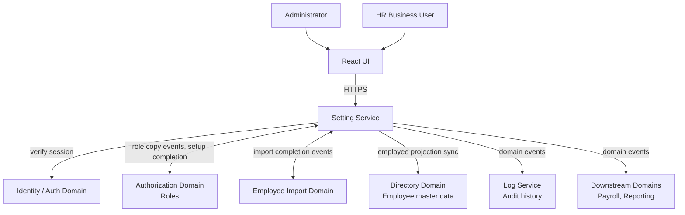

### 27.2 High-Level Setting Architecture

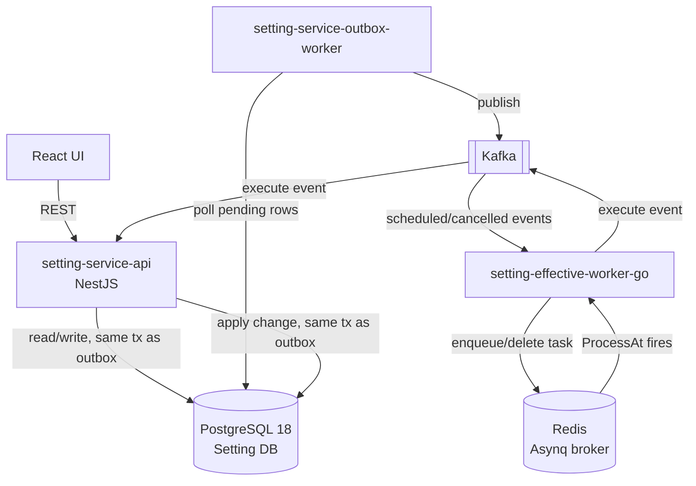

### 27.3 Data Ownership Diagram

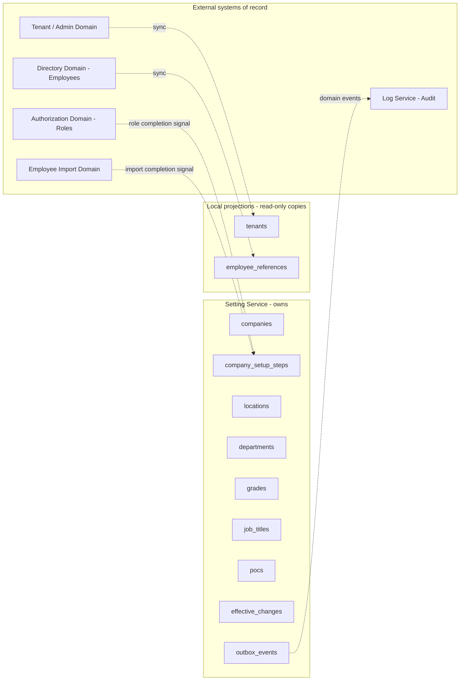

### 27.4 Trust Boundary Diagram

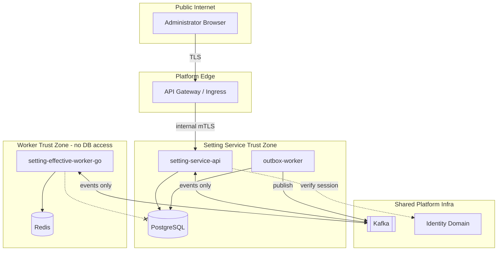

### 27.5 NestJS Internal Module Diagram

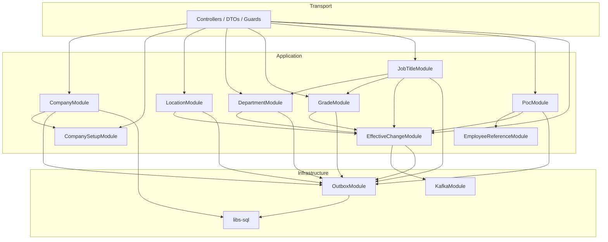

### 27.6 Effective Change Architecture

```mermaid
graph LR
    Req[Admin Request:<br/>create/update/deactivate]
    Validate[Validate effectiveAt,<br/>one-pending-per-entity]
    Persist[Persist scheduled state<br/>+ outbox row, one tx]
    Publish[Outbox publishes<br/>scheduled event]
    GoEnqueue[Go Worker enqueues<br/>Asynq task]
    Fire[Asynq fires at effectiveAt]
    Exec[Go Worker publishes<br/>execute event]
    Apply[NestJS revalidates<br/>+ applies, one tx]
    Final[Outbox publishes<br/>final domain event]

    Req --> Validate --> Persist --> Publish --> GoEnqueue --> Fire --> Exec --> Apply --> Final
```

### 27.7 Kafka + Asynq Worker Architecture

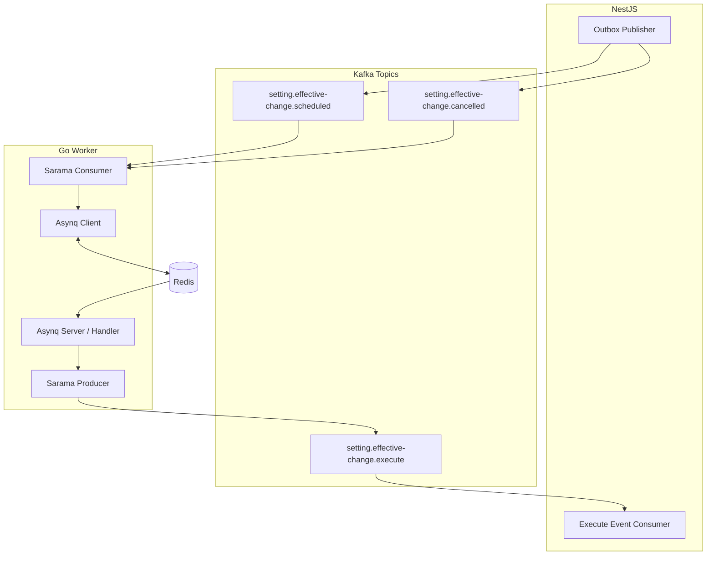

### 27.8 Company Template Copy Architecture

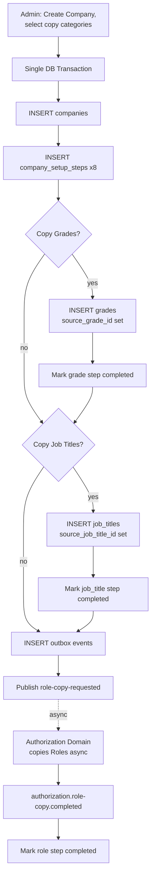

### 27.9 Frontend Architecture

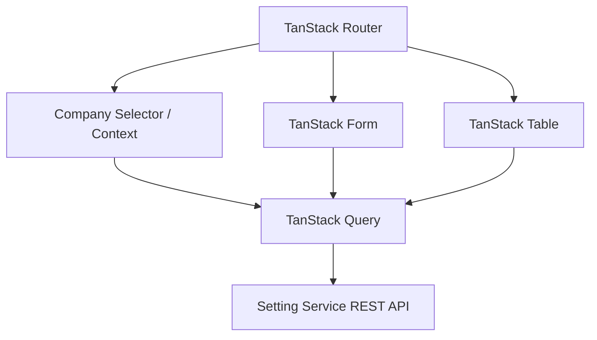

### 27.10 Kubernetes Deployment Architecture

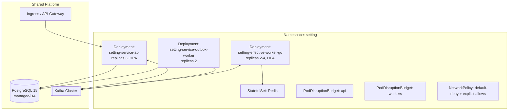

---

## 28. Sequence Diagrams

### 28.1 Tenant Provisioning → Default Company Creation

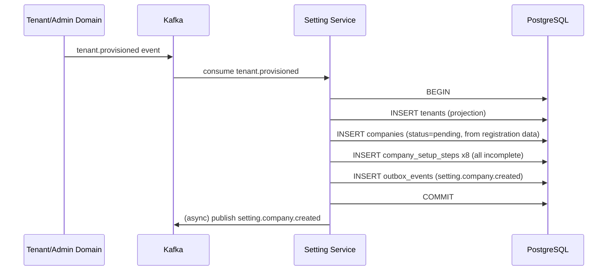

### 28.2 Create Additional Company

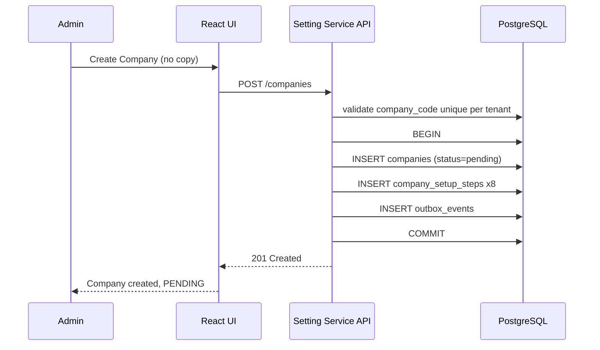

### 28.3 Create Company by Copying Template Configuration

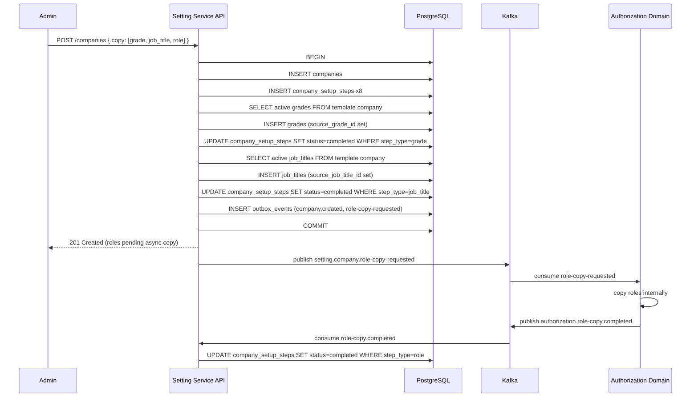

### 28.4 Create Location with Future effectiveAt

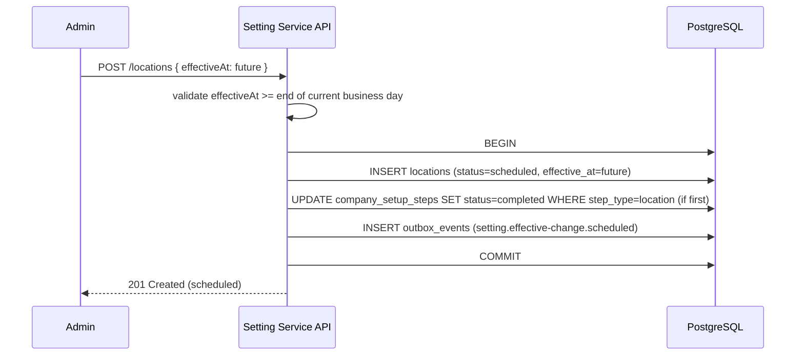

### 28.5 Update Department with Future effectiveAt

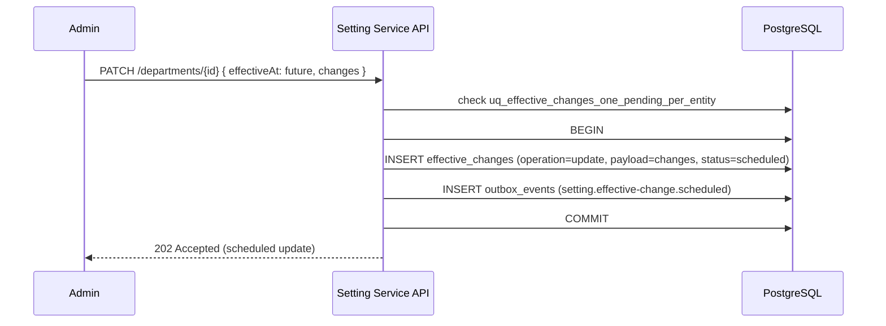

### 28.6 Deactivate Grade

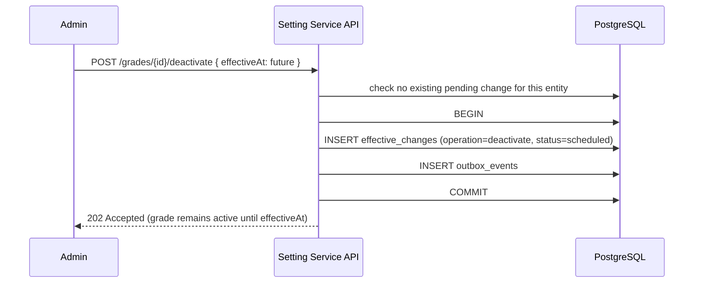

### 28.7 Scheduled Job Title Update (full lifecycle)

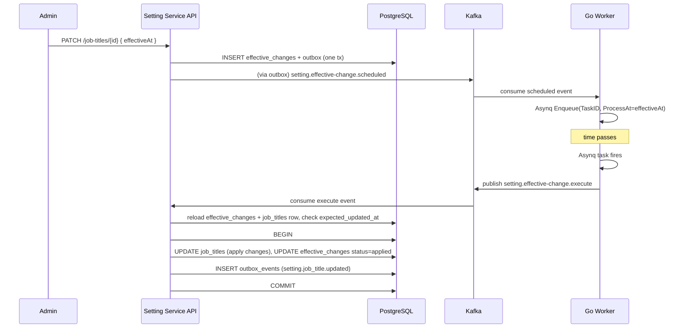

### 28.8 Effective Change Scheduling: Setting Service → Kafka → Go Worker → Asynq

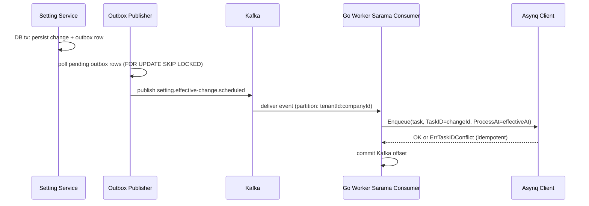

### 28.9 Effective Change Execution: Asynq → Go Worker → Kafka → Setting Service → PostgreSQL

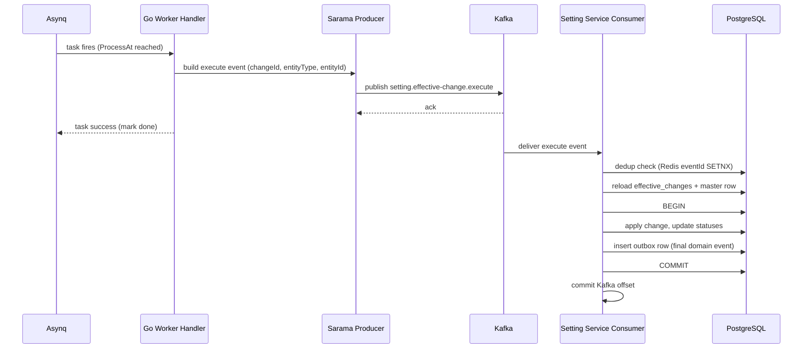

### 28.10 Cancel Scheduled Change

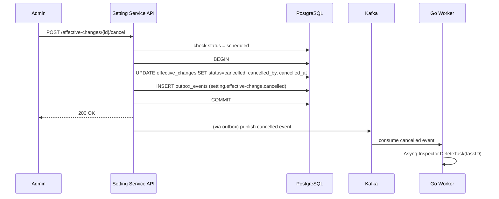

### 28.11 Conflict at Effective Execution Time

```mermaid
sequenceDiagram
    participant Kafka
    participant Consumer as Setting Service Consumer
    participant DB as PostgreSQL
    participant Admin

    Kafka->>Consumer: setting.effective-change.execute
    Consumer->>DB: reload master row, compare expected_updated_at
    alt updated_at mismatch (entity changed since scheduling)
        Consumer->>DB: UPDATE effective_changes SET status=conflict, error_message
        Consumer->>DB: INSERT outbox_events (setting.effective-change.conflict)
        Consumer-->>Admin: (via UI on next fetch) "Update failed - needs attention"
    else no mismatch
        Consumer->>DB: apply change normally
    end
```

### 28.12 Company Setup Progress

```mermaid
sequenceDiagram
    participant Admin
    participant UI as React UI
    participant API as Setting Service API
    participant DB as PostgreSQL

    Admin->>UI: open Company Setup page
    UI->>API: GET /companies/{id}/setup
    API->>DB: SELECT company_setup_steps WHERE company_id=... ORDER BY step_order
    DB-->>API: 8 rows with individual status
    API-->>UI: { steps: [...] }
    UI-->>Admin: render checklist, complete/incomplete per step
```

### 28.13 Company Activation

```mermaid
sequenceDiagram
    participant Admin
    participant API as Setting Service API
    participant DB as PostgreSQL

    Admin->>API: POST /companies/{id}/activate
    API->>DB: SELECT company_setup_steps WHERE company_id=...
    alt any step incomplete
        API-->>Admin: 409 Conflict { incompleteSteps: [...] }
    else all steps complete
        API->>DB: BEGIN
        API->>DB: UPDATE companies SET status=active, activated_at=now(), activated_by
        API->>DB: INSERT outbox_events (setting.company.activated)
        API->>DB: COMMIT
        API-->>Admin: 200 OK { status: active }
    end
```

### 28.14 PoC Assignment

```mermaid
sequenceDiagram
    participant Admin
    participant API as Setting Service API
    participant DB as PostgreSQL

    Admin->>API: POST /pocs { poc_type: HR_HEAD, employee_id, effectiveAt }
    API->>DB: validate employee_references (tenant match, active)
    API->>DB: check uq_pocs_one_active_per_type (no existing active/scheduled HR_HEAD)
    API->>DB: BEGIN
    API->>DB: INSERT pocs (status=scheduled)
    API->>DB: UPDATE company_setup_steps SET status=completed WHERE step_type=poc (if first)
    API->>DB: INSERT outbox_events
    API->>DB: COMMIT
    API-->>Admin: 201 Created
```

### 28.15 PoC Replacement with effectiveAt

```mermaid
sequenceDiagram
    participant Admin
    participant API as Setting Service API
    participant DB as PostgreSQL

    Admin->>API: PATCH /pocs/{id} { new employee_id, effectiveAt: future }
    API->>DB: check no existing pending change for this poc entity
    API->>DB: BEGIN
    API->>DB: INSERT effective_changes (entity_type=poc, operation=update, payload={employee_id})
    API->>DB: INSERT outbox_events (scheduled)
    API->>DB: COMMIT
    API-->>Admin: 202 Accepted (replacement scheduled)
    Note over API,DB: existing PoC holder remains of record until effectiveAt (same mechanism as §28.7)
```

### 28.16 Kafka Unavailable

```mermaid
sequenceDiagram
    participant Admin
    participant API as Setting Service API
    participant DB as PostgreSQL
    participant Outbox as Outbox Publisher
    participant Kafka

    Admin->>API: PATCH /locations/{id} { effectiveAt }
    API->>DB: BEGIN + INSERT effective_changes + outbox row + COMMIT
    API-->>Admin: 202 Accepted (write succeeded)
    loop retry with backoff
        Outbox->>Kafka: publish attempt
        Kafka-->>Outbox: connection error
    end
    Note over Outbox: setting_outbox_backlog_age_seconds rising, alert fires
    Kafka->>Kafka: recovers
    Outbox->>Kafka: publish succeeds
    Outbox->>DB: UPDATE outbox_events SET status=published
```

### 28.17 Redis / Asynq Unavailable

```mermaid
sequenceDiagram
    participant Kafka
    participant Worker as Go Worker
    participant Redis
    participant Recon as Reconciliation Job
    participant DB as PostgreSQL

    Kafka->>Worker: setting.effective-change.scheduled
    Worker->>Redis: Asynq Enqueue
    Redis-->>Worker: connection error
    Note over Worker: retry with backoff, offset not committed until success or DLQ
    Redis->>Redis: recovers (or is redeployed empty)
    par periodic reconciliation
        Recon->>DB: SELECT effective_changes WHERE status=scheduled AND effective_at > now()
        Recon->>Redis: Inspector.ListScheduledTasks
        Recon->>Redis: re-enqueue any missing changeId (deterministic TaskID, safe)
    end
```

### 28.18 Worker Restart / Recovery

```mermaid
sequenceDiagram
    participant K8s as Kubernetes
    participant Worker as Go Worker Pod
    participant Redis
    participant Kafka

    K8s->>Worker: SIGTERM (rolling update / node drain)
    Worker->>Worker: srv.Shutdown() - stop pulling new tasks
    Worker->>Worker: wait for in-flight handlers (bounded timeout)
    Worker->>K8s: exit 0
    K8s->>Worker: start new pod
    Worker->>Redis: reconnect, resume processing scheduled tasks
    Worker->>Kafka: rejoin consumer group, resume from last committed offset
    Note over Redis: any task whose lease expired during the gap is returned to queue and retried
```

### 28.19 Transactional Outbox Publishing

```mermaid
sequenceDiagram
    participant API as Setting Service (writer)
    participant DB as PostgreSQL
    participant Pub as Outbox Publisher (replica N)
    participant Kafka

    API->>DB: BEGIN
    API->>DB: UPDATE domain table
    API->>DB: INSERT outbox_events (status=pending)
    API->>DB: COMMIT
    loop poll cycle
        Pub->>DB: SELECT ... FOR UPDATE SKIP LOCKED LIMIT 100
        DB-->>Pub: batch of pending rows (no overlap with other replicas)
        Pub->>Kafka: publish each event (acks=all, idempotent producer)
        Kafka-->>Pub: broker ack
        Pub->>DB: UPDATE outbox_events SET status=published, published_at=now()
    end
```

---

## 29. Architecture Decision Records

### ADR-1: Setting Service owns organizational configuration
- **Context:** Multiple domains touch "organization" concepts (Payroll, Reporting, Directory), risking duplicated/conflicting ownership.
- **Decision:** Setting Service is the sole system of record for Company, Location, Department, Grade, Job Title, PoC, and Company setup state.
- **Alternatives considered:** Distribute ownership per consuming domain; embed configuration inside Directory/Employee domain.
- **Consequences:** Clear bounded context; other domains consume via events/projections, never write directly.
- **Risks:** Setting Service becomes a bottleneck for org-structure changes.
- **Mitigations:** Async event propagation (Kafka) decouples consumers from Setting Service's availability.

### ADR-2: PostgreSQL is durable source of truth
- **Context:** Multiple stores (Redis, Kafka) are involved in the architecture.
- **Decision:** PostgreSQL alone holds authoritative business state; Redis and Kafka are never queried as the final answer to "what is true."
- **Alternatives considered:** Event-sourced state reconstructed from Kafka; Redis as a fast primary store.
- **Consequences:** Simple mental model — "check the DB" always gives the right answer.
- **Risks:** None significant given PostgreSQL's maturity for this workload.
- **Mitigations:** N/A.

### ADR-3: Redis is not durable organizational storage
- **Context:** Asynq requires Redis; teams might be tempted to also cache/store business state there.
- **Decision:** Redis is scoped strictly to runtime infrastructure (§16) — Asynq broker, locks, dedup keys, optional caching.
- **Alternatives considered:** Using Redis as a write-through cache/source for setup-progress or master-data reads.
- **Consequences:** Redis data loss is an operational inconvenience (delayed scheduling, self-healed by reconciliation), never a business-data-loss event.
- **Risks:** Team drift toward using Redis as a shortcut store over time.
- **Mitigations:** Code review checklist item; this ADR as the documented guardrail.

### ADR-4: Effective-dated changes are scheduled asynchronously
- **Context:** BR-10 through BR-15 require future-dated application of changes, sometimes weeks out.
- **Decision:** Scheduling and execution are decoupled via Kafka + Asynq rather than a synchronous "wait until effectiveAt" mechanism.
- **Alternatives considered:** PostgreSQL-native `pg_cron`; a single NestJS in-process scheduler.
- **Consequences:** Horizontally scalable, survives NestJS pod restarts/redeploys without losing scheduled work.
- **Risks:** More moving parts (Kafka, Go worker, Asynq) than a simpler in-process cron.
- **Mitigations:** Reconciliation job (§5.9) and idempotency guarantees (§23) bound the operational risk.

### ADR-5: Go + Asynq handles delayed execution
- **Context:** Need a reliable, horizontally-scalable delayed-task mechanism.
- **Decision:** A dedicated Go service using Asynq (Redis-backed) handles the "wait until effectiveAt, then fire" responsibility.
- **Alternatives considered:** NestJS-native job scheduling (e.g. `@nestjs/schedule` + a DB-polling cron); a managed cloud scheduler service.
- **Consequences:** Independently scalable, language/runtime-appropriate for a lightweight I/O coordinator (§3.1).
- **Risks:** Introduces a second language/runtime into the stack.
- **Mitigations:** Worker's responsibility is intentionally minimal (§3.1) — no business logic, so the operational surface is small.

### ADR-6: Go Worker does not directly mutate Setting DB
- **Context:** Business-critical requirement in the brief.
- **Decision:** The worker never holds a PostgreSQL connection to the Setting DB; all domain mutation funnels back through NestJS Setting Service via Kafka.
- **Alternatives considered:** Grant the Go worker its own scoped DB user/connection for direct writes.
- **Consequences:** Single source of business-rule enforcement; simpler security boundary (network-level, §26.3).
- **Risks:** An extra network hop (Kafka round-trip) adds latency to execution.
- **Mitigations:** Acceptable trade-off — effective-dated changes are not latency-sensitive by nature (they were already scheduled in advance).

### ADR-7: Kafka bridges Setting Service and Go Worker
- **Context:** Need reliable, ordered, replayable communication between the two independently-deployed services.
- **Decision:** Kafka is the sole communication channel for the scheduling/execution protocol (§4, §6).
- **Alternatives considered:** Direct gRPC/HTTP calls between NestJS and Go worker.
- **Consequences:** Durable, replayable, decoupled — either side can be down without losing work.
- **Risks:** Added infrastructure complexity vs. direct RPC.
- **Mitigations:** Kafka is already shared platform infrastructure (§1), not new to the org.

### ADR-8: Setting Service remains final domain authority
- **Context:** With execution split across two services, ambiguity about "who decides" must be resolved.
- **Decision:** Every apply/reject decision (conflict detection, cancellation races, validation) is made inside a Setting Service PostgreSQL transaction — the Go worker never decides business outcomes.
- **Alternatives considered:** Split validation responsibility between services.
- **Consequences:** One place to look for "why did/didn't this change apply."
- **Risks:** None significant.
- **Mitigations:** N/A.

### ADR-9: Transactional Outbox prevents PostgreSQL/Kafka dual-write inconsistency
- **Context:** Naively writing to PostgreSQL then publishing to Kafka as two separate operations risks partial failure (write succeeds, publish fails, or vice versa).
- **Decision:** Adopt the transactional outbox pattern (§7) for every domain state change.
- **Alternatives considered:** Two-phase commit across PostgreSQL and Kafka (not natively supported by Kafka); "best effort" dual write with manual reconciliation.
- **Consequences:** Guaranteed at-least-once delivery of every domain event, with the DB write as the atomic commit point.
- **Risks:** Added outbox-publisher component and its own operational surface.
- **Mitigations:** `FOR UPDATE SKIP LOCKED` (§7.2) keeps it simple and horizontally scalable.

### ADR-10: Company template is copy-on-create, not inheritance
- **Context:** PRD explicitly requires copy semantics (BR-5 through BR-9, BC-7).
- **Decision:** Template configuration copy is a one-time, point-in-time duplication with `source_*_id` for traceability only; no live inheritance mechanism is built.
- **Alternatives considered:** A dynamic inheritance/override model (rejected by the PRD itself).
- **Consequences:** Simple, predictable Company independence post-copy.
- **Risks:** None — this directly matches business requirements.
- **Mitigations:** N/A.

### ADR-11: Master data is Company-scoped
- **Context:** Multi-company tenants require strict isolation (BR-25/26).
- **Decision:** Every Location/Department/Grade/Job Title/PoC row is scoped by `company_id`, with uniqueness constraints scoped to `(company_id, code)` rather than tenant-wide.
- **Alternatives considered:** Tenant-global master data shared/referenced across Companies.
- **Consequences:** True Company independence; no accidental cross-company coupling.
- **Risks:** Some duplication of similar configuration across sibling Companies (mitigated by template copy, ADR-10).
- **Mitigations:** N/A.

### ADR-12: Audit persistence belongs to Log Service
- **Context:** Schema explicitly states "Audit history is owned by Log Service, not Setting DB."
- **Decision:** Setting Service does not maintain its own audit-log tables; it emits domain events that Log Service (and other interested consumers) subscribe to.
- **Alternatives considered:** Setting Service-local audit tables (rejected — schema decision #2).
- **Consequences:** No duplicated audit infrastructure; single audit system across the platform.
- **Risks:** Setting Service's own outbox table could be mistaken for an audit log.
- **Mitigations:** Explicit documentation (§7) that outbox is a transient relay, pruned regularly, not a durable audit record.

### ADR-13: PoC is a direct Company assignment using `pocType`
- **Context:** Schema decision #6 — no separate responsibility-type master table.
- **Decision:** `pocs.poc_type` is a validated business string, not a foreign key to a types table.
- **Alternatives considered:** A normalized `organization_responsibility_types` table (explicitly prohibited, §30).
- **Consequences:** Simpler schema; new PoC types added via application-layer allow-list changes, not migrations.
- **Risks:** Slightly weaker DB-level type safety.
- **Mitigations:** Application-layer validation + integration test coverage of the allow-list.

### ADR-14: Job Title belongs to Department and Grade
- **Context:** Schema decision #5.
- **Decision:** `job_titles` has mandatory FKs to both `departments` and `grades`, with application-layer enforcement that both belong to the same Company as the Job Title itself (§13).
- **Alternatives considered:** Job Title independent of Department/Grade, linked only loosely.
- **Consequences:** Strong structural guarantee reflecting real organizational modeling.
- **Risks:** Cross-company reference bugs if the application-layer check is ever bypassed.
- **Mitigations:** Mandatory dedicated test coverage (§13.1); recommended future composite-FK hardening (§13.1, §31).

### ADR-15: Polyrepo with independently versioned shared libraries
- **Context:** Brief mandates polyrepo, explicitly prohibits monorepo and `workspace:*` cross-repo dependencies.
- **Decision:** `setting-service` and `setting-effective-worker-go` are separate repos; `@hros/libs-*` are independently published, semver-versioned packages consumed like any third-party dependency.
- **Alternatives considered:** Monorepo with shared workspace linking (explicitly rejected by the brief).
- **Consequences:** Fully independent release lifecycles (§2.1, §26); deliberate, PR-reviewed dependency upgrades.
- **Risks:** More upgrade overhead than a monorepo's implicit shared-version model.
- **Mitigations:** Standard semver discipline and changelogs on each `@hros/libs-*` package.

### ADR-16: React + TanStack frontend
- **Context:** Brief mandates React + TanStack Router/Query/Form/Table, explicitly no Next.js.
- **Decision:** Frontend is a separate repository using this stack, consuming Setting Service's REST API directly (no SSR/BFF layer).
- **Alternatives considered:** Next.js with server components/SSR (explicitly rejected by the brief).
- **Consequences:** Simple client-rendered SPA architecture, consistent with a pure REST backend.
- **Risks:** None significant for an internal admin-tool-style UI.
- **Mitigations:** N/A.

---

## 30. Prohibited Designs

Explicit verification that this architecture does **not** introduce any of the following:

| Prohibited design | Verification |
|---|---|
| Monorepo | §2.1, §26 — `setting-service` and `setting-effective-worker-go` are separate repos with independent pipelines |
| Cross-service database access | §3.1, §25.2, §26.3 — Go worker has no PostgreSQL credentials or network path to the Setting DB (NetworkPolicy-enforced) |
| Go Worker writing directly to Setting PostgreSQL | §3.1, ADR-6 — worker only ever publishes Kafka events |
| Audit tables inside Setting DB | §7, ADR-12 — outbox is transient relay only; audit owned by Log Service |
| Per-master-data history/version tables unless already present in schema | §4.3 — status field (`scheduled/active/inactive`) + `effective_changes` used instead, matching schema decision #1 |
| Live Company configuration inheritance | §9, ADR-10 — strictly copy-on-create with traceability-only `source_*_id` |
| Tenant-global Grade/Job Title mutable records shared across Companies | §12.1, ADR-11 — every master row is `company_id`-scoped, uniqueness scoped per-Company |
| Direct email or push delivery from Setting Service | Not present anywhere in this architecture — all downstream notification concerns are delegated via domain events to whichever service owns notifications (out of scope, §1) |
| Business logic inside controllers | §8.1 — controllers are transport-only; all rules live in application/domain layers |
| Authentication logic reimplemented by Setting Service | §17 (`@hros/libs-apis`), §25 — Setting Service consumes a shared auth guard, never re-verifies credentials itself |
| Kafka direct dual writes without outbox | §7, ADR-9 — transactional outbox is mandatory for every domain state change |
| Redis as organizational source of truth | §16, ADR-3 |
| Job Title referencing Department/Grade from another Company | §13.1 — explicit application-layer rejection, recommended future composite-FK hardening |
| Cross-tenant template copy | §9, §25.1 — template lookup query is always `tenant_id`-scoped, structurally cannot select another tenant's template |
| Distributed transactions across services | §4, §22, §24 — no 2PC anywhere; each service's local transaction is the atomic unit, cross-service coordination is via idempotent, replayable events, never a distributed transaction |

---

## 31. Architecture Gaps / Open Decisions

This architecture deliberately does **not** invent answers to business questions the PRD leaves open. Where the schema implies a technical capability (e.g., `parent_department_id`) beyond what the PRD explicitly describes, that is also flagged rather than silently assumed to be in scope.

### Confirmed Architecture
- Effective-dated changes for Location, Department, Grade, Job Title use the scheduled/active/inactive status model plus `effective_changes`, matching schema decision #7.
- Company template copy is strictly copy-on-create (BR-5–9, BC-7); no inheritance mechanism exists.
- The Go Worker never writes to the Setting DB (explicit brief requirement, §3.1).
- Job Title requires both Department and Grade from the same Company (schema FKs + §13.1 application check).
- PoC uses a direct `poc_type` string, no responsibility-type table (schema decision #6).
- Redis is runtime infrastructure only, never a source of truth (§16).
- Audit persistence is owned by Log Service, not Setting DB (schema comment #2).

### Recommended Defaults (this document's proposal, pending product/eng sign-off)
- **Department is a copy prerequisite when Job Title copy is selected** (§9.2): the UI should require the Administrator to either also copy Departments or ensure equivalent Departments already exist before enabling Job Title copy.
- **PoC assignments are not auto-copied during template copy** (§9.4, §14.4), given the high likelihood of dangling employee references in a brand-new Company; the `poc` setup step is left incomplete pending manual assignment.
- **A PoC's employee becoming inactive/terminated does not auto-deactivate the PoC assignment** (§14.3); instead, the Admin UI surfaces a warning based on the `employee_references.employment_status` projection.
- **Composite foreign keys** (`(department_id, company_id)`, `(grade_id, company_id)`) are recommended as a future hardening migration for Job Title's cross-company guarantee (§13.1), on top of the mandatory application-layer check already in place.
- **PostgreSQL Row-Level Security (RLS)** policies scoped by `tenant_id`/`company_id` are recommended as a defense-in-depth hardening layer (§25.2), not yet confirmed as adopted.

### Open Product Decisions
- Exact mandatory field list for "Company Information" step completion (FR-16 step 1) — the schema's `information_completed_at`/`information_completed_by` columns imply a discrete "mark complete" action, but the specific required fields are not enumerated in the PRD.
- Exact minimum completion criteria for Location/Department/Grade/Job Title setup steps — e.g., does one active record satisfy the step, or is a minimum count/coverage required?
- Whether Location/Department/Grade/Job Title `code` can ever be changed after creation, or is immutable once set.
- Whether one Company may have more than one Headquarters Location (current design enforces at most one via `uq_locations_one_headquarter_per_company`, per a "reasonable default" comment already present in the schema itself).
- Whether multiple PoCs of the same `poc_type` are allowed simultaneously within one Company (current design enforces at most one via `uq_pocs_one_active_per_type`, again per the schema's own "optional business rule" comment).
- Whether PoC supports primary/secondary assignment (would require relaxing the above uniqueness constraint).
- Whether all PoC changes strictly require `effectiveAt`, or whether some PoC operations may be immediate (the PRD's FR-13 effective-dating mandate is scoped to Location/Department/Grade/Job Title; PoC's FR-24–26 do not explicitly restate the effective-dating requirement, though this architecture applies the same mechanism for consistency — §14.1).
- Whether Department hierarchy (`parent_department_id`) is a required product feature or purely a schema-level future-proofing column not yet exposed in the UI/API.
- How a Job Title should behave if its referenced Department or Grade is scheduled for future deactivation (§13.2) — block creation, warn, or allow silently.
- Whether a scheduled change can be **edited** in place, or must always be cancelled and recreated (this document assumes cancel-then-recreate as the simpler default, consistent with BR-13's one-pending-change constraint, but an edit-in-place UX is not precluded by the schema).

### Open Technical Decisions
- Maximum allowed scheduling horizon for `effectiveAt` (e.g., is a 5-year-out effective date valid, or should there be a sane upper bound to prevent Asynq task/Redis bloat?).
- Which Company/Tenant timezone is authoritative for computing "end of the current business day" (BR-10) — the Company's own `timezone` column is the natural candidate, but this must be explicitly confirmed, since a Tenant's Companies could span multiple timezones/countries.
- Formal Redis/Asynq durability requirements and accepted recovery-time objective — i.e., how coarse can the reconciliation-job interval (§5.9) be before it's considered an unacceptable delay to scheduled execution visibility.
- Whether Row-Level Security (§25.2) is adopted as a hard requirement or remains a recommended-but-optional hardening layer.
- Exact retry/backoff parameter values (Asynq `MaxRetry`, Kafka consumer retry topic backoff curve, outbox publisher polling interval) — this document specifies the *mechanisms*, not final tuned constants, which should be set via load testing.

---

*End of Document*