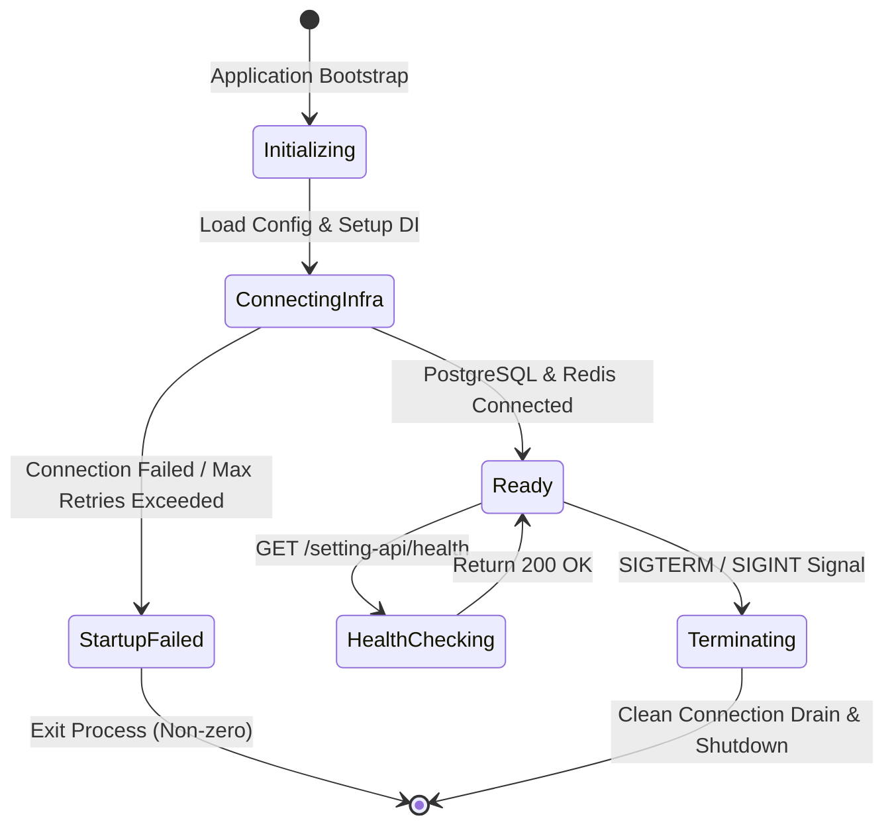

# Data Model: Init Setting Service Infrastructure

## 1. Entities & Value Objects

### 1.1 InfrastructureConfig (Value Object / Configuration Schema)
Represents the environment-driven runtime configuration for setting-svc infrastructure.

| Field | Type | Constraint | Description |
|---|---|---|---|
| `apiPrefix` | `string` | Read-only, default `'setting-api'` | Global URI prefix for all REST endpoints |
| `port` | `number` | Positive integer, default `3000` | HTTP service listening port |
| `dbHost` | `string` | Required | PostgreSQL database host |
| `dbPort` | `number` | Positive integer, default `5432` | PostgreSQL database port |
| `dbName` | `string` | Required | PostgreSQL database name |
| `redisHost` | `string` | Required | Redis cache host |
| `redisPort` | `number` | Positive integer, default `6379` | Redis cache port |

### 1.2 HealthStatus (Data Transfer Object)
Represents the system status response for the `/setting-api/health` endpoint.

| Field | Type | Description |
|---|---|---|
| `status` | `'ok' \| 'error'` | Overall operational health state |
| `timestamp` | `string` (ISO 8601) | Timestamp of health check execution |
| `info` | `Record<string, { status: string }>` | Subsystem health status (database, redis) |
| `details` | `Record<string, { status: string }>` | Comprehensive check results |

---

## 2. State & Lifecycle

