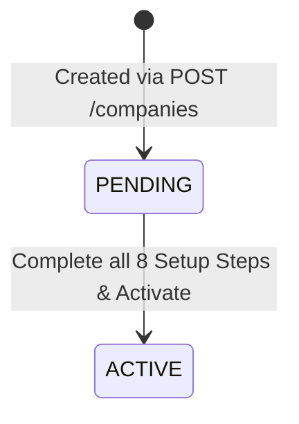
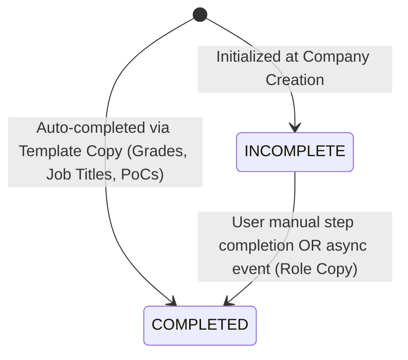

# Data Model: Additional Company Creation

## Entities & Relationships

### 1. Company (`companies`)
Represents an independent legal entity under a tenant.

```text
+----------------------------------------------------------------+
| companies                                                      |
+----------------------------------------------------------------+
| id                  UUID PK (DEFAULT gen_random_uuid())        |
| tenant_id           UUID NOT NULL (Indexed)                    |
| company_code        VARCHAR(50) NOT NULL                       |
| name                VARCHAR(255) NOT NULL                      |
| legal_name          VARCHAR(255) NULLABLE                      |
| tax_id              VARCHAR(100) NULLABLE                      |
| currency            VARCHAR(3) NOT NULL                        |
| timezone            VARCHAR(50) NOT NULL                       |
| country             VARCHAR(2) NOT NULL                        |
| status              ENUM ('PENDING', 'ACTIVE') DEFAULT PENDING |
| is_template         BOOLEAN NOT NULL DEFAULT FALSE             |
| created_at          TIMESTAMPTZ NOT NULL DEFAULT NOW()         |
| updated_at          TIMESTAMPTZ NOT NULL DEFAULT NOW()         |
| deleted_at          TIMESTAMPTZ NULLABLE                       |
| version             INT NOT NULL DEFAULT 1                     |
+----------------------------------------------------------------+
Constraints:
- UNIQUE (tenant_id, company_code) [uq_companies_tenant_code]
```

### 2. Company Setup Step (`company_setup_steps`)
Tracks 8 mandatory setup steps per company.

```text
+----------------------------------------------------------------+
| company_setup_steps                                            |
+----------------------------------------------------------------+
| id                     UUID PK                                 |
| tenant_id              UUID NOT NULL                           |
| company_id             UUID NOT NULL (FK -> companies.id)      |
| step_type              ENUM (8 values) NOT NULL                |
| status                 ENUM ('INCOMPLETE', 'COMPLETED')        |
| completed_at           TIMESTAMPTZ NULLABLE                    |
| external_reference_id  VARCHAR(255) NULLABLE                   |
| metadata               JSONB NULLABLE                          |
| created_at             TIMESTAMPTZ NOT NULL                    |
| updated_at             TIMESTAMPTZ NOT NULL                    |
+----------------------------------------------------------------+
Step Types:
1. COMPANY_INFORMATION
2. LOCATION
3. DEPARTMENT
4. GRADE
5. JOB_TITLE
6. ROLE
7. EMPLOYEE_IMPORT
8. ORGANIZATION_RESPONSIBILITY

Constraints:
- UNIQUE (company_id, step_type) [uq_company_setup_steps_step]
```

### 3. Cloned Master Data Entities
When `copyFromDefault` is enabled, records are duplicated:

- **Grade (`grades`)**: Scoped to `(tenant_id, target_company_id)` with `source_grade_id` populated for audit.
- **Job Title (`job_titles`)**: Scoped to `(tenant_id, target_company_id)` with `grade_id` referencing newly copied grade; `department_id = NULL`.
- **Point of Contact (`pocs`)**: Scoped to `(tenant_id, target_company_id)` with responsibility types cloned.

### 4. Outbox Event (`outbox_events`)
```text
+----------------------------------------------------------------+
| outbox_events                                                  |
+----------------------------------------------------------------+
| id              UUID PK                                        |
| aggregate_type  VARCHAR(100) NOT NULL                          |
| aggregate_id    VARCHAR(255) NOT NULL                          |
| event_type      VARCHAR(100) NOT NULL                          |
| payload         JSONB NOT NULL                                 |
| status          VARCHAR(50) NOT NULL DEFAULT 'PENDING'         |
| created_at      TIMESTAMPTZ NOT NULL                           |
+----------------------------------------------------------------+
```

## State Transitions

### Company Lifecycle


### Setup Step Lifecycle

