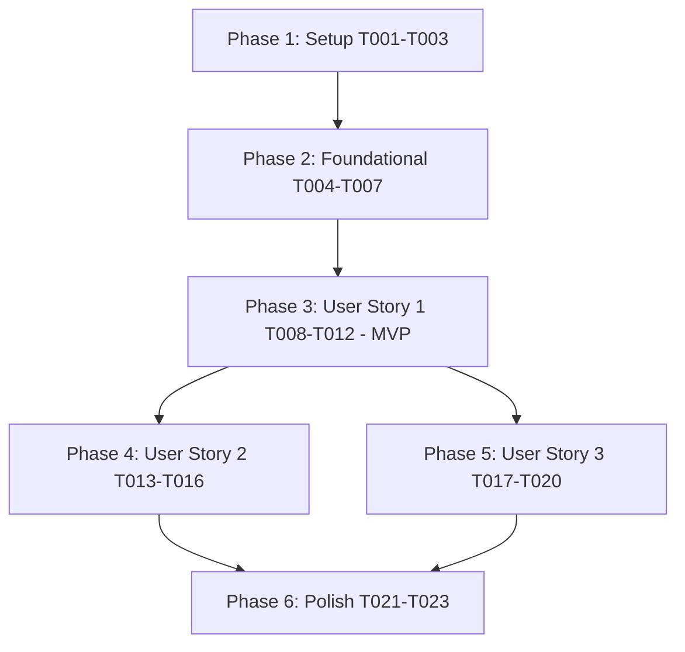

# Tasks: Additional Company Creation

**Input**: Design documents from `specs/004-additional-company-creation/`
**Prerequisites**: [plan.md](file:///home/ren0503/new-hros/admin-module/setting-svc/specs/004-additional-company-creation/plan.md), [spec.md](file:///home/ren0503/new-hros/admin-module/setting-svc/specs/004-additional-company-creation/spec.md), [research.md](file:///home/ren0503/new-hros/admin-module/setting-svc/specs/004-additional-company-creation/research.md), [data-model.md](file:///home/ren0503/new-hros/admin-module/setting-svc/specs/004-additional-company-creation/data-model.md), [contracts/api-and-events.md](file:///home/ren0503/new-hros/admin-module/setting-svc/specs/004-additional-company-creation/contracts/api-and-events.md)

## Format: `[ID] [P?] [Story] Description`
- **[P]**: Can run in parallel (different files, no dependencies)
- **[Story]**: Which user story this task belongs to (`[US1]`, `[US2]`, `[US3]`)
- Exact file paths included in all tasks

---

## Phase 1: Setup (Shared Infrastructure)

**Purpose**: Module structure & DTO definition alignment

- [x] T001 Define `CreateCompanyDto` validation rules with class-validator in `src/modules/company/dto/create-company.dto.ts`
- [x] T002 [P] Define `CompanyResponseDto` and setup step progress response DTOs in `src/modules/company/dto/company-response.dto.ts`
- [x] T003 [P] Export copyable categories enum in `src/modules/company/enums/copyable-category.enum.ts`

---

## Phase 2: Foundational (Blocking Prerequisites)

**Purpose**: Database entity mappings, uniqueness constraints, and repositories

**⚠️ CRITICAL**: Foundational tasks must be completed before user story service orchestration

- [x] T004 [BE-01] Verify and update `Company` TypeORM entity mapping with `uq_companies_tenant_code` constraint in `src/modules/company/entities/company.entity.ts`
- [x] T005 [P] Verify and update `CompanySetupStep` TypeORM entity mapping with `uq_company_setup_steps_step` in `src/modules/company/entities/company-setup-step.entity.ts`
- [x] T006 [P] Implement `CompanyRepository` methods (`existsByTenantAndCode`, `findTemplateCompany`, `createCompany`) in `src/modules/company/repositories/company.repository.ts`
- [x] T007 [P] Implement `CompanySetupStepRepository` methods (`bulkCreateSteps`, `findByCompanyAndStep`) in `src/modules/company/repositories/company-setup-step.repository.ts`

**Checkpoint**: Foundation ready - persistence layer and repository interfaces ready for service orchestration

---

## Phase 3: User Story 1 - Create Additional Company with Default Status and Empty Steps (Priority: P1) 🎯 MVP

**Goal**: Allow authenticated Tenant Administrators to create a new legal entity (Company) in `PENDING` status, seed 8 `INCOMPLETE` setup steps, and publish `company.created` domain event via Outbox.

**Independent Test**: Send `POST /companies` with `copyFromDefault: false`. Confirm HTTP 201 Created with status `PENDING`, 8 `INCOMPLETE` setup steps in database, and 1 outbox event for `company.created`.

### Implementation for User Story 1

- [x] T008 [US1] Unit test for setup step sequence seeding in `src/modules/company/services/setup-step-seeder.service.spec.ts`
- [x] T009 [US1] Implement `SetupStepSeederService` to seed exactly 8 mandatory setup steps in `src/modules/company/services/setup-step-seeder.service.ts`
- [x] T010 [US1] Unit test for company creation command handler in `src/modules/company/services/company.service.spec.ts`
- [x] T011 [US1] Implement transactional company creation and outbox event publishing (`company.created`) in `src/modules/company/services/company.service.ts`
- [x] T012 [US1] Implement `POST /companies` controller endpoint with RBAC guards and RequestContext mapping in `src/modules/company/controllers/company.controller.ts`

**Checkpoint**: User Story 1 complete — base company creation with step seeding is fully functional and testable independently.

---

## Phase 4: User Story 2 - Point-in-Time Snapshot Copy of Local Master Data (Priority: P2)

**Goal**: Allow Tenant Administrators to selectively copy master data categories (Grades, Job Titles, Organization Responsibilities) from the Default Company into the newly created Company with zero continuous inheritance and auto-mark copied setup steps as `COMPLETED`.

**Independent Test**: Send `POST /companies` with `copyFromDefault: true` and `copyCategories: ['GRADES', 'JOB_TITLES']`. Verify cloned records under the new company ID, setup steps 4 (`GRADE`) and 5 (`JOB_TITLE`) marked `COMPLETED`, and modifying source records does not alter target records.

### Implementation for User Story 2

- [x] T013 [P] [US2] Unit test for template copy service in `src/modules/company/services/template-copy.service.spec.ts`
- [x] T014 [US2] Implement `TemplateCopyService` for point-in-time deep copying of Grades, Job Titles, and PoCs in `src/modules/company/services/template-copy.service.ts`
- [x] T015 [US2] Update `SetupStepSeederService` to auto-satisfy step status to `COMPLETED` when categories are copied in `src/modules/company/services/setup-step-seeder.service.ts`
- [x] T016 [US2] Integrate `TemplateCopyService` and template company validation into `CompanyService.createCompany` transaction in `src/modules/company/services/company.service.ts`

**Checkpoint**: User Story 2 complete — snapshot master data copy and automatic setup step satisfaction are functional.

---

## Phase 5: User Story 3 - Role Configuration Copy Delegation via Asynchronous Messaging (Priority: P3)

**Goal**: Dispatch asynchronous `authorization.role-copy.requested` domain event via Outbox when `ROLES` category is selected and consume `authorization.role-copy.completed` event to transition setup step 6 (`ROLE`) to `COMPLETED`.

**Independent Test**: Send `POST /companies` with `ROLES` in `copyCategories`, verify outbox event write. Simulate consuming `authorization.role-copy.completed` Kafka event and verify step 6 transitions to `COMPLETED` idempotently.

### Implementation for User Story 3

- [x] T017 [US3] Add outbox write for `authorization.role-copy.requested` in `CompanyService.createCompany` in `src/modules/company/services/company.service.ts`
- [x] T018 [P] [US3] Unit test for Kafka role copy completed consumer in `src/modules/kafka/consumers/role-copy-completed.consumer.spec.ts`
- [x] T019 [US3] Implement `RoleCopyCompletedConsumer` with Redis deduplication and idempotent step update in `src/modules/kafka/consumers/role-copy-completed.consumer.ts`
- [x] T020 [US3] Register Kafka consumer and handlers in `src/modules/kafka/kafka.module.ts`

**Checkpoint**: User Story 3 complete — cross-service role copying and asynchronous completion tracking are fully integrated.

---

## Phase 6: Polish & Cross-Cutting Concerns

**Purpose**: Idempotency enforcement, documentation, and end-to-end test verification

- [x] T021 Implement `Idempotency-Key` header validation and duplicate request caching in `src/modules/company/controllers/company.controller.ts`
- [x] T022 [P] Export module providers and public DTOs in `src/modules/company/index.ts`
- [x] T023 Run end-to-end scenario validation tests per `specs/004-additional-company-creation/quickstart.md`

---

## Dependencies & Execution Order

### Parallel Opportunities

- **Phase 1**: T002 and T003 can be built in parallel with T001.
- **Phase 2**: T005, T006, and T007 can proceed in parallel once entity definitions are mapped.
- **Phase 4 & 5**: Once US1 is in place, User Story 2 (Local Master Data Copy) and User Story 3 (Asynchronous Role Copy) can be developed in parallel by separate engineers.
- **Unit Tests**: T008, T010, T013, T018 can be written concurrently with or ahead of service implementations.

---

## Implementation Strategy

### MVP First (User Story 1 Only)
1. Complete Phase 1 (Setup) and Phase 2 (Foundational).
2. Complete Phase 3 (User Story 1): Base company creation, step seeding, and `company.created` event emission.
3. Validate User Story 1 independently with `copyFromDefault: false`.

### Incremental Delivery
1. Add User Story 2 (Template Copy) -> Enables administrative productivity when duplicating standard organizational structures.
2. Add User Story 3 (Async Role Copy) -> Enables cross-service security role provisioning across bounded contexts.
3. Complete Phase 6 (Idempotency and quickstart verification).
