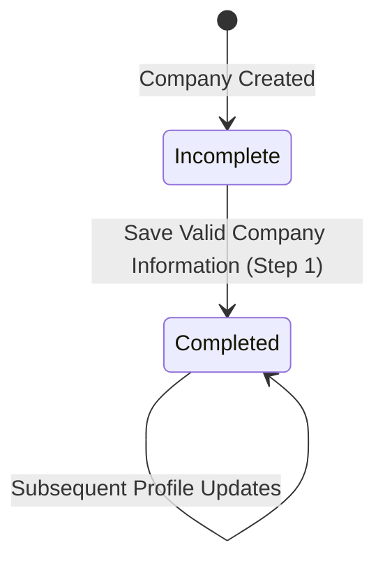

# Phase 1 Data Model: Company Information Completion

## 1. Entities & Schema Details

### 1.1 Company Entity (`companies`)

Represents the core legal entity / organizational unit under a Tenant.

| Column | Type | Nullable | Default | Description / Constraints |
|---|---|---|---|---|
| `id` | `UUID` | No | `uuid_generate_v4()` | Primary Key |
| `tenant_id` | `UUID` | No | - | Multi-tenant isolation foreign key |
| `company_code` | `VARCHAR(64)` | No | - | Unique code per tenant (`uq_companies_tenant_code`) |
| `legal_name` | `VARCHAR(255)` | No | - | Registered legal entity name |
| `display_name` | `VARCHAR(255)` | Yes | `NULL` | Business/operating brand name |
| `status` | `ENUM('pending', 'active')` | No | `'pending'` | Lifecycle status |
| `is_template` | `BOOLEAN` | No | `false` | Indicates whether company serves as Default Company template |
| `registration_number` | `VARCHAR(128)` | Yes | `NULL` | Business registration / incorporation number |
| `tax_registration_number` | `VARCHAR(128)` | Yes | `NULL` | Tax identification number / VAT / EIN |
| `country_code` | `CHAR(2)` | Yes | `NULL` | ISO-3166-1 alpha-2 country code |
| `legal_address` | `JSONB` | Yes | `NULL` | Structured address object (street, city, state, postalCode) |
| `timezone` | `VARCHAR(64)` | No | `'UTC'` | Valid IANA timezone string |
| `locale` | `VARCHAR(32)` | Yes | `NULL` | Preferred locale (e.g. `en-US`, `vi-VN`) |
| `currency_code` | `CHAR(3)` | Yes | `NULL` | ISO-4217 3-letter currency code |
| `information_completed_at` | `TIMESTAMPTZ` | Yes | `NULL` | Timestamp when Step 1 was first completed |
| `information_completed_by` | `UUID` | Yes | `NULL` | User ID who completed Step 1 |
| `activated_at` | `TIMESTAMPTZ` | Yes | `NULL` | Activation timestamp |
| `activated_by` | `UUID` | Yes | `NULL` | User ID who activated company |
| `created_by` | `UUID` | Yes | `NULL` | Audit creator user ID |
| `updated_by` | `UUID` | Yes | `NULL` | Audit modifier user ID |
| `created_at` | `TIMESTAMPTZ` | No | `NOW()` | Entity creation timestamp |
| `updated_at` | `TIMESTAMPTZ` | No | `NOW()` | Entity update timestamp |

---

### 1.2 Company Setup Step Entity (`company_setup_steps`)

Tracks the provisioning and onboarding completion state for the 8 sequential setup steps per company.

| Column | Type | Nullable | Default | Description / Constraints |
|---|---|---|---|---|
| `id` | `UUID` | No | `uuid_generate_v4()` | Primary Key |
| `tenant_id` | `UUID` | No | - | Multi-tenant isolation foreign key |
| `company_id` | `UUID` | No | - | Foreign key to `companies.id` (ON DELETE CASCADE) |
| `step_type` | `ENUM` | No | - | Step identifier (`COMPANY_INFORMATION`, `LOCATION`, etc.) |
| `step_order` | `SMALLINT` | No | `1` | Sequence order (1 for `COMPANY_INFORMATION`) |
| `status` | `ENUM` | No | `'incomplete'` | Step status: `incomplete` or `completed` |
| `completed_at` | `TIMESTAMPTZ` | Yes | `NULL` | Timestamp when step was completed |
| `completed_by` | `UUID` | Yes | `NULL` | User ID who completed the step |
| `external_reference_id` | `VARCHAR(255)` | Yes | `NULL` | Optional reference ID |
| `metadata` | `JSONB` | No | `'{}'` | Step metadata / configuration details |
| `created_at` | `TIMESTAMPTZ` | No | `NOW()` | Creation timestamp |
| `updated_at` | `TIMESTAMPTZ` | No | `NOW()` | Update timestamp |

---

### 1.3 Transactional Outbox Entity (`outbox_events`)

Persists domain events atomically within the application database transaction for reliable Kafka dispatch.

| Column | Type | Nullable | Default | Description |
|---|---|---|---|---|
| `id` | `UUID` | No | `uuid_generate_v4()` | Primary Key |
| `aggregate_type` | `VARCHAR(64)` | No | - | Entity aggregate (`COMPANY`) |
| `aggregate_id` | `UUID` | No | - | Target company ID |
| `event_type` | `VARCHAR(128)` | No | - | `company.updated` |
| `payload` | `JSONB` | No | - | Full event payload JSON |
| `status` | `ENUM` | No | `'pending'` | Dispatch status: `pending`, `published`, `failed` |
| `created_at` | `TIMESTAMPTZ` | No | `NOW()` | Creation timestamp |

---

## 2. State Transitions & Invariants

- **INV-001 (Tenant Isolation)**: All read and write operations on `companies` and `company_setup_steps` must include `tenant_id = :tenantId`.
- **INV-002 (Atomic Commit)**: Modifications to `companies`, update of `company_setup_steps` (Step 1), and insertion into `outbox_events` must execute within the exact same database transaction.
- **INV-003 (Step 1 Idempotence)**: If Setup Step 1 is already in `COMPLETED` status, modifying company profile fields preserves `status = completed` without error.
- **INV-004 (Valid Status)**: Company information updates are only permitted when company status is `PENDING` or `ACTIVE`.
