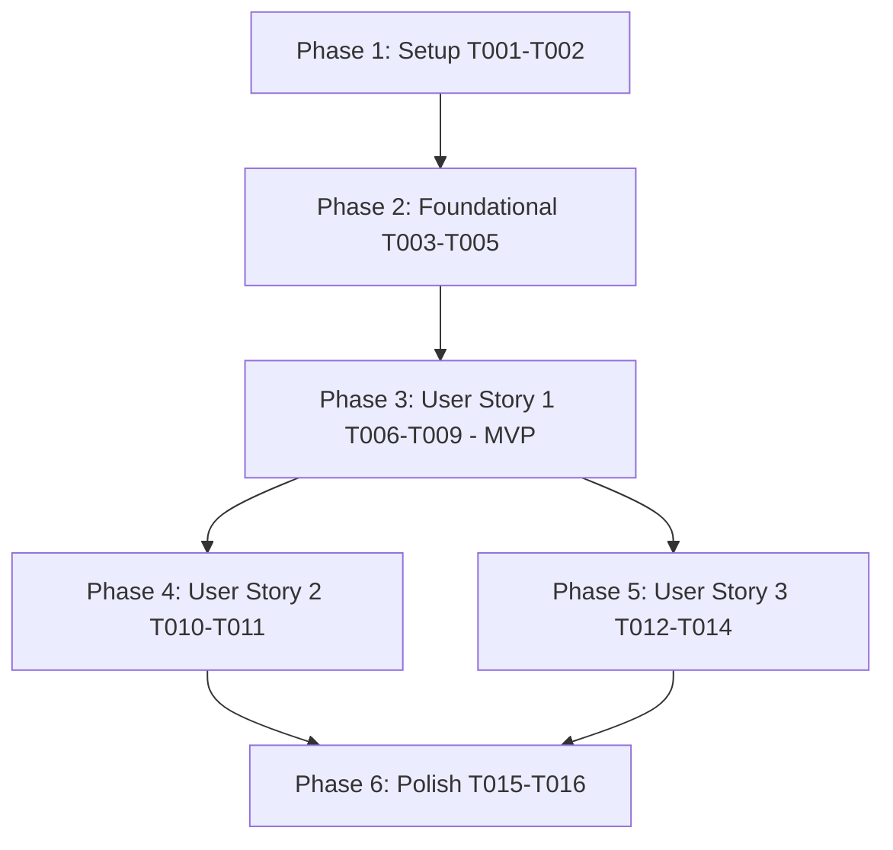

# Tasks: Company Information Completion

**Input**: Design documents from `specs/005-company-information-completion/`
**Prerequisites**: [plan.md](file:///home/ren0503/new-hros/admin-module/setting-svc/specs/005-company-information-completion/plan.md), [spec.md](file:///home/ren0503/new-hros/admin-module/setting-svc/specs/005-company-information-completion/spec.md), [research.md](file:///home/ren0503/new-hros/admin-module/setting-svc/specs/005-company-information-completion/research.md), [data-model.md](file:///home/ren0503/new-hros/admin-module/setting-svc/specs/005-company-information-completion/data-model.md), [contracts/api-and-events.md](file:///home/ren0503/new-hros/admin-module/setting-svc/specs/005-company-information-completion/contracts/api-and-events.md)

## Format: `[ID] [P?] [Story] Description`
- **[P]**: Can run in parallel (different files, no dependencies)
- **[Story]**: Which user story this task belongs to (`[US1]`, `[US2]`, `[US3]`)
- Exact file paths included in all tasks

---

## Phase 1: Setup (Shared Infrastructure & DTOs)

**Purpose**: Define request/response DTO structures and validation schemas for company information updates

- [x] T001 Define `UpdateCompanyInformationDto` validation rules with class-validator in `src/modules/company/dto/update-company-information.dto.ts`
- [x] T002 [P] Ensure `CompanyResponseDto` and setup step progress response DTOs support information completion fields in `src/modules/company/dto/company-response.dto.ts`

---

## Phase 2: Foundational (Blocking Prerequisites)

**Purpose**: Database entity mappings and repository query methods within tenant boundaries

**⚠️ CRITICAL**: Foundational tasks must be completed before user story service orchestration

- [x] T003 [BE-01] Verify and update `CompanyEntity` profile and audit completion column mappings in `src/modules/company/entities/company.entity.ts`
- [x] T004 [P] Implement `findByIdAndTenant` and `updateCompanyInfo` persistence methods in `src/modules/company/repositories/company.repository.ts`
- [x] T005 [P] Implement `markStepCompleted` step transition helper in `src/modules/company/repositories/company-setup-step.repository.ts`

**Checkpoint**: Foundation ready - persistence layer and repository interfaces ready for transactional service orchestration

---

## Phase 3: User Story 1 - Initial Completion of Company Information for Pending Company (Priority: P1) 🎯 MVP

**Goal**: Allow authenticated Tenant Administrators to review and complete profile information for a `PENDING` company, transition Setup Step 1 (`COMPANY_INFORMATION`) to `COMPLETED`, record completion audit attributes, and emit a `company.updated` domain event via Transactional Outbox.

**Independent Test**: Send `PATCH /companies/:id/information` with baseline profile data for a `PENDING` company with Step 1 in `INCOMPLETE` status. Confirm HTTP 200 OK, `information_completed_at` populated, Step 1 status updated to `COMPLETED`, and a `company.updated` outbox event written.

### Implementation for User Story 1

- [x] T006 [US1] Unit test for company information completion and step 1 transition in `src/modules/company/services/company.service.spec.ts`
- [x] T007 [US1] Implement `updateCompanyInformation` with transactional step 1 completion and outbox event write in `src/modules/company/services/company.service.ts`
- [x] T008 [US1] Unit test for `PATCH /companies/:id/information` endpoint in `src/modules/company/controllers/company.controller.spec.ts`
- [x] T009 [US1] Implement `PATCH /companies/:id/information` controller endpoint with RBAC guards in `src/modules/company/controllers/company.controller.ts`

**Checkpoint**: User Story 1 complete — initial company information completion and Step 1 progression functional and independently testable.

---

## Phase 4: User Story 2 - Profile and Legal Entity Information Updates for Active or Configured Company (Priority: P2)

**Goal**: Allow Tenant Administrators to perform ongoing updates to legal entity attributes (e.g. legal name, tax ID, timezone, address) for active or already configured companies without disrupting existing `COMPLETED` setup step states.

**Independent Test**: Send `PATCH /companies/:id/information` with partial profile updates for an `ACTIVE` company or a company with Step 1 already `COMPLETED`. Confirm HTTP 200 OK, attributes updated, and Step 1 remains `COMPLETED` without errors.

### Implementation for User Story 2

- [x] T010 [US2] Unit test for partial profile updates and completed step state preservation in `src/modules/company/services/company.service.spec.ts`
- [x] T011 [US2] Update `CompanyService.updateCompanyInformation` to handle partial updates and preserve `COMPLETED` step status in `src/modules/company/services/company.service.ts`

**Checkpoint**: User Story 2 complete — ongoing profile maintenance and non-destructive step state handling functional.

---

## Phase 5: User Story 3 - Input Validation and Multi-Tenant Isolation Enforcement (Priority: P3)

**Goal**: Enforce strict format validations (ISO-4217, ISO-3166-1 alpha-2, IANA timezone), enforce multi-tenant isolation, and support duplicate request deduplication via idempotency keys.

**Independent Test**: Send invalid format payloads and verify HTTP 400 rejection; attempt cross-tenant updates and verify HTTP 404/403 rejection; send duplicate requests with identical `Idempotency-Key` headers and verify cached response without duplicate mutations.

### Implementation for User Story 3

- [x] T012 [US3] Add strict validation decorators for ISO currency, ISO country, and IANA timezone in `src/modules/company/dto/update-company-information.dto.ts`
- [x] T013 [US3] Enforce tenant boundary scoping and verify cross-tenant access rejection in `src/modules/company/services/company.service.ts`
- [x] T014 [US3] Integrate `Idempotency-Key` header handling and Redis response caching for update endpoint in `src/modules/company/controllers/company.controller.ts`

**Checkpoint**: User Story 3 complete — validation rigor, tenant security, and idempotency guarantees verified.

---

## Phase 6: Polish & Cross-Cutting Concerns

**Purpose**: Barrel exports, API contract verification, and end-to-end scenario execution

- [x] T015 [P] Export update DTOs and service methods in `src/modules/company/index.ts`
- [x] T016 Run end-to-end verification suite per `specs/005-company-information-completion/quickstart.md`

---

## Dependencies & Execution Order

### Parallel Opportunities

- **Phase 1**: T002 can be implemented in parallel with T001.
- **Phase 2**: T004 and T005 can be implemented in parallel once entity definitions (T003) are verified.
- **Phase 4 & 5**: Once US1 (Phase 3) is established, User Story 2 (Profile updates) and User Story 3 (Validation & Idempotency) can be implemented in parallel.
- **Unit Tests**: T006, T008, T010 can be developed in parallel with or ahead of service implementations.

---

## Implementation Strategy

### MVP First (User Story 1 Only)
1. Complete Phase 1 (Setup) and Phase 2 (Foundational).
2. Complete Phase 3 (User Story 1): Profile update, Step 1 transition to `COMPLETED`, outbox event generation, and `PATCH /companies/:id/information` endpoint.
3. Validate User Story 1 independently with baseline payload.

### Incremental Delivery
1. Add User Story 2 (Active Company & Ongoing Maintenance) -> Non-destructive partial updates for active organizations.
2. Add User Story 3 (Strict Validation & Idempotency) -> Enforces ISO code standards, cross-tenant isolation, and network retry protection.
3. Complete Phase 6 (Exports & end-to-end verification).
