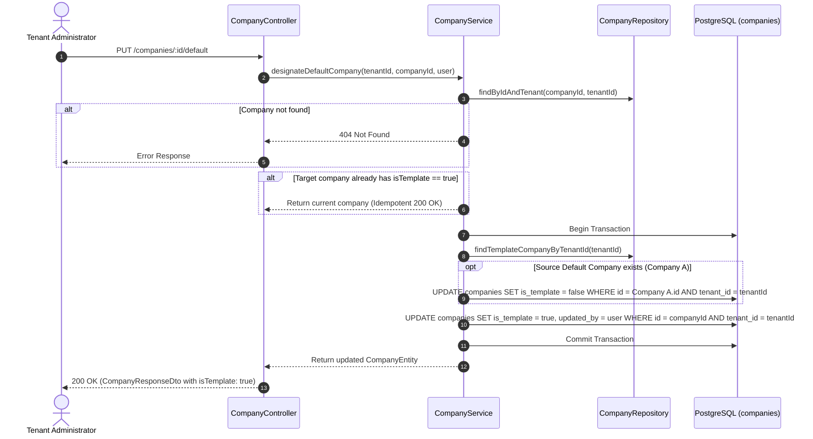

# Phase 1 Data Model: Default Company Designation

## 1. Entities & Schema Details

### 1.1 Company Entity (`companies`)

Represents the organization unit under a Tenant with the default template designation attribute.

| Column | Type | Nullable | Default | Description / Constraints |
|---|---|---|---|---|
| `id` | `UUID` | No | `uuid_generate_v4()` | Primary Key |
| `tenant_id` | `UUID` | No | - | Multi-tenant isolation foreign key |
| `company_code` | `VARCHAR(64)` | No | - | Unique code per tenant (`uq_companies_tenant_code`) |
| `legal_name` | `VARCHAR(255)` | No | - | Registered legal entity name |
| `display_name` | `VARCHAR(255)` | Yes | `NULL` | Business/operating brand name |
| `status` | `ENUM('pending', 'active')` | No | `'pending'` | Lifecycle status |
| `is_template` | `BOOLEAN` | No | `false` | **Marks company as tenant configuration template / default company** |
| `registration_number` | `VARCHAR(128)` | Yes | `NULL` | Business registration number |
| `tax_registration_number` | `VARCHAR(128)` | Yes | `NULL` | Tax identification number |
| `country_code` | `CHAR(2)` | Yes | `NULL` | ISO-3166-1 alpha-2 country code |
| `currency_code` | `CHAR(3)` | Yes | `NULL` | ISO-4217 3-letter currency code |
| `timezone` | `VARCHAR(64)` | No | `'UTC'` | Valid IANA timezone string |
| `locale` | `VARCHAR(32)` | Yes | `NULL` | Preferred locale |
| `legal_address` | `JSONB` | Yes | `NULL` | Structured address object |
| `information_completed_at` | `TIMESTAMPTZ` | Yes | `NULL` | Step 1 completion timestamp |
| `information_completed_by` | `UUID` | Yes | `NULL` | User ID who completed Step 1 |
| `activated_at` | `TIMESTAMPTZ` | Yes | `NULL` | Activation timestamp |
| `activated_by` | `UUID` | Yes | `NULL` | User ID who activated company |
| `created_by` | `UUID` | Yes | `NULL` | Creator user ID |
| `updated_by` | `UUID` | Yes | `NULL` | Modifier user ID |
| `created_at` | `TIMESTAMPTZ` | No | `NOW()` | Creation timestamp |
| `updated_at` | `TIMESTAMPTZ` | No | `NOW()` | Update timestamp |

#### Uniqueness Constraints & Indices

- `uq_companies_tenant_code`: `UNIQUE (tenant_id, company_code)`
- `uq_companies_one_template_per_tenant`: `CREATE UNIQUE INDEX IF NOT EXISTS uq_companies_one_template_per_tenant ON companies (tenant_id) WHERE is_template = true;`

---

## 2. Invariants & Designation Transfer Flow

### Invariants

- **INV-001 (Single Default Company Invariant)**: Exactly one company per tenant can have `is_template = true` at any point in time. Enforced by application transaction logic and partial database unique index `uq_companies_one_template_per_tenant`.
- **INV-002 (Tenant Scoping)**: All lookup and mutation queries MUST include `tenant_id = :tenantId`.
- **INV-003 (Atomic Transfer)**: Resetting the source default company and updating the target default company MUST commit atomically within a single database transaction.
- **INV-004 (Idempotent Designation)**: Designating an existing template company returns success without database errors or changes.
- **INV-005 (No Event Publishing)**: No outbox events or broker messages are generated for default company transfer.
