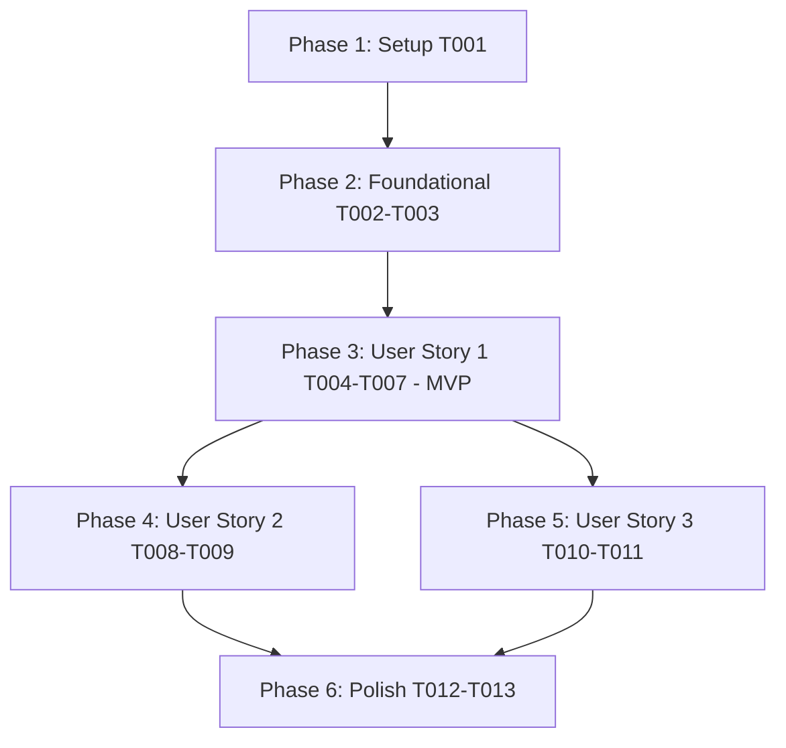

# Tasks: Default Company Designation

**Input**: Design documents from `specs/006-default-company-designation/`
**Prerequisites**: [plan.md](plan.md), [spec.md](spec.md), [research.md](research.md), [data-model.md](data-model.md), [contracts/api-and-events.md](contracts/api-and-events.md)

## Format: `[ID] [P?] [Story] Description`
- **[P]**: Can run in parallel (different files, no dependencies)
- **[Story]**: Which user story this task belongs to (`[US1]`, `[US2]`, `[US3]`)
- Exact file paths included in all tasks

---

## Phase 1: Setup & DTO Verification

**Purpose**: Verify DTO definitions and interfaces for default company designation

- [X] T001 Verify `CompanyResponseDto` includes `isTemplate: boolean` in `src/modules/company/dto/company-response.dto.ts`

---

## Phase 2: Foundational (Blocking Prerequisites)

**Purpose**: Entity mappings, partial unique constraint, and repository query methods within tenant boundaries

**⚠️ CRITICAL**: Foundational tasks must be completed before user story service orchestration

- [X] T002 Ensure `CompanyEntity` reflects `isTemplate` property and partial unique index annotation `uq_companies_one_template_per_tenant` in `src/modules/company/entities/company.entity.ts`
- [X] T003 [P] Implement `findTemplateCompanyByTenantId`, `clearTemplateDesignation`, and `setTemplateDesignation` repository methods in `src/modules/company/repositories/company.repository.ts`

**Checkpoint**: Foundation ready - persistence layer and repository interfaces ready for transactional service orchestration.

---

## Phase 3: User Story 1 - Transfer Default Company Designation to Target Company (Priority: P1) 🎯 MVP

**Goal**: Allow authenticated Tenant Administrators to transfer the Default Company designation from the source default company to a target company within the tenant, atomically resetting `is_template = false` on the old default and setting `is_template = true` on the new default, with zero event publishing.

**Independent Test**: Send `PUT /companies/:id/default` for a valid company in a tenant where another company is default. Confirm HTTP 200 OK with `isTemplate: true`, database persisted `is_template = true` for target and `is_template = false` for source, and no events published.

### Implementation for User Story 1

- [X] T004 [US1] Unit test for default company transfer in `src/modules/company/services/company.service.spec.ts`
- [X] T005 [US1] Implement `designateDefaultCompany` transfer logic in `src/modules/company/services/company.service.ts`
- [X] T006 [US1] Unit test for `PUT /companies/:id/default` endpoint in `src/modules/company/controllers/company.controller.spec.ts`
- [X] T007 [US1] Implement `PUT /companies/:id/default` (and `PATCH /companies/:id/default`) controller endpoint in `src/modules/company/controllers/company.controller.ts`

**Checkpoint**: User Story 1 complete — default company designation transfer functional and independently testable.

---

## Phase 4: User Story 2 - Atomic Conversion Guarantee & Invariant Enforcement (Priority: P2)

**Goal**: Ensure the conversion executes atomically within a single database transaction and handles idempotent re-designation without error.

**Independent Test**: Send `PUT /companies/:id/default` for the currently default company. Confirm idempotent HTTP 200 OK with `isTemplate: true` and no database errors.

### Implementation for User Story 2

- [X] T008 [US2] Unit test for idempotent re-designation and atomic transaction rollback on failure in `src/modules/company/services/company.service.spec.ts`
- [X] T009 [US2] Ensure atomic transaction execution and idempotency guard in `src/modules/company/services/company.service.ts`

**Checkpoint**: User Story 2 complete — atomic conversion and idempotency verified.

---

## Phase 5: User Story 3 - Access Control and Multi-Tenant Isolation (Priority: P3)

**Goal**: Enforce strict tenant isolation (reject cross-tenant designation with 404 Not Found), require Administrator permissions (reject non-admins with 403 Forbidden), and reject unauthenticated requests (401 Unauthorized).

**Independent Test**: Attempt cross-tenant designation and verify HTTP 404; attempt designation with non-admin token and verify HTTP 403; send unauthenticated request and verify HTTP 401.

### Implementation for User Story 3

- [X] T010 [US3] Unit test for tenant scoping, not-found handling, and authorization guards in `src/modules/company/controllers/company.controller.spec.ts`
- [X] T011 [US3] Enforce strict tenant boundary checks and Administrator permission guards on designation endpoint in `src/modules/company/controllers/company.controller.ts`

**Checkpoint**: User Story 3 complete — tenant isolation and authorization security rules verified.

---

## Phase 6: Polish & Cross-Cutting Concerns

**Purpose**: Barrel exports and end-to-end scenario execution

- [X] T012 [P] Export designation methods in `src/modules/company/index.ts`
- [X] T013 Run full verification suite per `specs/006-default-company-designation/quickstart.md`

---

## Dependencies & Execution Order

### Parallel Opportunities

- **Phase 2**: T003 can run in parallel with T002.
- **Phase 4 & 5**: Once US1 (Phase 3) is established, User Story 2 (Atomicity & Idempotency) and User Story 3 (Access Control & Isolation) can be implemented in parallel.
- **Unit Tests**: T004, T006, T008, T010 can be developed alongside or ahead of service implementations.
