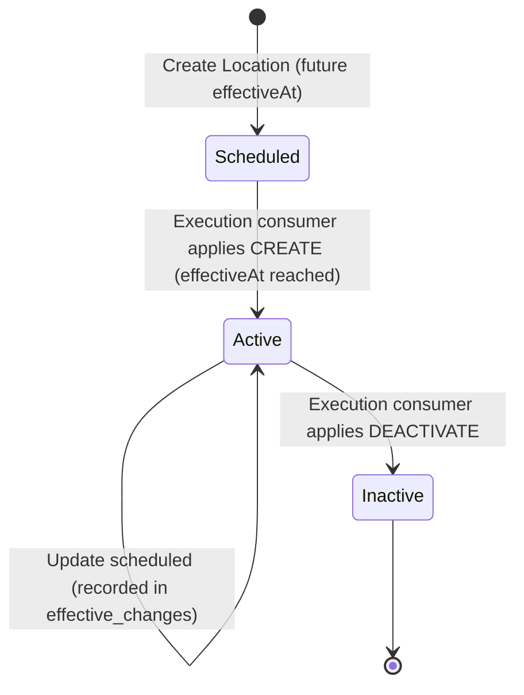
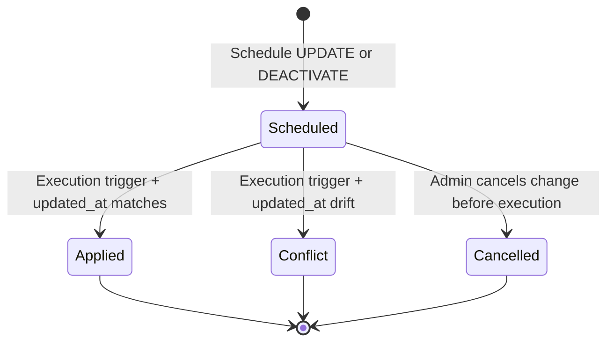

# Data Model: Location Management

## Entity Specifications

### 1. `LocationEntity` (`locations` table)

Represents a physical office, branch, or administrative facility belonging to a Company.

| Field Name | Type | Nullable | Default | Description / Constraints |
|---|---|---|---|---|
| `id` | `UUID` | No | `gen_random_uuid()` | Primary Key |
| `tenant_id` | `UUID` | No | - | Foreign Key $\to$ `tenants(id)` |
| `company_id` | `UUID` | No | - | Foreign Key $\to$ `companies(id)` |
| `code` | `VARCHAR(64)` | No | - | Unique per company: `(company_id, code)` |
| `name` | `VARCHAR(255)` | No | - | Human-readable location name |
| `description` | `TEXT` | Yes | `NULL` | Optional descriptive notes |
| `country_code` | `CHAR(2)` | Yes | `NULL` | ISO 3166-1 alpha-2 country code |
| `timezone` | `VARCHAR(64)` | Yes | `NULL` | IANA Timezone identifier (e.g. `Asia/Tokyo`) |
| `address` | `JSONB` | Yes | `NULL` | Structured address (`street`, `city`, `state`, `postalCode`) |
| `is_headquarter` | `BOOLEAN` | No | `false` | Headquarter indicator (single per company if active/scheduled) |
| `status` | `VARCHAR(32)` | No | `'scheduled'` | Enum: `scheduled`, `active`, `inactive` |
| `effective_at` | `TIMESTAMPTZ` | No | - | Future effective date timestamp |
| `created_by` | `UUID` | Yes | `NULL` | User who created the location |
| `updated_by` | `UUID` | Yes | `NULL` | User who last updated the location |
| `created_at` | `TIMESTAMPTZ` | No | `NOW()` | Audit timestamp |
| `updated_at` | `TIMESTAMPTZ` | No | `NOW()` | Optimistic concurrency & audit timestamp |

#### Database Indexes & Constraints
1. **PK**: `PRIMARY KEY (id)`
2. **UQ Code**: `CONSTRAINT uq_locations_company_code UNIQUE (company_id, code)`
3. **Partial UQ Headquarter**: `CREATE UNIQUE INDEX uq_locations_one_headquarter_per_company ON locations (company_id) WHERE is_headquarter = true AND status <> 'inactive';`
4. **Tenant/Company Filter Index**: `CREATE INDEX idx_locations_tenant_company_status ON locations (tenant_id, company_id, status);`

---

### 2. `EffectiveChangeEntity` (`effective_changes` table)

Records pending future modifications (UPDATE, DEACTIVATE) on existing active master data.

| Field Name | Type | Nullable | Default | Description / Constraints |
|---|---|---|---|---|
| `id` | `UUID` | No | `gen_random_uuid()` | Primary Key |
| `tenant_id` | `UUID` | No | - | Foreign Key $\to$ `tenants(id)` |
| `company_id` | `UUID` | No | - | Foreign Key $\to$ `companies(id)` |
| `entity_type` | `VARCHAR(64)` | No | - | Domain entity type (`location`) |
| `entity_id` | `UUID` | No | - | Target location ID |
| `operation` | `VARCHAR(32)` | No | - | Enum: `CREATE`, `UPDATE`, `DEACTIVATE` |
| `effective_at` | `TIMESTAMPTZ` | No | - | Execution timestamp |
| `status` | `VARCHAR(32)` | No | `'scheduled'` | Enum: `scheduled`, `applied`, `cancelled`, `conflict` |
| `payload` | `JSONB` | No | `'{}'` | Modified field values for UPDATE |
| `expected_updated_at` | `TIMESTAMPTZ` | Yes | `NULL` | Optimistic lock snapshot of `locations.updated_at` |
| `attempt_count` | `INT` | No | `0` | Execution attempt counter |
| `last_attempted_at` | `TIMESTAMPTZ` | Yes | `NULL` | Last execution attempt |
| `processed_at` | `TIMESTAMPTZ` | Yes | `NULL` | Final execution timestamp |
| `error_message` | `TEXT` | Yes | `NULL` | Error details if failed/conflict |
| `created_by` | `UUID` | Yes | `NULL` | Initiating user |
| `cancelled_by` | `UUID` | Yes | `NULL` | Cancelling user |
| `cancelled_at` | `TIMESTAMPTZ` | Yes | `NULL` | Cancellation timestamp |
| `created_at` | `TIMESTAMPTZ` | No | `NOW()` | Record creation timestamp |
| `updated_at` | `TIMESTAMPTZ` | No | `NOW()` | Record update timestamp |

#### Database Indexes & Constraints
1. **Single Pending Change Constraint**: `CREATE UNIQUE INDEX uq_effective_changes_one_pending_per_entity ON effective_changes (entity_type, entity_id) WHERE status = 'scheduled';`
2. **Lookup Index**: `CREATE INDEX idx_effective_changes_status_effective_at ON effective_changes (status, effective_at);`

---

## State Lifecycle & Transitions

### Effective Change Lifecycle

