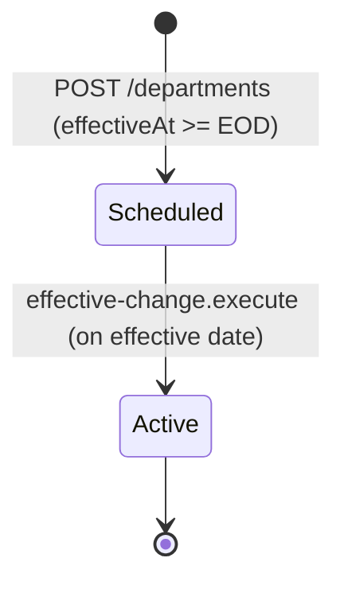
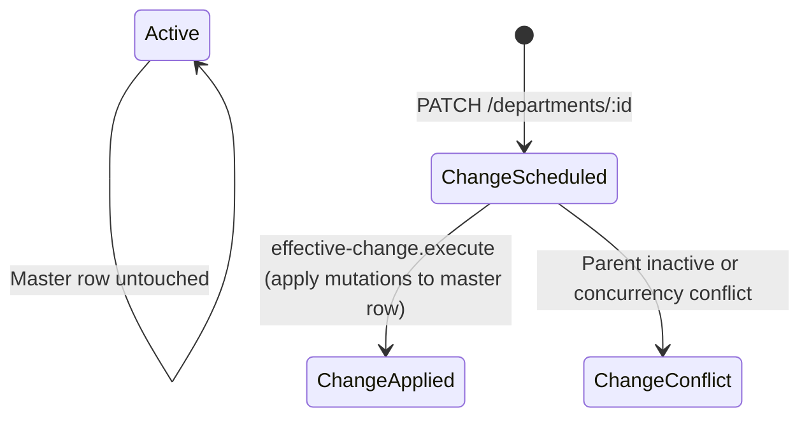
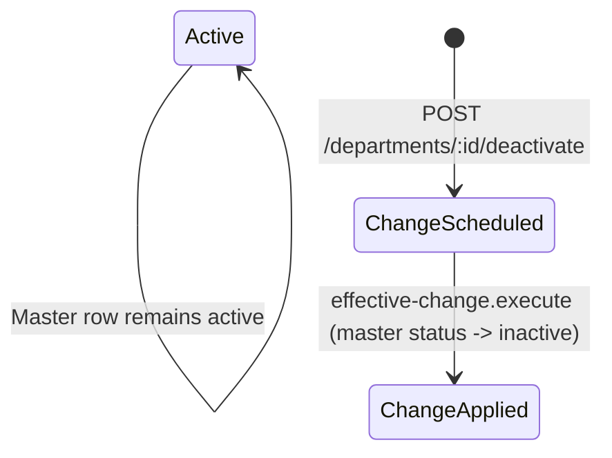

# Data Model: Department Management

**Feature**: Department Management  
**Branch**: `009-department-management`  
**Date**: 2026-08-16  

---

## 1. Entities & Schema Definitions

### 1.1 Department Entity (`departments` Table)

Represents a functional organizational unit scoped strictly to a single company within a tenant.

```sql
CREATE TABLE departments (
    id UUID PRIMARY KEY DEFAULT gen_random_uuid(),
    tenant_id UUID NOT NULL REFERENCES tenants(id) ON DELETE RESTRICT,
    company_id UUID NOT NULL REFERENCES companies(id) ON DELETE CASCADE,
    code VARCHAR(64) NOT NULL,
    name VARCHAR(255) NOT NULL,
    description TEXT,
    parent_department_id UUID REFERENCES departments(id) ON DELETE RESTRICT,
    status VARCHAR(32) NOT NULL DEFAULT 'scheduled', -- 'scheduled', 'active', 'inactive'
    effective_at TIMESTAMPTZ NOT NULL,
    created_by UUID,
    updated_by UUID,
    created_at TIMESTAMPTZ NOT NULL DEFAULT NOW(),
    updated_at TIMESTAMPTZ NOT NULL DEFAULT NOW(),

    CONSTRAINT uq_departments_company_code UNIQUE (company_id, code),
    CONSTRAINT ck_departments_not_self_parent CHECK (parent_department_id IS NULL OR parent_department_id <> id)
);

CREATE INDEX idx_departments_tenant_company ON departments(tenant_id, company_id);
CREATE INDEX idx_departments_status ON departments(tenant_id, company_id, status);
CREATE INDEX idx_departments_parent ON departments(parent_department_id);
```

#### TypeScript Entity Mapping (`department.entity.ts`)

```typescript
@Entity(TableName.DEPARTMENTS)
@Unique('uq_departments_company_code', ['companyId', 'code'])
@Check('ck_departments_not_self_parent', `parent_department_id IS NULL OR parent_department_id <> id`)
export class DepartmentEntity {
  @PrimaryGeneratedColumn('uuid')
  id: string;

  @Column({ type: 'uuid', name: 'tenant_id' })
  tenantId: string;

  @ManyToOne(() => TenantEntity, { onDelete: 'RESTRICT' })
  @JoinColumn({ name: 'tenant_id' })
  tenant: TenantEntity;

  @Column({ type: 'uuid', name: 'company_id' })
  companyId: string;

  @ManyToOne(() => CompanyEntity, { onDelete: 'CASCADE' })
  @JoinColumn({ name: 'company_id' })
  company: CompanyEntity;

  @Column({ type: 'varchar', length: 64 })
  code: string;

  @Column({ type: 'varchar', length: 255 })
  name: string;

  @Column({ type: 'text', nullable: true })
  description?: string;

  @Column({ type: 'uuid', nullable: true, name: 'parent_department_id' })
  parentDepartmentId?: string;

  @ManyToOne(() => DepartmentEntity, (dept) => dept.children, { onDelete: 'RESTRICT' })
  @JoinColumn({ name: 'parent_department_id' })
  parentDepartment?: DepartmentEntity;

  @OneToMany(() => DepartmentEntity, (dept) => dept.parentDepartment)
  children: DepartmentEntity[];

  @Column({ type: 'enum', enum: MasterDataStatus, default: MasterDataStatus.SCHEDULED })
  status: MasterDataStatus;

  @Column({ type: 'timestamptz', name: 'effective_at' })
  effectiveAt: Date;

  @Column({ type: 'uuid', nullable: true, name: 'created_by' })
  createdBy?: string;

  @Column({ type: 'uuid', nullable: true, name: 'updated_by' })
  updatedBy?: string;

  @CreateDateColumn({ type: 'timestamptz', name: 'created_at' })
  createdAt: Date;

  @UpdateDateColumn({ type: 'timestamptz', name: 'updated_at' })
  updatedAt: Date;
}
```

---

### 1.2 Effective Change Entity (`effective_changes` Table)

Stores scheduled mutations (updates or deactivations) awaiting future execution.

```sql
-- Existing table schema referenced:
-- id UUID PK, tenant_id UUID, company_id UUID, entity_type VARCHAR(64), entity_id UUID,
-- change_type VARCHAR(32) ('UPDATE', 'DEACTIVATE'), payload JSONB,
-- status VARCHAR(32) ('scheduled', 'applied', 'failed', 'conflict', 'cancelled'),
-- effective_at TIMESTAMPTZ, processed_at TIMESTAMPTZ, error_message TEXT,
-- created_by UUID, created_at TIMESTAMPTZ, updated_at TIMESTAMPTZ
```

---

## 2. State Lifecycle Diagrams

### 2.1 Creation Lifecycle



### 2.2 Update Lifecycle



### 2.3 Deactivation Lifecycle



---

## 3. Hierarchy Traversal & Anti-Cycle Model

```
Ancestor Chain Check on Target Department (T) updating parent to (P):

  P.parent -> G1 -> G2 -> ... -> Root

  IF T in [P, G1, G2, ..., Root] -> REJECT (Circular Hierarchy Detected)
  IF Depth > 50 -> REJECT (Max Depth Exceeded)
  OTHERWISE -> VALID
```
