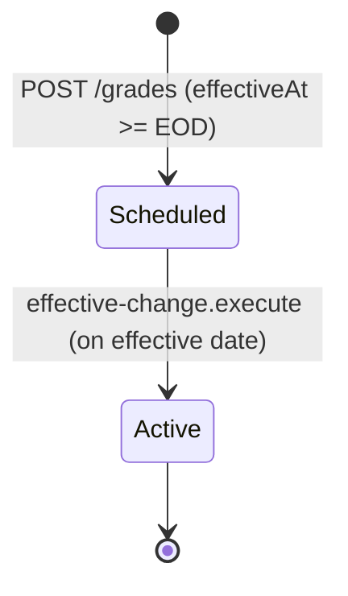
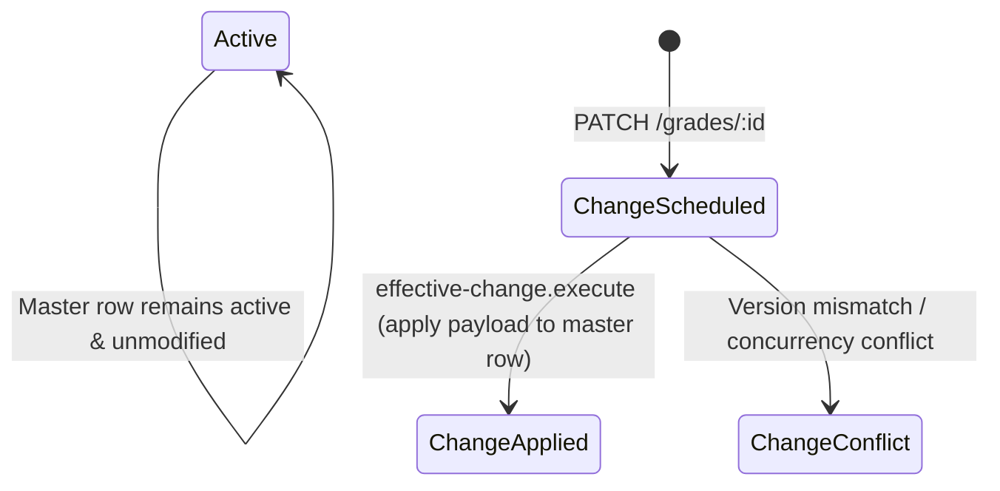
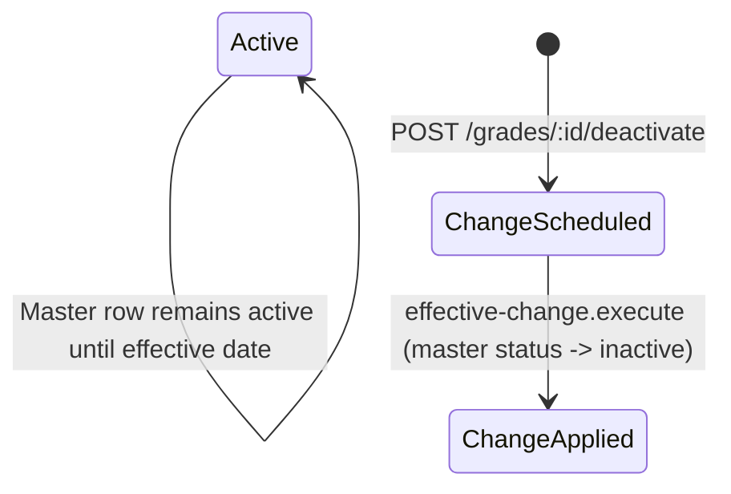

# Data Model: Grade Management

**Feature**: Grade Management  
**Branch**: `010-grade-management`  
**Date**: 2026-08-16  

---

## 1. Entities & Schema Definitions

### 1.1 Grade Entity (`grades` Table)

Represents a compensation level or grading band scoped strictly to a single company within a tenant.

```sql
CREATE TABLE IF NOT EXISTS grades (
    id              uuid PRIMARY KEY DEFAULT uuidv7(),
    tenant_id       uuid NOT NULL REFERENCES tenants(id) ON DELETE RESTRICT,
    company_id      uuid NOT NULL REFERENCES companies(id) ON DELETE CASCADE,

    code            varchar(64) NOT NULL,
    name            varchar(255) NOT NULL,
    description     text,
    rank_order      integer,

    -- Traceability for data copied from a template company (informational only)
    source_grade_id uuid REFERENCES grades(id) ON DELETE SET NULL,

    status          master_data_status NOT NULL DEFAULT 'scheduled', -- 'scheduled', 'active', 'inactive'
    effective_at    timestamptz NOT NULL,

    created_by      uuid,
    updated_by      uuid,
    created_at      timestamptz NOT NULL DEFAULT now(),
    updated_at      timestamptz NOT NULL DEFAULT now(),

    CONSTRAINT uq_grades_company_code UNIQUE (company_id, code)
);

CREATE INDEX IF NOT EXISTS idx_grades_company_status
    ON grades (company_id, status);
CREATE INDEX IF NOT EXISTS idx_grades_tenant_company
    ON grades (tenant_id, company_id);
```

#### TypeScript Entity Mapping (`grade.entity.ts`)

```typescript
@Entity(TableName.GRADES)
@Unique('uq_grades_company_code', ['companyId', 'code'])
export class GradeEntity {
  @PrimaryGeneratedColumn('uuid')
  id: string;

  @Column({ type: 'uuid', name: 'tenant_id' })
  tenantId: string;

  @ManyToOne(() => TenantEntity, { onDelete: 'RESTRICT' })
  @JoinColumn({ name: 'tenant_id' })
  tenant: TenantEntity;

  @Column({ type: 'uuid', name: 'company_id' })
  companyId: string;

  @ManyToOne(() => CompanyEntity, { onDelete: 'CASCADE' })
  @JoinColumn({ name: 'company_id' })
  company: CompanyEntity;

  @Column({ type: 'varchar', length: 64 })
  code: string;

  @Column({ type: 'varchar', length: 255 })
  name: string;

  @Column({ type: 'text', nullable: true })
  description?: string;

  @Column({ type: 'integer', nullable: true, name: 'rank_order' })
  rankOrder?: number;

  @Column({ type: 'uuid', nullable: true, name: 'source_grade_id' })
  sourceGradeId?: string;

  @ManyToOne(() => GradeEntity, { onDelete: 'SET NULL' })
  @JoinColumn({ name: 'source_grade_id' })
  sourceGrade?: GradeEntity;

  @Column({ type: 'enum', enum: MasterDataStatus, default: MasterDataStatus.SCHEDULED })
  status: MasterDataStatus;

  @Column({ type: 'timestamptz', name: 'effective_at' })
  effectiveAt: Date;

  @Column({ type: 'uuid', nullable: true, name: 'created_by' })
  createdBy?: string;

  @Column({ type: 'uuid', nullable: true, name: 'updated_by' })
  updatedBy?: string;

  @CreateDateColumn({ type: 'timestamptz', name: 'created_at' })
  createdAt: Date;

  @UpdateDateColumn({ type: 'timestamptz', name: 'updated_at' })
  updatedAt: Date;
}
```

---

### 1.2 Effective Change Entity (`effective_changes` Table)

Stores scheduled mutations (updates or deactivations) awaiting future execution.

```sql
-- Schema Reference:
-- id UUID PK, tenant_id UUID, company_id UUID, entity_type VARCHAR(64) ('GRADE'),
-- entity_id UUID, change_type VARCHAR(32) ('UPDATE', 'DEACTIVATE'),
-- payload JSONB, expected_updated_at TIMESTAMPTZ, status VARCHAR(32) ('scheduled', 'applied', 'failed', 'conflict', 'cancelled'),
-- effective_at TIMESTAMPTZ, processed_at TIMESTAMPTZ, error_message TEXT,
-- created_by UUID, created_at TIMESTAMPTZ, updated_at TIMESTAMPTZ
```

---

## 2. State Lifecycle & Transitions

### 2.1 Creation Lifecycle



### 2.2 Update Lifecycle



### 2.3 Deactivation Lifecycle



---

## 3. Data Integrity & Validation Rules

1. **Uniqueness**: `(company_id, code)` must be unique across all records in `grades` table.
2. **Effective Date**: `effectiveAt` must be greater than or equal to the end of the current business day in the company's timezone (or UTC).
3. **Single Pending Change**: At most one record in `effective_changes` with `status = 'scheduled'` can exist for `(company_id, 'GRADE', entity_id)`.
4. **Soft State Transition**: No physical `DELETE` queries on `grades`; inactive records retain full historical representation.
