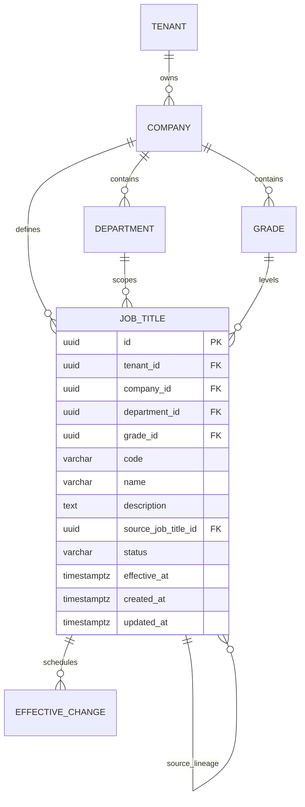
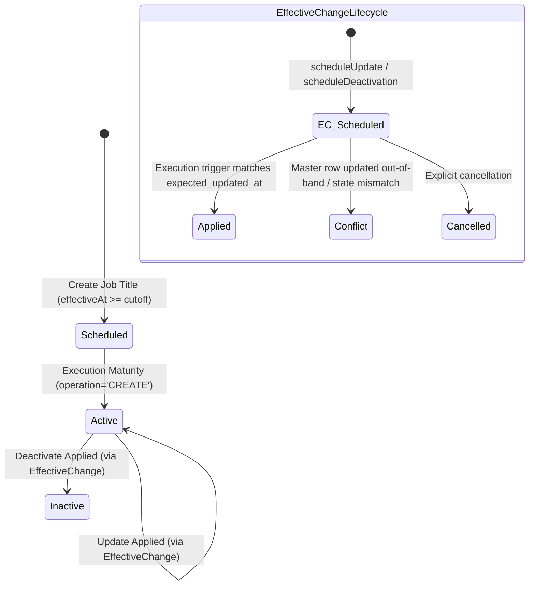

# Data Model: Job Title Management

## Schema & Tables

### 1. `job_titles` Table

Stores master job title records scoped per company.

```sql
CREATE TABLE IF NOT EXISTS job_titles (
    id UUID PRIMARY KEY DEFAULT gen_random_uuid(),
    tenant_id UUID NOT NULL REFERENCES tenants(id) ON DELETE RESTRICT,
    company_id UUID NOT NULL REFERENCES companies(id) ON DELETE CASCADE,
    department_id UUID NOT NULL REFERENCES departments(id) ON DELETE RESTRICT,
    grade_id UUID NOT NULL REFERENCES grades(id) ON DELETE RESTRICT,
    code VARCHAR(64) NOT NULL,
    name VARCHAR(255) NOT NULL,
    description TEXT NULL,
    source_job_title_id UUID NULL REFERENCES job_titles(id) ON DELETE SET NULL,
    status VARCHAR(32) NOT NULL DEFAULT 'scheduled', -- 'scheduled' | 'active' | 'inactive'
    effective_at TIMESTAMPTZ NOT NULL,
    created_by UUID NULL,
    updated_by UUID NULL,
    created_at TIMESTAMPTZ NOT NULL DEFAULT NOW(),
    updated_at TIMESTAMPTZ NOT NULL DEFAULT NOW(),
    CONSTRAINT uq_job_titles_company_code UNIQUE (company_id, code)
);

CREATE INDEX IF NOT EXISTS idx_job_titles_tenant_company_status ON job_titles(tenant_id, company_id, status);
CREATE INDEX IF NOT EXISTS idx_job_titles_department ON job_titles(department_id);
CREATE INDEX IF NOT EXISTS idx_job_titles_grade ON job_titles(grade_id);
```

### 2. `effective_changes` Table (Shared Master Change Entity)

Stores scheduled mutations (updates and deactivations) awaiting future execution.

```sql
-- Existing table schema referenced:
-- entity_type = 'job_title'
-- entity_id = job_titles.id
-- operation = 'UPDATE' | 'DEACTIVATE'
-- status = 'scheduled' | 'applied' | 'failed' | 'conflict' | 'cancelled'
-- expected_updated_at = timestamptz (optimistic concurrency lock against job_titles.updated_at)
```

### 3. `company_setup_steps` Table (Shared Onboarding Readiness)

```sql
-- step_type = 'JOB_TITLE' (Step 5)
-- status = 'PENDING' | 'COMPLETED'
```

---

## Entity Relationships & Domain Invariants



### Invariants

1. **Same-Company Invariant (INV-006, ADR-14)**:
   - `job_title.company_id == department.company_id == grade.company_id`
   - `job_title.tenant_id == department.tenant_id == grade.tenant_id`
2. **Company Code Uniqueness (BR-SET-F008-01)**:
   - Composite unique constraint on `(company_id, code)` across all statuses.
3. **Single Pending Change Constraint (INV-007, BR-13)**:
   - For any `job_title.id`, there can be at most one `effective_changes` record with `status = 'scheduled'`.
4. **Mandatory Future Effective Date (BR-10, BR-SET-F010-01)**:
   - `effective_at` $\ge$ end of current business day in company timezone.
5. **No Hard Deletes (Principle V, BC-5)**:
   - Job Titles and effective changes are never hard-deleted; retirement transitions `status` to `inactive`.

---

## State Machine Transitions


