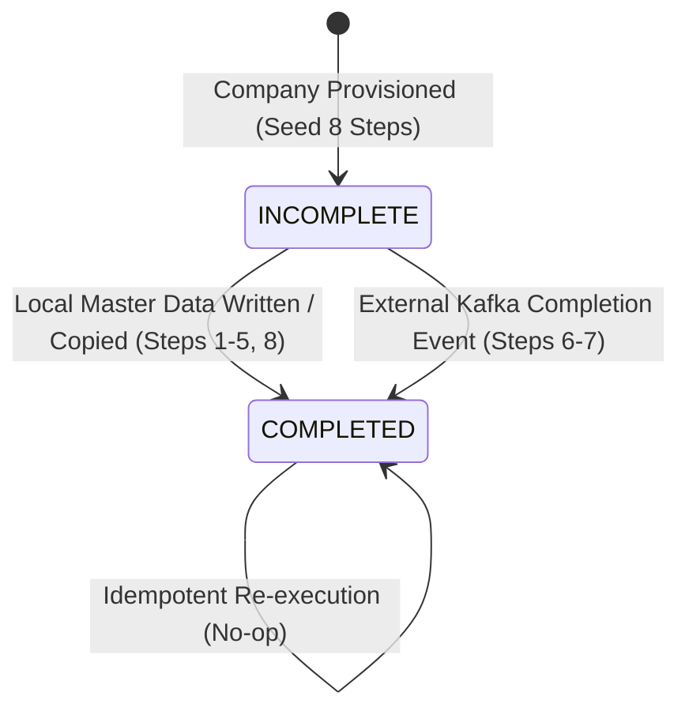

# Data Model: Company Setup Steps Tracking

## 1. Entity: `CompanySetupStepEntity` (`company_setup_steps`)

Represents the state of each mandatory setup step for a Company.

### Table Schema & Entity Mapping

| Column | Type | Nullable | Default | Description |
| :--- | :--- | :--- | :--- | :--- |
| `id` | `uuid` | No | `uuid_generate_v4()` | Primary Key |
| `tenant_id` | `uuid` | No | - | Foreign key to `tenants(id)` |
| `company_id` | `uuid` | No | - | Foreign key to `companies(id)` with ON DELETE CASCADE |
| `step_type` | `enum (setup_step_type)` | No | - | Step identifier (`COMPANY_INFORMATION`, `LOCATION`, `DEPARTMENT`, `GRADE`, `JOB_TITLE`, `ROLE`, `EMPLOYEE_IMPORT`, `POC`) |
| `step_order` | `smallint` | No | - | Sequence number (1 to 8) |
| `status` | `enum (setup_step_status)` | No | `'incomplete'` | Completion status (`incomplete`, `completed`) |
| `completed_at` | `timestamptz` | Yes | `NULL` | Timestamp when step was marked completed |
| `completed_by` | `uuid` | Yes | `NULL` | User UUID who completed the step |
| `external_reference_id` | `varchar(255)` | Yes | `NULL` | External batch or job reference ID (e.g. role copy batch or employee import batch) |
| `metadata` | `jsonb` | No | `'{}'` | Contextual JSON attributes (e.g. `{ "completedViaCopy": true }`) |
| `created_at` | `timestamptz` | No | `NOW()` | Record creation timestamp |
| `updated_at` | `timestamptz` | No | `NOW()` | Record update timestamp |

### Constraints & Indices

- **Primary Key**: `pk_company_setup_steps` on `id`.
- **Unique Constraint**: `uq_company_setup_step` on `(company_id, step_type)`.
- **Unique Constraint**: `uq_company_setup_order` on `(company_id, step_order)`.
- **Check Constraint**: `ck_company_setup_order` (`step_order BETWEEN 1 AND 8`).
- **Check Constraint**: `ck_company_setup_completion` (`(status = 'incomplete' AND completed_at IS NULL) OR (status = 'completed' AND completed_at IS NOT NULL)`).
- **Index**: `idx_company_setup_steps_tenant_company` on `(tenant_id, company_id)`.

---

## 2. Enums

### `SetupStepType`
```typescript
export enum SetupStepType {
  COMPANY_INFORMATION = 'company_information',
  LOCATION = 'location',
  DEPARTMENT = 'department',
  GRADE = 'grade',
  JOB_TITLE = 'job_title',
  ROLE = 'role',
  EMPLOYEE_IMPORT = 'employee_import',
  POC = 'poc', // Maps to Organization Responsibility / Point of Contact
}
```

### `SetupStepStatus`
```typescript
export enum SetupStepStatus {
  INCOMPLETE = 'incomplete',
  COMPLETED = 'completed',
}
```

---

## 3. Sequence & Step Order Mapping

| Step Order | Step Type Enum | Description | Completion Trigger Domain |
| :--- | :--- | :--- | :--- |
| **1** | `COMPANY_INFORMATION` | Basic company profile and legal details | Local (`CompanyService.updateCompanyInformation`) |
| **2** | `LOCATION` | Work locations & facilities | Local (`LocationService.create` / template copy) |
| **3** | `DEPARTMENT` | Organizational hierarchy / departments | Local (`DepartmentService.create` / template copy) |
| **4** | `GRADE` | Compensation / job leveling grades | Local (`GradeService.create` / template copy) |
| **5** | `JOB_TITLE` | Positions / job titles | Local (`JobTitleService.create` / template copy) |
| **6** | `ROLE` | Security permissions & user roles | External Kafka event (`authorization.role-copy.completed`) |
| **7** | `EMPLOYEE_IMPORT` | Initial workforce batch import | External Kafka event (`employee-import.batch.completed`) |
| **8** | `POC` | Point of Contact / Organization Responsibility | Local (`PocService.create` / template copy) |

---

## 4. State Transitions


