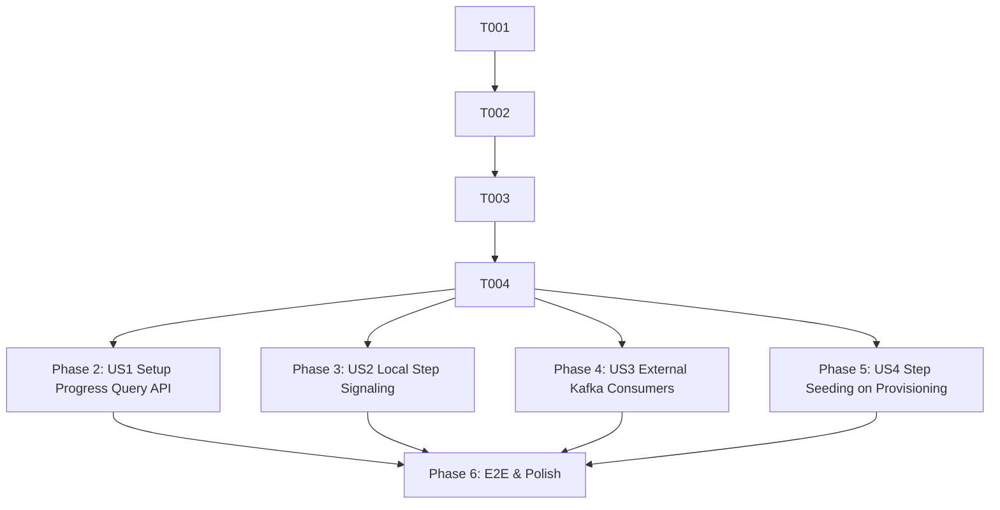

# Tasks: Mandatory Company Setup Sequence & Progress Tracking

**Input**: Design documents from `/specs/012-company-setup-tracking/` (`spec.md`, `plan.md`, `research.md`, `data-model.md`, `contracts/setup-progress.contract.md`, `quickstart.md`).

**Prerequisites**: `plan.md`, `spec.md`, `data-model.md`, `contracts/setup-progress.contract.md`.

**Organization**: Tasks are grouped by user story (and foundational infrastructure) to enable independent implementation and testing.

## Format: `[ID] [P?] [Story] Description`

- **[P]**: Can run in parallel (different files, no dependencies)
- **[Story]**: Which user story this task belongs to (e.g. US1, US2, US3, US4)
- Exact file paths included in each task description

---

## Phase 1: Setup & Foundational (Persistence & Data Access)

**Purpose**: Core persistence entity, repository methods, and enums required across all user stories.

- [x] T001 [P] Verify and update `SetupStepType` and `SetupStepStatus` enums in `src/enums/index.ts` and `src/modules/company/enums/mandatory-setup-steps.enum.ts`
- [x] T002 [P] Verify `CompanySetupStepEntity` definitions, unique constraints `(company_id, step_type)` / `(company_id, step_order)`, check constraints, and relations in `src/modules/company/entities/company-setup-step.entity.ts`
- [x] T003 Extend `CompanySetupStepRepository` in `src/modules/company/repositories/company-setup-step.repository.ts` with scoped batch queries, step lookups, and transactional `markStepCompleted` method supporting metadata and `externalReferenceId`
- [x] T004 Write unit tests for `CompanySetupStepRepository` in `src/modules/company/repositories/company-setup-step.repository.spec.ts`

**Checkpoint**: Foundation ready — step persistence and repository access methods are verified.

---

## Phase 2: User Story 1 - Query Company Setup Progress and Readiness (Priority: P1) 🎯 MVP

**Goal**: Expose `GET /companies/:id/setup` and service methods allowing administrators to query real-time progress across all 8 mandatory setup steps, calculate activation eligibility, and list incomplete steps.

**Independent Test**: Invoke `GET /companies/:id/setup` for companies with various step completion configurations and verify response payload structure, `isEligibleForActivation` calculation, tenant isolation, and error handling.

### Tests for User Story 1
- [x] T005 [P] [US1] Unit tests for `CompanySetupQueryService` in `src/modules/company/services/company-setup-query.service.spec.ts`
- [x] T006 [P] [US1] Unit tests for `CompanyController.getCompanySetupProgress` in `src/modules/company/controllers/company.controller.spec.ts`

### Implementation for User Story 1
- [x] T007 [P] [US1] Create DTOs `CompanySetupProgressResponseDto` and `SetupStepDetailDto` in `src/modules/company/dto/company-setup-progress-response.dto.ts`
- [x] T008 [US1] Implement `CompanySetupQueryService` in `src/modules/company/services/company-setup-query.service.ts` with `getCompanySetupProgress` and `validateAllStepsCompleted`
- [x] T009 [US1] Implement `GET :id/setup` endpoint in `src/modules/company/controllers/company.controller.ts` with `@UseGuards(AuthGuard, PermissionGuard)` and `@RequirePermission('company:read')`
- [x] T010 [US1] Register `CompanySetupQueryService` in `src/modules/company/company.module.ts` and export via `src/modules/company/index.ts`

**Checkpoint**: User Story 1 is fully functional and testable independently.

---

## Phase 3: User Story 2 - Local Setting Master Data Step Completion Signaling (Priority: P1)

**Goal**: Ensure internal Setting modules (Company, Location, Department, Grade, Job Title, PoC) signal step completion atomically within their write transactions, and handle template copy-on-create automatically.

**Independent Test**: Create entities for internal modules within test transactions and verify that the corresponding `company_setup_steps` row transitions to `COMPLETED` idempotently with attribution and metadata.

### Tests for User Story 2
- [x] T011 [P] [US2] Unit tests for `CompanySetupCommandService` in `src/modules/company/services/company-setup-command.service.spec.ts`
- [x] T012 [P] [US2] Unit tests for template copy step completion signaling in `src/modules/company/services/template-copy.service.spec.ts`

### Implementation for User Story 2
- [x] T013 [US2] Implement `CompanySetupCommandService` in `src/modules/company/services/company-setup-command.service.ts` to manage in-transaction step status transitions and idempotency
- [x] T014 [US2] Integrate `CompanySetupCommandService` or repository into `src/modules/company/services/company.service.ts` (Step 1 `COMPANY_INFORMATION`)
- [x] T015 [US2] Verify and integrate step completion signaling in `src/modules/location/services/location.service.ts` (Step 2 `LOCATION`), `src/modules/department/services/department.service.ts` (Step 3 `DEPARTMENT`), `src/modules/grade/services/grade.service.ts` (Step 4 `GRADE`), `src/modules/job-title/services/job-title.service.ts` (Step 5 `JOB_TITLE`), and `src/modules/poc/services/poc.service.ts` (Step 8 `POC`)
- [x] T016 [US2] Ensure `TemplateCopyService` in `src/modules/company/services/template-copy.service.ts` marks copied steps as `COMPLETED` with `{ "completedViaCopy": true }` metadata
- [x] T017 [US2] Register `CompanySetupCommandService` in `src/modules/company/company.module.ts` and export in `src/modules/company/index.ts`

**Checkpoint**: User Stories 1 and 2 are fully functional and integrated.

---

## Phase 4: User Story 3 - Asynchronous External Step Completion Signals (Roles & Employee Import) (Priority: P2)

**Goal**: Consume external Kafka events (`authorization.role-copy.completed` / `authorization.role-setup.completed` and `employee-import.batch.completed`) to mark Steps 6 and 7 as `COMPLETED` with external reference IDs and Redis deduplication.

**Independent Test**: Publish mock Kafka events to target topics and verify step records update to `COMPLETED` with external references, while duplicate event deliveries are ignored.

### Tests for User Story 3
- [x] T018 [P] [US3] Unit tests for `RoleCopyCompletedConsumer` in `src/kafka/consumers/role-copy-completed.consumer.spec.ts`
- [x] T019 [P] [US3] Unit tests for `EmployeeImportCompletedConsumer` in `src/kafka/consumers/employee-import-completed.consumer.spec.ts`

### Implementation for User Story 3
- [x] T020 [P] [US3] Define payload types for role copy and employee import events in `src/kafka/types/setup-step-events.types.ts`
- [x] T021 [US3] Update `RoleCopyCompletedConsumer` in `src/kafka/consumers/role-copy-completed.consumer.ts` with Redis idempotency check and Step 6 (`ROLE`) completion updates
- [x] T022 [US3] Implement `EmployeeImportCompletedConsumer` in `src/kafka/consumers/employee-import-completed.consumer.ts` with Redis idempotency check and Step 7 (`EMPLOYEE_IMPORT`) completion updates
- [x] T023 [US3] Register consumers in `src/kafka/kafka.module.ts` and export via `src/kafka/index.ts`

**Checkpoint**: External event consumers for Steps 6 and 7 are complete and testable.

---

## Phase 5: User Story 4 - Company Setup Step Initialization on Provisioning (Priority: P2)

**Goal**: Guarantee deterministic seeding of all 8 mandatory setup steps in `INCOMPLETE` status when a new Company is provisioned.

**Independent Test**: Provision a new company and verify all 8 steps exist with correct sequence order (1-8) and `INCOMPLETE` status.

### Tests for User Story 4
- [x] T024 [P] [US4] Unit tests for `SetupStepSeederService` in `src/modules/company/services/setup-step-seeder.service.spec.ts`

### Implementation for User Story 4
- [x] T025 [US4] Verify and ensure `SetupStepSeederService` in `src/modules/company/services/setup-step-seeder.service.ts` seeds all 8 steps using `MANDATORY_SETUP_STEPS_SEQUENCE` during tenant and additional company provisioning
- [x] T026 [US4] Verify integration in `CompanyProvisioningService` (`src/modules/company/services/company-provisioning.service.ts`) and `CompanyService.createCompany` (`src/modules/company/services/company.service.ts`)

**Checkpoint**: All 4 user stories are complete.

---

## Phase 6: Polish, Integration & E2E Validation

**Purpose**: End-to-end flow validation, linting, type checks, and test suite execution.

- [x] T027 [P] Create comprehensive E2E test suite in `test/company-setup-tracking.spec.ts` validating provisioning -> progress query -> internal step completion -> external event signals -> activation eligibility
- [x] T028 Run quickstart validation scenarios from `specs/012-company-setup-tracking/quickstart.md`
- [x] T029 Run `pnpm lint`, `pnpm test`, and type-checks (`tsc --noEmit`) to verify 100% clean build

---

## Dependencies & Execution Order

### Parallel Opportunities

- **Phase 1**: T001, T002 can run in parallel.
- **Phase 2 (US1)**: T005, T006, T007 can be written in parallel.
- **Phase 3 (US2)**: T011, T012 can be written in parallel.
- **Phase 4 (US3)**: T018, T019, T020 can be written in parallel.
- **Cross-Story Parallelism**: After Phase 1, US1 (Query API) and US2 (Local Signaling) can proceed concurrently.

---

## Implementation Strategy

### MVP First (User Story 1 & Foundational)
1. Complete Phase 1 (Foundational entities & repository).
2. Complete Phase 2 (User Story 1 - Query API & Service).
3. Validate `GET /companies/:id/setup` independently.

### Incremental Delivery
1. Phase 1 + Phase 2 → Query API available (MVP).
2. Phase 3 → In-transaction local master data signaling (Steps 1-5, 8).
3. Phase 4 → Asynchronous Kafka integration (Steps 6 & 7).
4. Phase 5 → Provisioning initialization validation.
5. Phase 6 → Full E2E test suite.
