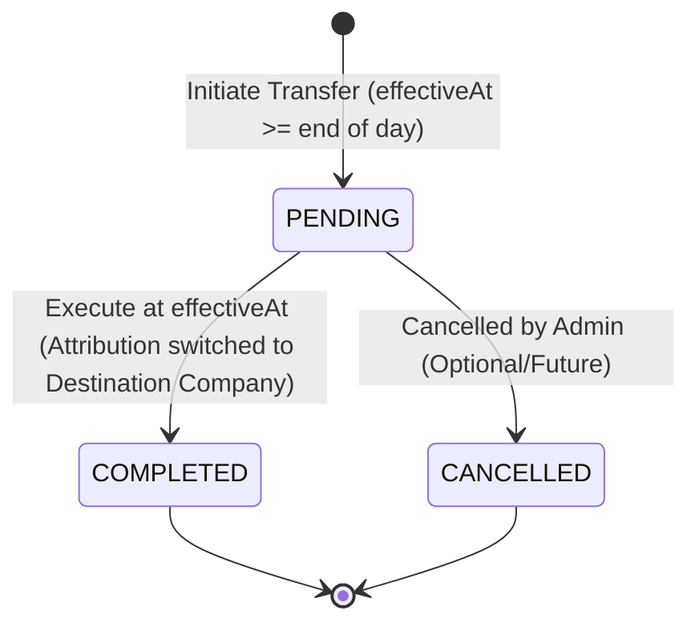

# Data Model: Employee Transfer Between Companies

**Feature**: Employee Transfer Between Companies  
**Branch**: `016-employee-transfer`  
**Date**: 2026-08-19

## Entities & Schema Definitions

### 1. `employee_transfers`

Represents an inter-company employee transfer lifecycle from initiation through scheduled execution.

```sql
CREATE TABLE employee_transfers (
    id UUID PRIMARY KEY DEFAULT gen_random_uuid(),
    tenant_id UUID NOT NULL REFERENCES tenants(id) ON DELETE RESTRICT,
    employee_id UUID NOT NULL,
    source_company_id UUID NOT NULL REFERENCES companies(id) ON DELETE RESTRICT,
    destination_company_id UUID NOT NULL REFERENCES companies(id) ON DELETE RESTRICT,
    destination_location_id UUID REFERENCES locations(id) ON DELETE RESTRICT,
    destination_department_id UUID REFERENCES departments(id) ON DELETE RESTRICT,
    destination_grade_id UUID REFERENCES grades(id) ON DELETE RESTRICT,
    destination_job_title_id UUID REFERENCES job_titles(id) ON DELETE RESTRICT,
    status VARCHAR(32) NOT NULL DEFAULT 'PENDING',
    effective_at TIMESTAMPTZ NOT NULL,
    completed_at TIMESTAMPTZ,
    notes TEXT,
    created_at TIMESTAMPTZ NOT NULL DEFAULT NOW(),
    updated_at TIMESTAMPTZ NOT NULL DEFAULT NOW(),
    created_by UUID,
    updated_by UUID
);

-- Constraints & Indexes
CREATE INDEX idx_employee_transfers_tenant_emp ON employee_transfers (tenant_id, employee_id);
CREATE INDEX idx_employee_transfers_status_eff ON employee_transfers (status, effective_at);
CREATE INDEX idx_employee_transfers_dest_co ON employee_transfers (tenant_id, destination_company_id);
CREATE INDEX idx_employee_transfers_src_co ON employee_transfers (tenant_id, source_company_id);

-- Enforce at most 1 pending transfer per employee (INV-007 / BR-33)
CREATE UNIQUE INDEX uq_employee_pending_transfer 
ON employee_transfers (tenant_id, employee_id) 
WHERE status = 'PENDING';
```

#### Field Specifications

| Field | Type | Nullable | Description | Validation Rules |
|-------|------|----------|-------------|------------------|
| `id` | UUID | No | Primary Key | UUID v4 |
| `tenant_id` | UUID | No | Multi-tenant isolation key | Must match authenticated tenant |
| `employee_id` | UUID | No | Transferred Employee ID | Must exist in `employee_references` |
| `source_company_id` | UUID | No | Originating Company ID | Must match employee's current `company_id` |
| `destination_company_id` | UUID | No | Target Company ID | Must be `status = 'ACTIVE'`, distinct from source |
| `destination_location_id` | UUID | Yes | Target Location ID | Must belong to `destination_company_id` & `ACTIVE` |
| `destination_department_id` | UUID | Yes | Target Department ID | Must belong to `destination_company_id` & `ACTIVE` |
| `destination_grade_id` | UUID | Yes | Target Grade ID | Must belong to `destination_company_id` & `ACTIVE` |
| `destination_job_title_id` | UUID | Yes | Target Job Title ID | Must belong to `destination_company_id` & `ACTIVE` |
| `status` | VARCHAR(32) | No | Transfer Status | `PENDING`, `COMPLETED`, `CANCELLED` |
| `effective_at` | TIMESTAMPTZ | No | Effective execution timestamp | $\ge$ end of current business day |
| `completed_at` | TIMESTAMPTZ | Yes | Actual execution completion timestamp | Set upon transition to `COMPLETED` |
| `notes` | TEXT | Yes | Administrative notes/remarks | Max 1000 characters |
| `created_at` | TIMESTAMPTZ | No | Creation timestamp | Auto-set |
| `updated_at` | TIMESTAMPTZ | No | Last update timestamp | Auto-set |
| `created_by` | UUID | Yes | Initiating Administrator User ID | Injected from request context |
| `updated_by` | UUID | Yes | Last updater User ID | Injected from request context |

---

### 2. `employee_references` (Projection Updates)

Local projection tracking current company attribution within the Setting Service.

- When a transfer is in `PENDING` status: `employee_references.company_id` remains `source_company_id`.
- When transfer reaches `effective_at` and transitions to `COMPLETED`:
  - `employee_references.company_id` is updated to `destination_company_id`.
  - `source_version` is incremented.
  - `source_updated_at` is updated to execution timestamp.

---

### 3. `outbox_events` (Event Payloads)

#### Scheduling Event: `setting.effective-change.scheduled`

Payload staged in outbox upon `POST .../transfers`:

```json
{
  "eventId": "uuid-v4",
  "aggregateType": "EmployeeTransfer",
  "aggregateId": "transfer-uuid",
  "eventType": "setting.effective-change.scheduled",
  "tenantId": "tenant-uuid",
  "companyId": "destination-company-uuid",
  "payload": {
    "transferId": "transfer-uuid",
    "changeType": "EMPLOYEE_TRANSFER",
    "employeeId": "employee-uuid",
    "sourceCompanyId": "source-company-uuid",
    "destinationCompanyId": "destination-company-uuid",
    "effectiveAt": "2026-08-25T00:00:00.000Z"
  }
}
```

#### Execution Domain Notification: `employee.company-transferred`

Payload staged in outbox upon transfer completion:

```json
{
  "eventId": "uuid-v4",
  "aggregateType": "EmployeeTransfer",
  "aggregateId": "transfer-uuid",
  "eventType": "employee.company-transferred",
  "tenantId": "tenant-uuid",
  "companyId": "destination-company-uuid",
  "payload": {
    "transferId": "transfer-uuid",
    "employeeId": "employee-uuid",
    "tenantId": "tenant-uuid",
    "sourceCompanyId": "source-company-uuid",
    "destinationCompanyId": "destination-company-uuid",
    "destinationLocationId": "destination-location-uuid",
    "destinationDepartmentId": "destination-department-uuid",
    "destinationGradeId": "destination-grade-uuid",
    "destinationJobTitleId": "destination-job-title-uuid",
    "effectiveAt": "2026-08-25T00:00:00.000Z",
    "completedAt": "2026-08-25T00:00:01.234Z",
    "continuousEmployment": true
  }
}
```

---

## State Transition Diagram



### Transition Invariants

1. **Initiation (`[*] -> PENDING`)**:
   - Requires valid active employee belonging to source company.
   - Destination company must have `status = 'ACTIVE'`.
   - Destination master data references must belong to destination company and have `status = 'ACTIVE'`.
   - `effectiveAt` must be $\ge$ end of current business day.
   - No existing `PENDING` transfer for the employee (`uq_employee_pending_transfer`).
   - Outbox scheduling event atomically written.
2. **Execution (`PENDING -> COMPLETED`)**:
   - Triggered when current time $\ge$ `effectiveAt`.
   - Redis deduplication prevents concurrent duplicate execution.
   - `employee_references.company_id` updated to `destination_company_id`.
   - `employee_transfers.status` set to `COMPLETED`, `completed_at = NOW()`.
   - Downstream outbox event `employee.company-transferred` atomically written.
