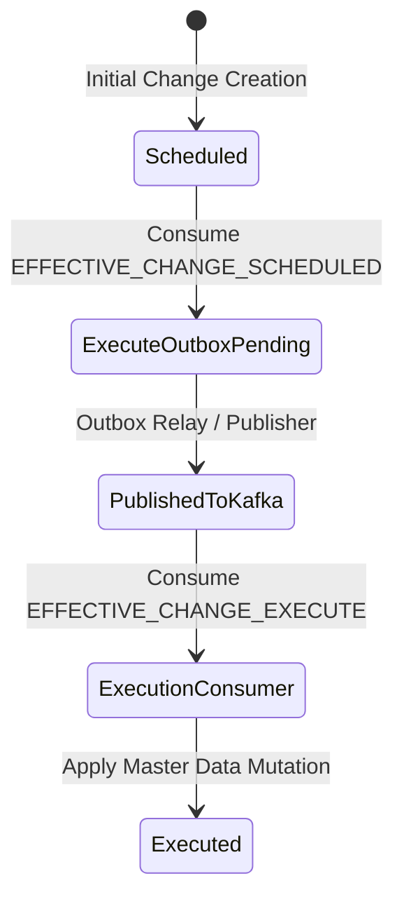

# Data Model: Consume EFFECTIVE_CHANGE_SCHEDULED & Dispatch EFFECTIVE_CHANGE_EXECUTE

## Entities & Schemas

### 1. OutboxEventEntity (`outbox_events` table)

Stores asynchronous events generated within domain transaction boundaries.

| Field | Type | Nullable | Description |
|---|---|---|---|
| `id` | UUID (Primary Key) | No | Unique outbox event record ID |
| `aggregateType` | VARCHAR(64) | No | Aggregate category (`location`, `department`, `grade`, `job_title`, `poc`, `employee_transfer`) |
| `aggregateId` | UUID | No | ID of the aggregate root / entity being changed |
| `eventType` | VARCHAR(128) | No | `setting.effective-change.execute` |
| `payload` | JSONB / Object | No | Serialized execution payload containing changeId, entityType, operation, effectiveAt, companyId, tenantId |
| `executionTime` | TIMESTAMPTZ | No | Timestamp indicating when the relay worker should dispatch/execute the event |
| `status` | VARCHAR(32) | No | Defaults to `PENDING` (`PENDING`, `PROCESSING`, `PUBLISHED`, `FAILED`) |
| `retryCount` | INT | No | Number of publish retries (default: 0) |
| `createdAt` | TIMESTAMP | No | Record creation timestamp |
| `updatedAt` | TIMESTAMP | No | Record update timestamp |

### 2. EffectiveChangeEntity (`effective_changes` table)

Tracks scheduled and active master data changes.

| Field | Type | Nullable | Description |
|---|---|---|---|
| `id` | UUID (Primary Key) | No | Unique change ID |
| `tenantId` | VARCHAR | No | Multi-tenant scoping identifier |
| `companyId` | UUID | No | Target company ID |
| `entityType` | VARCHAR | No | Entity category (`location`, `department`, etc.) |
| `entityId` | UUID | Yes | Target entity identifier (if update/delete) |
| `operation` | VARCHAR | No | `CREATE`, `UPDATE`, `DELETE`, `TRANSFER` |
| `effectiveAt` | TIMESTAMP | No | Effective execution date/time |
| `status` | VARCHAR | No | Lifecycle status (`SCHEDULED`, `EXECUTED`, `CANCELLED`) |
| `payload` | JSONB | No | Master data attributes to be applied upon execution |

## State Transitions

